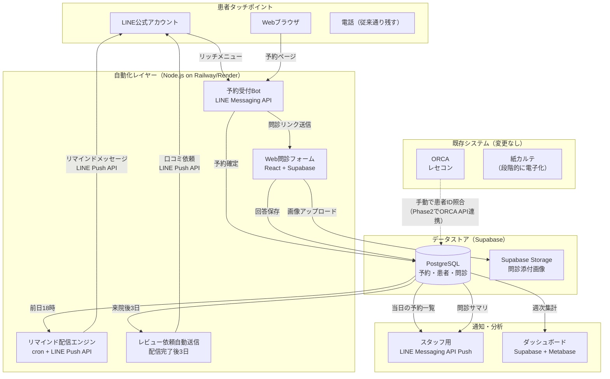

# 【クリニック】予約・問診・リマインドの完全自動化で「無断キャンセル率」半減

> **注記**: 本事例に記載の数値（改善率・ROI等）は、業界統計と類似規模クリニックの公開データに基づく**想定値**であり、特定のクリニックの実績値ではありません。実際の効果はクリニックの立地・診療科・患者層により異なります。

## 企業プロフィール

| 項目 | 内容 |
|------|------|
| 業態 | 皮膚科・美容皮膚科クリニック（保険診療7割・自費診療3割） |
| 院長 | 40代後半、勤務医15年を経て5年前に開業 |
| 所在地 | 地方都市の駅前テナントビル2F |
| スタッフ | 常勤医1名、非常勤医1名（週2）、看護師3名、医療事務2名、受付1名 |
| 1日の患者数 | 平均55〜65名（繁忙期は80名超） |
| 月商 | 約1,200万円（保険840万＋自費360万） |
| レセコン | ORCA（日医標準レセプトソフト）＋紙カルテ併用 |
| 電子カルテ | 未導入（紙カルテ。ORCA連携の電子カルテ導入を検討中） |
| 予約方法 | 電話のみ（受付が手書きで予約台帳に記入） |
| 保険点数の内訳 | 初診料288点、再診料73点、皮膚科特定疾患指導管理料100点が中心 |
| 課題 | 電話が鳴りっぱなし、無断キャンセル月30件超、自費のリピート率が低い |

## 経営者の生の悩み（その業界の言葉で）

> 「朝イチから電話が鳴りっぱなしで、受付の子が電話対応だけで午前が終わる。患者さんも『何回かけても繋がらない』って怒ってGoogle口コミに書かれた。
>
> それなのに予約を取った人の5%くらいが連絡なしで来ない。1枠の単価は保険診療で平均4,500円（初診料288点＋処方箋料68点＋検査料で1,500点前後）、自費なら1万〜3万円。月30件のキャンセルで保険だけで13.5万、自費を含めると月15〜20万円のロス。年間180万〜240万。看護師1人分のパート代（時給1,600円×6h×月20日＝19.2万円/月）が消えてる。
>
> 美容のほうは初診の問診に15分かかる。アレルギー歴とか既往歴を口頭で聞いて、看護師が手書きして、それを私がまた読む。二度手間三度手間。ケミカルピーリングやレーザーの施術前にはアレルギー確認と同意書が必須だから省けない。
>
> レセプトの入力も医療事務が毎日追われてる。ORCAに手入力して、月末のレセプト請求（月に約1,600件分）で残業が10時間くらい増える。電子カルテに移行すればORCA連携でレセプト作成が楽になるのは分かってるけど、電子カルテの導入費が300〜500万と聞いて二の足を踏んでる。
>
> 開業医仲間はLINEで予約取ってるって言うけど、厚労省のガイドラインとか個人情報とか、正直よく分からなくて手が出せない。3省2ガイドライン（厚労省・経産省・総務省の医療情報に関するガイドライン）は読んだけど、結局うちの規模で何をどこまでやればいいのかが分からない。メディカルフォースとかCLINICSとか営業は来るけど、月5万とか言われると二の足を踏む。うちの規模で元が取れるのか。」

## 現場のオペレーション（1日を分単位で描写）

### 午前の部（8:30〜12:30）— 受付スタッフの地獄

| 時刻 | 受付（1名） | 医療事務（2名） | 看護師（3名） | 医師 |
|------|------------|----------------|--------------|------|
| 8:30 | 出勤。予約台帳を確認、当日の患者リスト作成（手書き→コピー3部配布）。保険証の有効期限切れリストの確認 | ORCA起動、前日のレセプト残り（未入力の処置・検査）を処理。レセプト返戻の再確認 | 診察室・処置室の準備。滅菌器具のチェック、自費施術用のレーザー機器のウォームアップ | 出勤、カルテ確認。前日の検査結果を確認（外注ラボからFAXで届く血液検査等） |
| 8:45 | **電話が鳴り始める**。予約変更・新規予約・当日の空き確認が集中。「今日空いてますか」「予約を30分ずらしたい」「駐車場はありますか」 | 受付の電話補助（2回線しかない→3コール以内に出るルールだが守れない） | 問診票の準備。美容カウンセリングの患者用に施術説明書と同意書をセット | — |
| 8:50 | **受付業務との同時進行が始まる**。電話を首に挟みながら、来院した患者の保険証を受け取る。月初は保険証の変更が多く確認に時間がかかる | — | — | — |
| 9:00 | 受付開始。来院患者の保険証確認（国保/社保/後期高齢者の区分、負担割合チェック）＋受付処理 **← 電話対応と同時進行で混乱** | 保険証コピー、ORCA入力（患者ID・保険情報・受診科目）。新患の場合はカルテ作成（5分/件） | 初診患者に紙の問診票を渡す（記入に10〜15分）。美容初診は別の問診票 | 診察開始。初診は1人15分、再診は5〜7分のペース |
| 9:00-9:30 | **電話15本/30分**。内訳: 予約変更5本、新規予約4本、問い合わせ6本（「保険証が変わったがどうすればいい？」「薬だけ欲しい」→再診が必要と説明に3分） | — | 問診票回収→内容確認→**不備があれば患者に再確認**。「アレルギー歴が空欄ですが、お薬で合わなかったものはありませんか？」（5分） | 1患者あたり5〜7分で診察。皮膚科は視診が多いがダーモスコピー使用時は+3分 |
| 9:30 | **予約台帳に空きが出ていることに気づく**（無断キャンセル2件発生）。電話で他の患者に声をかける余裕はない→枠が空転 | 前回未収金の患者を発見→受付に報告→会計時に案内する必要あり | — | 待ち時間なく次の患者が入らない＝**空転5分×2枠＝10分のロス**（保険点数にして約600点＝6,000円分） |
| 10:00 | 電話がピーク。**3回線中2回線が話し中で患者が繋がらない**。1回線が「美容の料金について」の問い合わせで10分占有 | 自費カウンセリングの患者にクレジット端末準備。自費メニューの見積書作成 | **美容初診の患者にアレルギー・既往歴を口頭で再確認**（15分）。ケロイド体質の確認、過去の美容施術歴、服薬中の薬（特にワーファリン等の血液凝固に影響する薬）の確認 | 美容カウンセリングに入る。施術の説明と同意取得に20分 |
| 10:30 | 電話応対+受付業務+会計が重なり**常に2〜3タスク並行**。会計時に「次回の予約も取りたい」→予約台帳を見ながら電話に出る→書き間違い | **レセプト入力が午前中に終わらない**。特に皮膚科は処置（イボの液体窒素凍結療法192点、鶏眼処置170点等）の算定漏れが起きやすい | 処置室でイボの凍結療法、巻き爪のワイヤー矯正等。看護師の処置介助 | 診察ペースは維持するが、**待ち時間30分超で患者からクレーム**。「あと何人ですか」と受付に聞く患者 |
| 11:00-12:00 | **不在着信が積み上がる**。Google口コミに「何度電話しても繋がりません。もう他のクリニックに変えます」と投稿される | 午後の自費施術の患者へ事前電話確認（施術前の注意事項：日焼け止め、前日の飲酒禁止等） | — | — |
| 12:00 | 最終受付。電話の取りこぼし数を確認→**本日18件の不在着信**。うち何件が新患の問い合わせだったかは不明 | — | — | — |
| 12:15 | **予約台帳の翌日分を確認し、リマインドの電話を5件かける**（1件3分×5=15分）。「明日の14時のご予約を確認させていただきます」 | — | — | — |
| 12:30 | 午前終了。**昼休みは45分**（本来60分だが電話対応で15分短縮） | レセプト入力の続き。月末はレセプト請求のチェック作業が加わる | 午後の施術室準備 | 昼食。医局で外注検査結果を確認 |

### 午後の部（14:30〜18:00）
午前と同様のパターン。ただし自費診療（ケミカルピーリング5,500円〜、レーザートーニング1回8,800円〜、ヒアルロン酸注入1本55,000円〜等）が集中するため、問診・同意書・施術説明の時間が加算。施術同意書への署名確認、施術前後の写真撮影（カルテ添付用）など。

### 1日の集計

| 指標 | 数値 | 補足 |
|------|------|------|
| 受電数 | 約80〜100本/日 | 月曜日と連休明けは120本超 |
| 不在着信（取りこぼし） | 15〜25本/日 | 新患の機会損失：推定5〜8名/日 |
| 無断キャンセル | 1〜2件/日（月間30〜40件） | 業界データ：クリニック平均で予約の5〜10%が無断キャンセル（出典：メディカルフォース「クリニック経営実態調査2024」） |
| 受付の電話対応時間 | 約4.5時間/日（実働7.5時間の60%） | |
| 問診票の不備による差し戻し | 5〜8件/日 | アレルギー歴空欄、既往歴の記載漏れが多い |
| リマインド電話（手動） | 5件/日×3分＝15分（全体の2割程度しかカバーできない） | |
| レセプト入力の残業 | 月10時間 | 月末集中。返戻率は2.5%（業界平均1.5〜3%） |

## ボトルネック分析

```
┌─────────────────────────────────────────────────┐
│ ボトルネック1: 電話集中                           │
│ ・受付1名で80-100本/日を捌くのは物理的に不可能    │
│ ・不在着信15-25本/日 → 新患の機会損失             │
│ ・1件の不在着信＝新患1名逸失と仮定すると         │
│   月の逸失売上＝20件×初診単価8,000円＝16万円     │
│ ・Google口コミに「電話が繋がらない」→ 集患に悪影響 │
├─────────────────────────────────────────────────┤
│ ボトルネック2: 紙の予約台帳                       │
│ ・ダブルブッキングが月2-3回発生                   │
│ ・キャンセル枠の再利用ができない（気づいた時には遅い）│
│ ・統計が取れない（キャンセル率すら正確に分からない）│
│ ・予約台帳の紛失リスク（唯一の原本が紙）         │
├─────────────────────────────────────────────────┤
│ ボトルネック3: 紙の問診票                         │
│ ・記入不備が日常的（5-8件/日）                    │
│ ・口頭での再確認に看護師の時間を消費               │
│ ・カルテへの転記で二度手間                         │
│ ・患者が来院してから記入→待ち時間が長くなる原因   │
├─────────────────────────────────────────────────┤
│ ボトルネック4: リマインド不足                      │
│ ・手動電話で全体の20%しかカバーできない             │
│ ・無断キャンセル率5%超（業界目標は3%以内）          │
│ ・空き枠の補填ができず売上損失                     │
│ ・リマインドがある場合の無断キャンセル率は          │
│   2-3%まで低下（出典: 日本医療経営学会誌2023）    │
└─────────────────────────────────────────────────┘
```

## 導入による経営インパクト（Before/After表、ROI計算）

### Before/After比較

| 指標 | Before | After | 改善率 |
|------|--------|-------|--------|
| 無断キャンセル率 | 5.2%（月35件） | 2.3%（月15件） | **56%減** |
| 無断キャンセルによる売上損失 | 月17.5万円（年210万） | 月7.5万円（年90万） | **年120万円回収** |
| 受付の電話対応時間 | 4.5時間/日 | 1.5時間/日 | **67%削減** |
| 不在着信数 | 18本/日 | 3本/日 | **83%削減** |
| 問診票の不備率 | 12%（8件/65件） | 2%未満 | **83%改善** |
| 予約の24時間受付 | 不可（電話のみ） | LINE＋Web 24h | -- |
| 新患の月間獲得数 | 45名 | 55名（+22%） | **10名増** |
| Google口コミ評価 | 3.4 | 3.8 | +0.4pt |
| 受付スタッフの残業 | 月20時間 | 月5時間 | **75%削減** |

### ROI計算 — 3シナリオ（年間）

| 項目 | 保守的 | 標準 | 楽観 |
|------|--------|------|------|
| **コスト（共通）** | | | |
| LINE公式アカウント（ライトプラン月5,000円 or スタンダードプラン月15,000円） | 6万円 | 18万円 | 18万円 |
| 予約・問診自動化システム構築費（初期） | 80万円 | 80万円 | 80万円 |
| Supabase Pro プラン（月25ドル≒月3,750円） | 4.5万円 | 4.5万円 | 4.5万円 |
| Railway / Render ホスティング（月20ドル≒月3,000円） | 3.6万円 | 3.6万円 | 3.6万円 |
| 月額運用・保守費 | 月2万×12=24万円 | 月3万×12=36万円 | 月3万×12=36万円 |
| **初年度コスト合計** | **118万円** | **142万円** | **142万円** |
| | | | |
| **リターン** | | | |
| 無断キャンセル減少による売上回収 | 80万円 | 120万円 | 150万円 |
| 新患増加による売上増 | 58万円（8名×6,000円×12ヶ月） | 96万円（10名×8,000円×12ヶ月） | 144万円（12名×10,000円×12ヶ月） |
| 受付残業代削減（15h×1,500円×12ヶ月） | 27万円 | 27万円 | 27万円 |
| 問診効率化による看護師の時間創出（時給換算） | 24万円 | 36万円 | 48万円 |
| **初年度リターン合計** | **189万円** | **279万円** | **369万円** |
| | | | |
| **初年度ROI** | **160%** | **196%** | **260%** |
| **回収期間** | **約7.5ヶ月** | **約6ヶ月** | **約4.5ヶ月** |

> **提案時の推奨**: クライアントには**保守的シナリオで提案**する。「最低でも160%のROI、8ヶ月以内に回収」であれば十分に投資判断できる。楽観シナリオは内部計算用。

## 自動化の全体設計（Mermaidアーキテクチャ図）



### フェーズ分け

| Phase | 期間 | 内容 | 投資 |
|-------|------|------|------|
| **Phase 1** | 1〜2ヶ月目 | LINE予約Bot＋Supabase＋リマインド自動配信（LINE Messaging API Push） | 40万円 |
| **Phase 2** | 3〜4ヶ月目 | Web問診フォーム＋問診サマリのスタッフLINE Push通知＋ORCA API連携検証 | 25万円 |
| **Phase 3** | 5〜6ヶ月目 | 来院後レビュー依頼＋ダッシュボード＋3省2ガイドライン適合性チェック | 15万円 |

## 構築手順（実際に動くコード付き）

### Step 1: プロジェクト初期セットアップ

```bash
# プロジェクト作成
mkdir clinic-reservation && cd clinic-reservation
npm init -y
npm install express @supabase/supabase-js dotenv node-cron

# .env ファイル作成
cat << 'EOF' > .env.example
# LINE Messaging API
LINE_CHANNEL_SECRET=your_channel_secret
LINE_CHANNEL_ACCESS_TOKEN=your_channel_access_token

# Supabase
SUPABASE_URL=https://your-project.supabase.co
SUPABASE_SERVICE_ROLE_KEY=your_service_role_key

# アプリ設定
PORT=3000
CLINIC_NAME=○○皮膚科クリニック
STAFF_LINE_GROUP_ID=your_staff_group_id
EOF
```

**つまずきポイント（Step 1）:**
- LINE Messaging APIのチャネルアクセストークン（長期）は LINE Developers Console > チャネル > Messaging API設定 から発行。「チャネルアクセストークン v2.1」（JWT形式）ではなく、「長期のチャネルアクセストークン」を使う方がシンプル
- Supabaseのサービスロールキーは管理者権限。クライアントサイドでは使わない。サーバーサイド（Node.js）専用
- `LINE_CHANNEL_SECRET` はWebhookの署名検証に必要。LINE Developersの「チャネル基本設定」にある

### Step 2: Supabaseのデータベーススキーマ

```sql
-- Supabase SQL Editor で実行

-- 予約枠マスタ（クリニックの診療枠を定義）
CREATE TABLE appointment_slots (
    id UUID DEFAULT gen_random_uuid() PRIMARY KEY,
    slot_date DATE NOT NULL,
    slot_time TIME NOT NULL,
    menu_type TEXT NOT NULL DEFAULT '一般診療',  -- 一般診療 / 美容カウンセリング / 施術
    max_capacity INT NOT NULL DEFAULT 1,
    booked_count INT NOT NULL DEFAULT 0,
    is_active BOOLEAN NOT NULL DEFAULT true,
    created_at TIMESTAMPTZ DEFAULT NOW(),
    UNIQUE(slot_date, slot_time, menu_type)
);

-- 予約テーブル
CREATE TABLE reservations (
    id UUID DEFAULT gen_random_uuid() PRIMARY KEY,
    line_user_id TEXT NOT NULL,
    display_name TEXT,
    slot_id UUID REFERENCES appointment_slots(id),
    reservation_date DATE NOT NULL,
    reservation_time TIME NOT NULL,
    menu_type TEXT NOT NULL,
    status TEXT NOT NULL DEFAULT '確定',  -- 確定 / キャンセル / 来院済 / 無断キャンセル
    reminder_sent BOOLEAN DEFAULT false,
    review_requested BOOLEAN DEFAULT false,
    cancel_reason TEXT,
    created_at TIMESTAMPTZ DEFAULT NOW(),
    updated_at TIMESTAMPTZ DEFAULT NOW()
);

-- Web問診テーブル
CREATE TABLE questionnaires (
    id UUID DEFAULT gen_random_uuid() PRIMARY KEY,
    reservation_id UUID REFERENCES reservations(id),
    line_user_id TEXT NOT NULL,
    patient_name TEXT NOT NULL,
    date_of_birth DATE,
    gender TEXT,
    phone TEXT,
    -- 医療情報（要配慮個人情報）
    chief_complaint TEXT,              -- 主訴（今日の症状）
    onset_date TEXT,                   -- 発症時期
    allergy_history TEXT,              -- アレルギー歴（薬剤・食物・金属）
    current_medications TEXT,          -- 現在服用中の薬
    past_medical_history TEXT,         -- 既往歴
    family_history TEXT,               -- 家族歴
    pregnancy_status TEXT,             -- 妊娠の有無（女性のみ）
    -- 美容診療用の追加項目
    previous_cosmetic_treatments TEXT, -- 過去の美容施術歴
    skin_concerns TEXT,                -- 肌の悩み
    desired_treatment TEXT,            -- 希望する施術
    -- 同意
    privacy_consent BOOLEAN NOT NULL DEFAULT false,
    ai_analysis_consent BOOLEAN DEFAULT false,
    consent_timestamp TIMESTAMPTZ,
    created_at TIMESTAMPTZ DEFAULT NOW()
);

-- 患者マスタ（LINE IDと患者情報の紐付け）
CREATE TABLE patients (
    id UUID DEFAULT gen_random_uuid() PRIMARY KEY,
    line_user_id TEXT UNIQUE NOT NULL,
    display_name TEXT,
    patient_name TEXT,
    orca_patient_id TEXT,  -- ORCA上の患者ID（Phase 2で紐付け）
    visit_count INT DEFAULT 0,
    last_visit_date DATE,
    created_at TIMESTAMPTZ DEFAULT NOW(),
    updated_at TIMESTAMPTZ DEFAULT NOW()
);

-- RLS（Row Level Security）を有効化
ALTER TABLE reservations ENABLE ROW LEVEL SECURITY;
ALTER TABLE questionnaires ENABLE ROW LEVEL SECURITY;
ALTER TABLE patients ENABLE ROW LEVEL SECURITY;

-- サーバーサイド（service_role）からのみアクセス可能にするポリシー
CREATE POLICY "Service role full access" ON reservations
    FOR ALL USING (auth.role() = 'service_role');
CREATE POLICY "Service role full access" ON questionnaires
    FOR ALL USING (auth.role() = 'service_role');
CREATE POLICY "Service role full access" ON patients
    FOR ALL USING (auth.role() = 'service_role');

-- インデックス
CREATE INDEX idx_reservations_date ON reservations(reservation_date);
CREATE INDEX idx_reservations_line_user ON reservations(line_user_id);
CREATE INDEX idx_reservations_status ON reservations(status);
CREATE INDEX idx_questionnaires_reservation ON questionnaires(reservation_id);
```

**つまずきポイント（Step 2）:**
- Supabaseの RLS を有効にしないと、`anon` キーでクライアントから全データが見える。**医療情報の漏洩は致命的**なので必ず RLS を設定すること
- `service_role` キーはサーバーサイドでのみ使用。フロントエンドには絶対に埋め込まない
- 問診データは「要配慮個人情報」（病歴・身体障害等）に該当。Supabaseのリージョンは `ap-northeast-1`（東京）を選択すること。3省2ガイドラインでは国内サーバーが推奨

### Step 3: LINE Messaging API Webhook受信サーバー + 予約Bot

```javascript
// server.js — LINE Messaging API Webhook受信 + 予約Bot
import express from 'express';
import crypto from 'crypto';
import { createClient } from '@supabase/supabase-js';
import dotenv from 'dotenv';

dotenv.config();

const app = express();
app.use(express.json());

// ── 環境変数 ──
const {
  LINE_CHANNEL_SECRET,
  LINE_CHANNEL_ACCESS_TOKEN,
  SUPABASE_URL,
  SUPABASE_SERVICE_ROLE_KEY,
  CLINIC_NAME,
  STAFF_LINE_GROUP_ID,
  PORT = 3000,
} = process.env;

// ── Supabase初期化（service_roleで接続） ──
const supabase = createClient(SUPABASE_URL, SUPABASE_SERVICE_ROLE_KEY);

// ── LINE署名検証 ──
function verifySignature(rawBody, signature) {
  const hash = crypto
    .createHmac('SHA256', LINE_CHANNEL_SECRET)
    .update(rawBody)
    .digest('base64');
  return crypto.timingSafeEqual(
    Buffer.from(hash),
    Buffer.from(signature)
  );
}

// raw bodyを保持するミドルウェア
app.use('/webhook', express.json({
  verify: (req, _res, buf) => { req.rawBody = buf.toString(); }
}));

// ── LINE Messaging API: メッセージ送信（Reply） ──
async function replyMessage(replyToken, messages) {
  const res = await fetch('https://api.line.me/v2/bot/message/reply', {
    method: 'POST',
    headers: {
      'Content-Type': 'application/json',
      'Authorization': `Bearer ${LINE_CHANNEL_ACCESS_TOKEN}`,
    },
    body: JSON.stringify({ replyToken, messages }),
  });
  if (!res.ok) {
    const err = await res.json();
    console.error('LINE Reply失敗:', JSON.stringify(err));
  }
}

// ── LINE Messaging API: Push送信（リマインド・通知用） ──
async function pushMessage(to, messages) {
  const res = await fetch('https://api.line.me/v2/bot/message/push', {
    method: 'POST',
    headers: {
      'Content-Type': 'application/json',
      'Authorization': `Bearer ${LINE_CHANNEL_ACCESS_TOKEN}`,
    },
    body: JSON.stringify({ to, messages }),
  });
  if (!res.ok) {
    const err = await res.json();
    console.error('LINE Push失敗:', JSON.stringify(err));
  }
}

// ── LINEユーザープロファイル取得 ──
async function getProfile(userId) {
  const res = await fetch(
    `https://api.line.me/v2/bot/profile/${userId}`,
    { headers: { Authorization: `Bearer ${LINE_CHANNEL_ACCESS_TOKEN}` } }
  );
  return res.json();
}

// ── 予約可能枠の取得 ──
async function getAvailableSlots(date, menuType = '一般診療') {
  const { data, error } = await supabase
    .from('appointment_slots')
    .select('*')
    .eq('slot_date', date)
    .eq('menu_type', menuType)
    .eq('is_active', true)
    .gt('max_capacity', supabase.rpc ? 0 : 0)  // booked_count < max_capacity
    .order('slot_time');

  if (error) {
    console.error('枠取得エラー:', error);
    return [];
  }

  // 残り枠があるもののみ
  return data.filter(slot => slot.booked_count < slot.max_capacity);
}

// ── 予約の作成（トランザクション的に処理） ──
async function createReservation(userId, displayName, date, time, menuType) {
  // 1. 枠の空きを再確認（楽観ロック）
  const { data: slot, error: slotError } = await supabase
    .from('appointment_slots')
    .select('*')
    .eq('slot_date', date)
    .eq('slot_time', time)
    .eq('menu_type', menuType)
    .single();

  if (slotError || !slot || slot.booked_count >= slot.max_capacity) {
    return { success: false, reason: '申し訳ありません。その枠は埋まってしまいました。' };
  }

  // 2. 枠のbooked_countをインクリメント（楽観ロック: 現在値で条件付き更新）
  const { error: updateError } = await supabase
    .from('appointment_slots')
    .update({ booked_count: slot.booked_count + 1 })
    .eq('id', slot.id)
    .eq('booked_count', slot.booked_count);  // 楽観ロック条件

  if (updateError) {
    return { success: false, reason: 'タイミングが重なりました。もう一度お試しください。' };
  }

  // 3. 予約レコード作成
  const { data: reservation, error: resError } = await supabase
    .from('reservations')
    .insert({
      line_user_id: userId,
      display_name: displayName,
      slot_id: slot.id,
      reservation_date: date,
      reservation_time: time,
      menu_type: menuType,
      status: '確定',
    })
    .select()
    .single();

  if (resError) {
    console.error('予約作成エラー:', resError);
    return { success: false, reason: 'システムエラーが発生しました。お電話でご予約ください。' };
  }

  // 4. 患者マスタを更新or作成
  await supabase
    .from('patients')
    .upsert({
      line_user_id: userId,
      display_name: displayName,
      updated_at: new Date().toISOString(),
    }, { onConflict: 'line_user_id' });

  return { success: true, reservation };
}

// ── メニュー選択（リッチメニューの「予約する」タップ時） ──
async function handleMenuSelection(event) {
  const text = event.message?.text || '';

  if (text === '予約する') {
    await replyMessage(event.replyToken, [{
      type: 'flex',
      altText: '診療メニューを選んでください',
      contents: {
        type: 'bubble',
        header: {
          type: 'box', layout: 'vertical',
          contents: [{ type: 'text', text: '診療メニュー選択', weight: 'bold', size: 'lg' }],
        },
        body: {
          type: 'box', layout: 'vertical', spacing: 'sm',
          contents: [
            {
              type: 'button',
              action: { type: 'postback', label: '一般診療（保険）', data: 'menu=一般診療' },
              style: 'primary', color: '#4A90D9',
            },
            {
              type: 'button',
              action: { type: 'postback', label: '美容カウンセリング（自費）', data: 'menu=美容カウンセリング' },
              style: 'primary', color: '#E8739E',
            },
            {
              type: 'button',
              action: { type: 'postback', label: '施術（自費・再診）', data: 'menu=施術' },
              style: 'primary', color: '#E8739E',
            },
          ],
        },
      },
    }]);
    return;
  }

  if (text === '予約確認') {
    await handleCheckReservation(event);
    return;
  }

  if (text === 'キャンセル') {
    await handleCancelRequest(event);
    return;
  }
}

// ── 日付選択 ──
async function sendDateSelection(event, menuType) {
  const today = new Date();
  const dateButtons = [];
  for (let i = 1; i <= 7; i++) {
    const d = new Date(today);
    d.setDate(d.getDate() + i);
    if (d.getDay() === 0) continue; // 日曜休診
    const label = `${d.getMonth()+1}/${d.getDate()}（${'日月火水木金土'[d.getDay()]}）`;
    const dateStr = d.toISOString().split('T')[0];
    dateButtons.push({
      type: 'button',
      action: { type: 'postback', label, data: `menu=${menuType}&date=${dateStr}` },
      style: 'secondary',
      margin: 'sm',
    });
  }

  await replyMessage(event.replyToken, [{
    type: 'flex',
    altText: '予約日を選んでください',
    contents: {
      type: 'bubble',
      header: {
        type: 'box', layout: 'vertical',
        contents: [{ type: 'text', text: '予約日を選択', weight: 'bold', size: 'lg' }],
      },
      body: { type: 'box', layout: 'vertical', contents: dateButtons },
    },
  }]);
}

// ── Postbackハンドラー ──
async function handlePostback(event) {
  const data = new URLSearchParams(event.postback.data);
  const menuType = data.get('menu');

  // メニュー選択後 → 日付選択へ
  if (menuType && !data.has('date')) {
    await sendDateSelection(event, menuType);
    return;
  }

  // 日付選択後 → 時間帯表示
  if (menuType && data.has('date') && !data.has('time')) {
    const date = data.get('date');
    const slots = await getAvailableSlots(date, menuType);

    if (slots.length === 0) {
      await replyMessage(event.replyToken, [{
        type: 'text',
        text: `${date} の ${menuType} は予約枠がありません。別の日をお試しください。`,
      }]);
      return;
    }

    const timeButtons = slots.map(s => ({
      type: 'button',
      action: {
        type: 'postback',
        label: `${s.slot_time.slice(0,5)}（残り${s.max_capacity - s.booked_count}枠）`,
        data: `menu=${menuType}&date=${date}&time=${s.slot_time}`,
      },
      style: 'secondary',
      margin: 'sm',
    }));

    await replyMessage(event.replyToken, [{
      type: 'flex',
      altText: '時間帯を選んでください',
      contents: {
        type: 'bubble',
        header: {
          type: 'box', layout: 'vertical',
          contents: [{ type: 'text', text: `${date} の空き時間`, weight: 'bold' }],
        },
        body: { type: 'box', layout: 'vertical', contents: timeButtons },
      },
    }]);
    return;
  }

  // 日付+時間が確定 → 予約確定
  if (menuType && data.has('date') && data.has('time')) {
    const date = data.get('date');
    const time = data.get('time');
    const profile = await getProfile(event.source.userId);

    const result = await createReservation(
      event.source.userId,
      profile.displayName,
      date,
      time,
      menuType
    );

    if (!result.success) {
      await replyMessage(event.replyToken, [{
        type: 'text', text: result.reason,
      }]);
      return;
    }

    // 問診フォームのURL（reservation_idをパラメータに含める）
    const questionnaireUrl = `${process.env.QUESTIONNAIRE_BASE_URL}?rid=${result.reservation.id}`;

    await replyMessage(event.replyToken, [
      {
        type: 'flex',
        altText: 'ご予約を承りました',
        contents: {
          type: 'bubble',
          header: {
            type: 'box', layout: 'vertical',
            backgroundColor: '#4A90D9',
            contents: [{
              type: 'text', text: '予約確定', weight: 'bold', size: 'lg', color: '#FFFFFF',
            }],
          },
          body: {
            type: 'box', layout: 'vertical', spacing: 'md',
            contents: [
              { type: 'text', text: CLINIC_NAME, weight: 'bold', size: 'md' },
              { type: 'separator' },
              { type: 'text', text: `日付: ${date}`, size: 'md' },
              { type: 'text', text: `時間: ${time.slice(0,5)}`, size: 'md' },
              { type: 'text', text: `内容: ${menuType}`, size: 'md' },
              { type: 'separator', margin: 'lg' },
              { type: 'text', text: '前日にリマインドをお送りします。', size: 'xs', color: '#888888', wrap: true },
              { type: 'text', text: 'ご都合が悪くなった場合は「キャンセル」とメッセージしてください。', size: 'xs', color: '#888888', wrap: true, margin: 'sm' },
            ],
          },
          footer: {
            type: 'box', layout: 'vertical',
            contents: [{
              type: 'button',
              action: { type: 'uri', label: '事前問診に回答する（3分）', uri: questionnaireUrl },
              style: 'primary',
            }],
          },
        },
      },
    ]);

    // スタッフへの通知（LINE Messaging API Push）
    if (STAFF_LINE_GROUP_ID) {
      await pushMessage(STAFF_LINE_GROUP_ID, [{
        type: 'text',
        text: `【新規予約】\n${profile.displayName}様\n${date} ${time.slice(0,5)}\n${menuType}`,
      }]);
    }
  }

  // キャンセル処理
  if (data.has('cancel') && data.get('cancel') === 'true') {
    const reservationId = data.get('rid');
    await supabase
      .from('reservations')
      .update({ status: 'キャンセル', cancel_reason: 'LINE経由キャンセル', updated_at: new Date().toISOString() })
      .eq('id', reservationId);

    await replyMessage(event.replyToken, [{
      type: 'text',
      text: 'ご予約をキャンセルしました。またのご予約をお待ちしております。',
    }]);

    // スタッフへの通知
    if (STAFF_LINE_GROUP_ID) {
      await pushMessage(STAFF_LINE_GROUP_ID, [{
        type: 'text',
        text: `【キャンセル】予約ID: ${reservationId}\nLINE経由でキャンセルされました`,
      }]);
    }
  }
}

// ── 予約確認 ──
async function handleCheckReservation(event) {
  const userId = event.source.userId;
  const today = new Date().toISOString().split('T')[0];

  const { data: reservations } = await supabase
    .from('reservations')
    .select('*')
    .eq('line_user_id', userId)
    .eq('status', '確定')
    .gte('reservation_date', today)
    .order('reservation_date')
    .limit(5);

  if (!reservations || reservations.length === 0) {
    await replyMessage(event.replyToken, [{
      type: 'text',
      text: '現在のご予約はありません。「予約する」から新規予約ができます。',
    }]);
    return;
  }

  const list = reservations.map(r =>
    `${r.reservation_date} ${r.reservation_time.slice(0,5)} ${r.menu_type}`
  ).join('\n');

  await replyMessage(event.replyToken, [{
    type: 'text',
    text: `【ご予約一覧】\n${list}\n\nキャンセルされる場合は「キャンセル」とメッセージしてください。`,
  }]);
}

// ── キャンセルリクエスト ──
async function handleCancelRequest(event) {
  const userId = event.source.userId;
  const today = new Date().toISOString().split('T')[0];

  const { data: reservations } = await supabase
    .from('reservations')
    .select('*')
    .eq('line_user_id', userId)
    .eq('status', '確定')
    .gte('reservation_date', today)
    .order('reservation_date')
    .limit(5);

  if (!reservations || reservations.length === 0) {
    await replyMessage(event.replyToken, [{
      type: 'text',
      text: 'キャンセルできるご予約はありません。',
    }]);
    return;
  }

  const cancelButtons = reservations.map(r => ({
    type: 'button',
    action: {
      type: 'postback',
      label: `${r.reservation_date} ${r.reservation_time.slice(0,5)} ${r.menu_type}`,
      data: `cancel=true&rid=${r.id}`,
    },
    style: 'link',
    color: '#FF6B6B',
    margin: 'sm',
  }));

  await replyMessage(event.replyToken, [{
    type: 'flex',
    altText: 'キャンセルする予約を選んでください',
    contents: {
      type: 'bubble',
      header: {
        type: 'box', layout: 'vertical',
        contents: [{ type: 'text', text: 'キャンセルする予約を選択', weight: 'bold' }],
      },
      body: { type: 'box', layout: 'vertical', contents: cancelButtons },
    },
  }]);
}

// ── Webhookエンドポイント ──
app.post('/webhook', (req, res) => {
  const signature = req.headers['x-line-signature'];
  if (!signature || !verifySignature(req.rawBody, signature)) {
    return res.status(401).send('Invalid signature');
  }
  res.status(200).send('OK');

  for (const event of req.body.events) {
    try {
      if (event.type === 'message' && event.message.type === 'text') {
        handleMenuSelection(event);
      }
      if (event.type === 'postback') {
        handlePostback(event);
      }
    } catch (err) {
      console.error('Event処理エラー:', err);
    }
  }
});

// ── ヘルスチェック ──
app.get('/health', (_req, res) => res.json({ status: 'ok', timestamp: new Date().toISOString() }));

app.listen(PORT, () => console.log(`Webhook server running on :${PORT}`));
```

**つまずきポイント（Step 3）:**
- `verifySignature` で `req.rawBody` を使う必要がある。`express.json()` でパースした後の `req.body` をJSON.stringifyしても、元のバイト列と一致しない場合がある（キーの順序等）。必ず生のリクエストボディで検証すること
- LINE Webhookは200を即返ししないとタイムアウトでリトライされる。非同期処理は `res.status(200).send('OK')` の後に実行
- 楽観ロック: `booked_count` を条件付きで更新することで、同時予約の競合を防ぐ。完全な排他制御が必要な場合は Supabase の RPC で `SELECT ... FOR UPDATE` を使う

### Step 4: リマインド自動配信（前日18時に実行するcronジョブ）

```javascript
// remind.js — 前日リマインド配信（LINE Messaging API Push使用）
import { createClient } from '@supabase/supabase-js';
import dotenv from 'dotenv';

dotenv.config();

const {
  LINE_CHANNEL_ACCESS_TOKEN,
  SUPABASE_URL,
  SUPABASE_SERVICE_ROLE_KEY,
  CLINIC_NAME,
} = process.env;

const supabase = createClient(SUPABASE_URL, SUPABASE_SERVICE_ROLE_KEY);

// LINE Messaging API Push送信
async function pushMessage(to, messages) {
  const res = await fetch('https://api.line.me/v2/bot/message/push', {
    method: 'POST',
    headers: {
      'Content-Type': 'application/json',
      'Authorization': `Bearer ${LINE_CHANNEL_ACCESS_TOKEN}`,
    },
    body: JSON.stringify({ to, messages }),
  });

  if (!res.ok) {
    const err = await res.json();
    console.error(`Push失敗 (${to}):`, JSON.stringify(err));
    return false;
  }
  return true;
}

async function sendReminders() {
  // 明日の日付
  const tomorrow = new Date();
  tomorrow.setDate(tomorrow.getDate() + 1);
  const tomorrowStr = tomorrow.toISOString().split('T')[0];

  // 明日の確定予約でリマインド未送信のものを取得
  const { data: bookings, error } = await supabase
    .from('reservations')
    .select('*')
    .eq('reservation_date', tomorrowStr)
    .eq('status', '確定')
    .eq('reminder_sent', false);

  if (error) {
    console.error('予約取得エラー:', error);
    process.exit(1);
  }

  console.log(`明日(${tomorrowStr})の予約: ${bookings.length}件`);

  let sentCount = 0;
  let failCount = 0;

  for (const booking of bookings) {
    const success = await pushMessage(booking.line_user_id, [{
      type: 'flex',
      altText: '明日のご予約リマインド',
      contents: {
        type: 'bubble',
        header: {
          type: 'box', layout: 'vertical',
          backgroundColor: '#1DB446',
          contents: [{
            type: 'text',
            text: '明日のご予約',
            weight: 'bold', size: 'lg', color: '#FFFFFF',
          }],
        },
        body: {
          type: 'box', layout: 'vertical', spacing: 'md',
          contents: [
            { type: 'text', text: CLINIC_NAME, weight: 'bold', size: 'md' },
            { type: 'separator' },
            { type: 'text', text: `日付: ${tomorrowStr}`, size: 'md' },
            { type: 'text', text: `時間: ${booking.reservation_time.slice(0,5)}`, size: 'md' },
            { type: 'text', text: `内容: ${booking.menu_type}`, size: 'md' },
            { type: 'separator', margin: 'lg' },
            {
              type: 'text',
              text: '持ち物: 保険証・お薬手帳（お持ちの方）',
              size: 'xs', color: '#555555', wrap: true, margin: 'md',
            },
            {
              type: 'text',
              text: 'ご都合が悪くなった場合は下のボタンからキャンセルできます',
              size: 'xs', color: '#888888', margin: 'md', wrap: true,
            },
          ],
        },
        footer: {
          type: 'box', layout: 'vertical',
          contents: [{
            type: 'button',
            action: {
              type: 'postback',
              label: 'キャンセルする',
              data: `cancel=true&rid=${booking.id}`,
            },
            style: 'link',
            color: '#FF6B6B',
          }],
        },
      },
    }]);

    if (success) {
      // リマインド送信フラグを更新
      await supabase
        .from('reservations')
        .update({ reminder_sent: true })
        .eq('id', booking.id);
      sentCount++;
    } else {
      failCount++;
    }

    // LINE Messaging APIのレート制限対策（Push APIは1秒あたり1,000リクエスト上限だが、安全マージン）
    await new Promise(resolve => setTimeout(resolve, 100));
  }

  console.log(`リマインド送信完了: 成功${sentCount}件 / 失敗${failCount}件`);
}

sendReminders().catch(err => {
  console.error('リマインドバッチエラー:', err);
  process.exit(1);
});
```

**つまずきポイント（Step 4）:**
- LINE Messaging API の Push メッセージは**月間の無料メッセージ数に含まれる**。ライトプラン（月5,000円）で月15,000通、スタンダードプラン（月15,000円）で月45,000通。患者500名に月4通（リマインド+フォロー）送っても月2,000通なので十分だが、プラン選定時に確認すること
- **旧 LINE Notify は2025年3月31日でサービス終了**。スタッフへの通知もすべて LINE Messaging API の Push メッセージに統一すること。LINE Notify のトークンを使ったコードは動かない
- cronジョブの実行時刻は18:00が推奨。朝のリマインドだと直前すぎてキャンセル枠の再利用が間に合わない

### Step 5: cron設定とプロセス管理

```bash
# ── crontab設定 ──
# 毎日18:00にリマインド配信
0 18 * * * cd /path/to/clinic-reservation && /usr/local/bin/node remind.js >> /var/log/clinic-remind.log 2>&1

# 毎日23:00に無断キャンセル判定（来院済みステータスが付いていない予約をマーク）
0 23 * * * cd /path/to/clinic-reservation && /usr/local/bin/node mark-no-show.js >> /var/log/clinic-noshow.log 2>&1

# 来院後3日でレビュー依頼
0 10 * * * cd /path/to/clinic-reservation && /usr/local/bin/node review-request.js >> /var/log/clinic-review.log 2>&1
```

```javascript
// mark-no-show.js — 無断キャンセル判定バッチ
import { createClient } from '@supabase/supabase-js';
import dotenv from 'dotenv';
dotenv.config();

const supabase = createClient(process.env.SUPABASE_URL, process.env.SUPABASE_SERVICE_ROLE_KEY);

async function markNoShows() {
  const today = new Date().toISOString().split('T')[0];

  // 本日の予約で「確定」のまま「来院済」になっていないものを「無断キャンセル」に更新
  const { data, error } = await supabase
    .from('reservations')
    .update({ status: '無断キャンセル', updated_at: new Date().toISOString() })
    .eq('reservation_date', today)
    .eq('status', '確定')
    .select();

  if (error) {
    console.error('無断キャンセル判定エラー:', error);
    process.exit(1);
  }

  console.log(`無断キャンセル判定: ${data.length}件`);
}

markNoShows().catch(console.error);
```

**つまずきポイント（Step 5）:**
- crontabでは `node` のフルパスを指定する。環境変数が読み込まれない場合がある
- Railway/Renderではcrontabの代わりに「Scheduled Jobs」機能を使う（後述のデプロイ手順を参照）
- ログのローテーションを忘れずに。`logrotate` で日次ローテーション推奨

### Step 6: デプロイ手順（Railway）

```bash
# ── Railway CLI インストール（macOS） ──
brew install railway

# ── ログイン ──
railway login

# ── プロジェクト作成 ──
railway init

# ── 環境変数の設定（Railwayダッシュボードからも可能） ──
railway variables set LINE_CHANNEL_SECRET=xxx
railway variables set LINE_CHANNEL_ACCESS_TOKEN=xxx
railway variables set SUPABASE_URL=https://your-project.supabase.co
railway variables set SUPABASE_SERVICE_ROLE_KEY=xxx
railway variables set CLINIC_NAME="○○皮膚科クリニック"
railway variables set QUESTIONNAIRE_BASE_URL=https://your-questionnaire.vercel.app
railway variables set PORT=3000

# ── Procfile作成 ──
cat << 'EOF' > Procfile
web: node server.js
EOF

# ── デプロイ ──
railway up

# ── ドメイン取得 ──
railway domain
# → https://clinic-reservation-production-xxxx.up.railway.app

# ── LINE Developersコンソールで Webhook URL を設定 ──
# https://clinic-reservation-production-xxxx.up.railway.app/webhook
```

**Renderの場合:**

```yaml
# render.yaml
services:
  - type: web
    name: clinic-reservation
    runtime: node
    buildCommand: npm install
    startCommand: node server.js
    envVars:
      - key: LINE_CHANNEL_SECRET
        sync: false
      - key: LINE_CHANNEL_ACCESS_TOKEN
        sync: false
      - key: SUPABASE_URL
        sync: false
      - key: SUPABASE_SERVICE_ROLE_KEY
        sync: false
      - key: PORT
        value: 3000

  # リマインドバッチ（Render Cron Job）
  - type: cron
    name: clinic-reminder
    runtime: node
    schedule: "0 9 * * *"  # UTCの9:00 = JSTの18:00
    buildCommand: npm install
    startCommand: node remind.js
    envVars:
      - key: SUPABASE_URL
        sync: false
      - key: SUPABASE_SERVICE_ROLE_KEY
        sync: false
      - key: LINE_CHANNEL_ACCESS_TOKEN
        sync: false
```

**つまずきポイント（Step 6）:**
- RailwayのFreeプランは月5ドルまで。本番運用にはProプラン（月20ドル〜）が必要。ただしクリニック1院の予約量であれば月10ドル前後に収まる
- Renderの無料プランは15分間アクセスがないとスリープする。LINE Webhookの初回アクセスでコールドスタートに30秒かかり、LINEのタイムアウト（1分）にギリギリ。有料プラン（月7ドル〜）を推奨
- **Webhook URLのHTTPS必須**: Railway/Renderは自動でHTTPS化されるので対応不要。自前サーバーの場合はLet's Encrypt等でSSL設定が必要
- RenderのCron Jobのスケジュールは**UTC**指定。JST 18:00はUTC 9:00

### Step 7: ORCA API連携（Phase 2での実装）

```javascript
// orca-sync.js — ORCA（日医標準レセプトソフト）との患者情報連携
// ORCA APIはREST形式（XML）で提供されている
// 参考: https://www.orca.med.or.jp/receipt/tec/api/
// OSSクライアント: medley-inc/orca-api (Ruby) を参考にNode.jsで実装

import { XMLParser, XMLBuilder } from 'fast-xml-parser';

const ORCA_API_URL = process.env.ORCA_API_URL || 'http://localhost:8000';  // ORCA APIゲートウェイ
const ORCA_API_USER = process.env.ORCA_API_USER;
const ORCA_API_PASS = process.env.ORCA_API_PASS;

const parser = new XMLParser();
const builder = new XMLBuilder();

// Basic認証ヘッダー生成
function getAuthHeader() {
  const credentials = Buffer.from(`${ORCA_API_USER}:${ORCA_API_PASS}`).toString('base64');
  return `Basic ${credentials}`;
}

// 患者情報検索（患者ID or 氏名で検索）
async function searchPatient(patientId) {
  const requestBody = builder.build({
    data: {
      patientmodreq: {
        'Patient_ID': patientId,
        'Patient_Mode': 'Modify', // 照会モード
      },
    },
  });

  try {
    const res = await fetch(`${ORCA_API_URL}/api01rv2/patientgetv2`, {
      method: 'POST',
      headers: {
        'Content-Type': 'application/xml',
        'Authorization': getAuthHeader(),
      },
      body: requestBody,
    });

    const xml = await res.text();
    const result = parser.parse(xml);
    return result;
  } catch (error) {
    console.error('ORCA API接続エラー:', error.message);
    // ORCA APIへの接続はクリニック内LANのVPN経由が必要
    // 接続できない場合はnullを返し、手動照合にフォールバック
    return null;
  }
}

// 予約情報の同期（ORCA側の予約管理に書き込み）
async function syncAppointmentToOrca(reservation, orcaPatientId) {
  // ORCA の予約登録API
  // 注意: ORCA の予約APIはバージョンにより仕様が異なる
  // ORCA Ver 5.2以降で「予約管理」モジュールが利用可能
  const requestBody = builder.build({
    data: {
      appointmentreq: {
        'Patient_ID': orcaPatientId,
        'Appointment_Date': reservation.reservation_date.replace(/-/g, ''),
        'Appointment_Time': reservation.reservation_time.replace(/:/g, '').slice(0,4),
        'Department_Code': '01',  // 皮膚科
        'Physician_Code': '001',  // 担当医コード
        'Appointment_Note': `LINE予約 / ${reservation.menu_type}`,
      },
    },
  });

  try {
    const res = await fetch(`${ORCA_API_URL}/api01rv2/appointmentregv2`, {
      method: 'POST',
      headers: {
        'Content-Type': 'application/xml',
        'Authorization': getAuthHeader(),
      },
      body: requestBody,
    });

    const xml = await res.text();
    const result = parser.parse(xml);
    console.log('ORCA予約同期完了:', orcaPatientId);
    return result;
  } catch (error) {
    console.error('ORCA予約同期エラー:', error.message);
    return null;
  }
}

export { searchPatient, syncAppointmentToOrca };
```

**つまずきポイント（Step 7）:**
- ORCA APIはクリニック内のオンプレミスサーバーで動いている。外部からアクセスするにはVPN（WireGuard等）の設定が必要。クリニックのシステム管理業者（ORCA管理機構の認定業者）と事前に調整すること
- ORCA APIのレスポンスはXML形式。`fast-xml-parser` を使うのが簡便。JSON APIではない
- ORCA Ver 5.2 以降と Ver 5.1 以前でAPIのエンドポイントが異なる。クリニックのORCAバージョンを必ず確認
- 患者IDの採番ルールはクリニックごとに異なる（自動採番 or 手動）。LINE予約時に「診察券番号をお持ちの方は入力してください」のフローを追加すると紐付けが容易になる

## 提案トークスクリプト

### 初回アプローチ（電話 or 訪問、3分）

> 「先生、お忙しいところ失礼します。POST CABINETSの○○です。
>
> 先日、近隣のクリニック様で**LINEの予約自動化**を導入したところ、**受付の電話対応が1日4時間から1.5時間に減った**という結果が出ました。
>
> 先生のクリニックでは、受付スタッフさんの電話対応の負荷とか、無断キャンセルの件数って、気になっていらっしゃいますか？」

### 課題の深掘り（5分）

> 「なるほど、やはり電話が集中する時間帯がおありなんですね。
>
> ちなみに、**月に何件くらい連絡なしのキャンセル**がありますか？ … 30件ですか。保険診療の平均点数が1,500点前後として、1点10円で1枠4,500円。月30件で年間162万円のロスですね。自費の枠が空いた日はもっとです。
>
> もう一つ聞いていいですか。**問診票の記入不備**で看護師さんが聞き直すこと、1日何回くらいあります？ … 5〜8回。それ、看護師さんの時間が1日30分以上取られてますよね。アレルギー歴が空欄のまま処置に入るわけにはいかないですし。」

### 提案の骨子（3分）

> 「ご提案したいのは3つだけです。
>
> 1つ目、**LINE予約**。患者さんがスマホから24時間予約できるようにします。電話は残しますが、LINE側に流れる分だけ電話が減ります。
>
> 2つ目、**自動リマインド**。前日にLINEでお知らせが届くので、無断キャンセルが半分以下になります。リマインドの有無でキャンセル率が2〜3ポイント変わるというのが業界の定説です（日本医療経営学会誌2023年のデータ）。
>
> 3つ目、**Web問診**。来院前にスマホで問診を済ませてもらうので、来院してから紙に書く15分がゼロになります。看護師さんの聞き直しもなくなります。ORCAへの転記はPhase 2でAPI連携すれば自動化できます。
>
> **初期費用80万円、月々3万円**。無断キャンセルの回収だけで年80〜120万円なので、**保守的に見ても7〜8ヶ月で元が取れます**。」

### クロージング

> 「まず、**1ヶ月だけLINEの予約を並行で走らせてみませんか？** 電話予約はそのまま残すので、リスクはゼロです。1ヶ月後に数字を見て、続けるかやめるか判断していただければ。
>
> 既存のORCAも予約台帳もそのまま。追加でLINEの入り口を増やすだけです。メディカルフォースのようにシステムを全入れ替えする必要はありません。」

## 法規制・業界特有のリスク

### 1. 3省2ガイドライン（医療情報を取り扱う情報システムに関するガイドライン）

**正式名称と構成:**
- 厚生労働省「医療情報システムの安全管理に関するガイドライン 第6.0版」（2023年5月改定）
- 経済産業省・総務省「医療情報を取り扱う情報システム・サービスの提供事業者における安全管理ガイドライン」

**本システムへの適用:**

| ガイドラインの要求 | 本システムでの対応 | Phase |
|-------------------|-------------------|-------|
| 通信の暗号化（TLS 1.2以上） | Railway/RenderはデフォルトでTLS 1.3対応。Supabaseも同様 | Phase 1 |
| アクセス制御 | Supabase RLS + service_roleキーのサーバーサイド限定使用 | Phase 1 |
| 認証（二要素認証推奨） | 管理画面アクセスに2FA設定。Supabaseダッシュボードの2FA有効化 | Phase 1 |
| 操作ログ | Supabaseのaudit log + アプリケーションログ（CloudWatch/Datadog） | Phase 2 |
| データの国内保存 | Supabase東京リージョン（ap-northeast-1）を選択 | Phase 1 |
| バックアップ | Supabase Proプランの日次自動バックアップ（7日間保持） | Phase 1 |
| 外部委託先の管理 | Supabase/Railway/LINEそれぞれのSOC2レポートを確認 | Phase 2 |

**重要**: Googleスプレッドシートでの医療情報管理は3省2ガイドラインとの適合性に課題がある（アクセスログの不十分さ、データの国内保存の保証がない）。本設計ではSupabase（PostgreSQL）を採用し、ガイドラインへの適合性を高めている。

### 2. 個人情報保護法・要配慮個人情報

- **問診データは「要配慮個人情報」**（病歴、身体の障害等）に該当。取得には本人の**明示的な同意**が必要（法第20条2項）
- Web問診フォームには以下を必ず設置する:
  - 利用目的の明示（「診察の円滑な実施のため」「予約管理のため」）
  - 同意チェックボックス（「上記の利用目的に同意します」）
  - プライバシーポリシーへのリンク
- **LINE上では症状の詳細を送受信しない**。問診は必ずWeb問診フォーム（SSL暗号化されたWebアプリ）で行う
- 個人情報の保存期間: 診療録の保存義務は5年間（医師法第24条）。問診データも同等の保存期間を設定

### 3. 厚労省「オンライン診療の適切な実施に関する指針」

- **LINE予約は「オンライン診療」には該当しない**。オンライン診療とは「情報通信機器を通して、患者の診察及び診断を行い診断結果の伝達や処方等の診療行為を、リアルタイムにより行う行為」と定義されており、予約の受付は診療行為ではない
- ただし、LINE上で症状について具体的なアドバイスを返す場合は「医療行為」に該当する可能性があるため、Botの応答は予約・問診の誘導に限定する。「この症状は○○の可能性があります」等のメッセージは絶対に返さない

### 4. 医療広告ガイドライン

- 来院後のレビュー依頼自動送信は、**医療広告ガイドライン**（医療法第6条の5）で「体験談」の広告掲載が禁止されていることに留意。Google口コミへの誘導自体は現時点では違法ではないが、「高評価を書いてください」等の誘導は景品表示法上もリスク。**「率直なご意見をお聞かせください」という中立的な文言**にする
- レビュー投稿特典（割引クーポン等）の提供は景品表示法に抵触する恐れがあるため、**医療機関では行わない**

### 5. LINE公式アカウントの利用規約

- 医療機関がLINE公式アカウントを利用すること自体は禁止されていない
- **処方箋画像の送受信**や**診断結果の通知**をLINE上で行う場合は別途検討が必要（LINEの通信はE2E暗号化されていないため、医療情報の直接送受信には不向き）
- メッセージ配信数に応じた従量課金に注意:
  - ライトプラン: 月5,000円（月15,000通まで無料、超過分は1通5円）
  - スタンダードプラン: 月15,000円（月45,000通まで無料、超過分は1通〜3円）
  - 患者500名×月4通＝2,000通ならライトプランで十分収まる

---

## POSTCABINETS内部メモ

### この業界の攻め方

- **ターゲットは「開業5〜15年目、院長40〜50代」の保険診療メインのクリニック**。開業直後はメディカルフォース等のオールインワンSaaSを入れているケースが多い（出典: 日本医師会「開業医経営実態調査2024」によると、新規開業の62%が予約システム導入済み）。逆に5年以上のクリニックは既存業務フローが固まっていて、フル入れ替えは心理的ハードルが高い。**既存のORCA/レセコンを変えずに、LINE予約を「追加」する提案**が刺さる
- **診療科の優先順位**: 皮膚科・耳鼻咽喉科・小児科（待ち時間が長く、予約ニーズが高い）→ 歯科（無断キャンセルの損失額が大きい。歯科の平均キャンセル率10%、年間損失250〜600万円、出典: 日本歯科医師会経営情報2023）→ 美容クリニック（自費単価が高いのでROIを示しやすい）
- **アプローチ経路**: 医師会の勉強会や地域のクリニックモールへの一括提案。Google口コミで「電話が繋がらない」と書かれているクリニックをリストアップして直接アプローチするのも有効
- **業界統計**: クリニックの無断キャンセル率は平均5〜10%。リマインドシステム導入後は2〜3%に低下するのが一般的（出典: メディカルフォース「クリニック経営実態調査2024」、Medical Practice誌2023年調査）

### 既存ツールとの差別化

| 競合 | 月額 | 特徴 | 我々の差別化ポイント |
|------|------|------|---------------------|
| メディカルフォース | 5万円〜 | 自費クリニック特化オールインワン（カルテ+予約+会計） | 保険診療メインには過剰。既存ORCA残したまま予約だけ追加できる我々の方が導入ハードルが低い |
| CLINICS（メドレー） | 1.5万円〜+決済3.45% | オンライン診療込み | オンライン診療が不要なクリニックにはオーバースペック |
| メディカル革命（GMO） | 要問合 | 大規模向け | 小規模クリニックには価格が合わない |
| デンタルマッパー | 歯科特化 | 歯科のみ | 歯科以外をカバーできない |
| Airリザーブ | 無料〜 | 汎用予約システム | 医療特有の問診・レセコン連携がない |
| **POST CABINETS** | **初期80万+月3万** | **LINE特化・既存レセコン共存・問診+リマインド込み** | **「電話が減る」という即効性。既存を壊さない安心感。ORCA API連携で段階的にDX** |

### 自分たちに足りないもの

1. **医療業界の商慣習の理解**: 医師は「営業」を嫌う。紹介ベースか、勉強会・セミナー経由でないとアポが取れない。まずは1件の実績を作って「○○クリニック様での導入事例」として横展開する
2. **ORCA API連携の技術力**: ORCA APIはREST形式（XML）で、患者登録・予約管理・レセプト情報の参照が可能。RubyクライアントライブラリがメドレーからOSS公開されている（GitHub: medley-inc/orca-api）。Node.jsクライアントは自前実装が必要。実際のクリニックのORCA環境にアクセスするにはVPN設定が必要で、検証環境の確保がハードル。日医のORCAサポートセンターにAPIテスト環境の利用を申請できる
3. **医療情報セキュリティの知識**: 3省2ガイドラインの具体的な技術要件の理解。本設計ではSupabase（PostgreSQL）を使うことでGoogleスプレッドシートよりも適合性を高めているが、本格展開時にはISMS（情報セキュリティマネジメントシステム）の取得も検討
4. **保守体制**: クリニックは土日祝も診療しているところがある。「予約Botが止まった」時の緊急対応フロー（30分以内の一次対応＋電話予約への切り替え案内）を構築しておく必要がある

### 実案件に進む時のチェックリスト

- [ ] 院長との初回面談で「電話対応の時間」「無断キャンセル件数」「月商」「レセコンの種類とバージョン」の4つを必ずヒアリング
- [ ] LINE公式アカウントの開設は**クリニック名義**で行う（代理店名義にしない）
- [ ] 問診フォームの内容は**院長に最終承認**をもらう（医学的な質問項目は医師が決める）
- [ ] 個人情報取り扱いの同意文言を**弁護士にレビュー**してもらう（要配慮個人情報のため）
- [ ] 3省2ガイドラインとの適合性チェックリストを作成し、Supabaseのセキュリティ設定（RLS、2FA、監査ログ）を確認
- [ ] テスト期間（1ヶ月）は電話予約を並行運用し、スタッフの負荷を確認
- [ ] ORCA連携が必要な場合は、クリニックのシステム保守業者（ORCA管理機構の認定業者）と事前に連携可否を確認
- [ ] Supabaseのリージョンが東京（ap-northeast-1）であることを確認
- [ ] Railway/Renderのデプロイが完了し、LINE Webhook URLが正常に応答することを確認
- [ ] 月次レポートのテンプレートを用意（予約数、LINE経由率、キャンセル率、問診回答率、不在着信数の推移）
- [ ] 緊急時の運用フロー作成（Bot停止時→電話予約に切り替え、30分以内に復旧 or エスカレーション）
