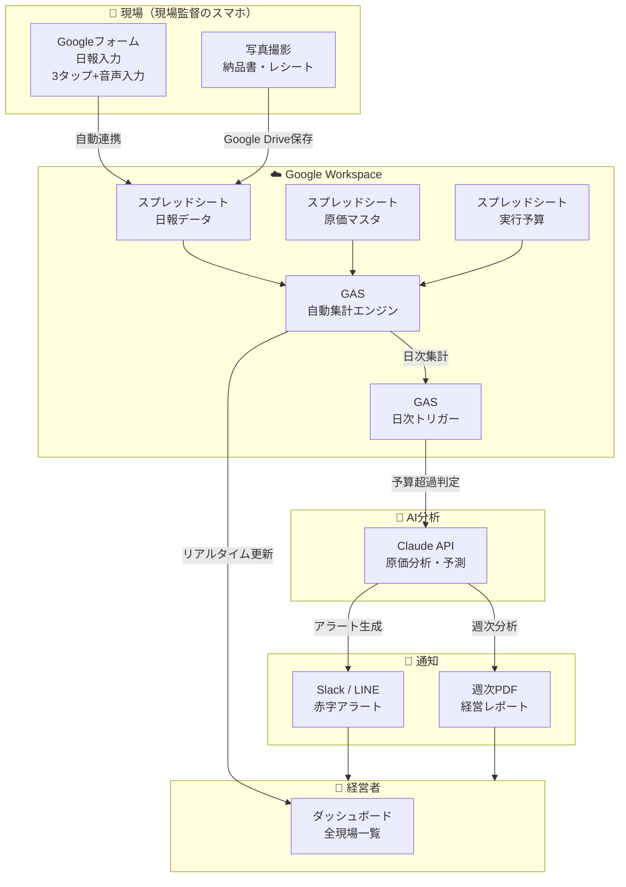

# 【建設業】日報→原価管理の自動集計で「赤字現場」を即発見

> POSTCABINETS 業務自動化コンサルティング｜提案用事例資料

> ※本事例は業界データに基づく想定です。実際の効果はクライアントの状況により異なります。

---

## 企業プロフィール

| 項目 | 内容 |
|------|------|
| 社名 | 丸山建設株式会社（仮名） |
| 所在地 | 大阪府堺市 |
| 創業 | 1987年（2代目が2019年に事業承継） |
| 年商 | 約4.8億円 |
| 従業員 | 正社員18名（現場監督4名・職人8名・営業2名・事務3名・社長） |
| 主要工事 | 住宅リフォーム（売上の55%）、小規模土木（30%）、店舗内装（15%） |
| 年間工事件数 | 約120件（リフォーム80件・土木25件・内装15件） |
| 同時進行現場 | 常時8〜12現場 |
| 元請比率 | 70%（残り30%は地場ゼネコンの下請） |
| 主な発注元 | 個人宅（リフォーム）、市の公共工事（土木）、不動産会社（内装） |

**なぜこの規模か：** 年商3〜10億、従業員15〜30名の建設会社は全国に約2万社（出典：国土交通省「建設業許可業者数調査」2024年3月末 https://www.mlit.go.jp/totikensangyo/const/content/001746571.pdf ）。原価管理を「社長の頭の中」と「事務員のExcel」で回しているゾーンで、最もDX効果が出やすい。建設業全体の約7割が従業員4人以下の小規模事業者だが、そこは自動化提案の対象にはなりにくい（出典：一般財団法人 建設業振興基金「建設業ハンドブック2024」）。「事務員がいて、Excelは使っているが、システムは入れていない」層がターゲット。

---

## 経営者の生の悩み（丸山社長・42歳の言葉で）

> 「うちは親父の代から"どんぶり勘定"でやってきた。受注のときに見積もって、実行予算も一応つくる。でも工事が始まったら、現場監督は忙しくて日報なんかまともに書かない。月末に事務の山田さんが請求書の束と出面帳を突き合わせて、やっと『この現場、赤字ですよ』って言ってくる。そのときにはもう工事は終わってる。」

> 「先月も堺市の舗装工事で、追加の砕石搬入と残土処分が予算を200万超えてた。現場の田中は『しゃーないっすよ、地盤が思ったより悪かったんで』って言うけど、2週間前に言ってくれたら段取り変えられた。200万あったらパートさん1人雇える。」

> 「2024年4月から残業の上限規制が始まって、今まで月80時間くらい残業してた監督たちを45時間に収めなあかん。でも書類仕事が減るわけやない。日報書いて、写真整理して、出来高つけて。これを現場で夜8時までやって、家帰って翌日の段取り。これじゃ若い子が辞めるのも当然やわ。実際うちも去年、入社3年目の監督が辞めた。」

> 「ANDPADとか施工管理アプリの営業はよう来る。でも初期費用10万、月3万6千円〜って言われて、うちみたいな18人の会社には重い。しかも職人がスマホ使えるかって話もあるし。」

---

## 現場のオペレーション

### 現場監督の1日（田中主任・34歳・2級建築施工管理技士）

| 時刻 | 行動 | 原価管理との関係 |
|------|------|-----------------|
| 6:30 | 自宅出発。車内で今日の搬入予定を確認（LINEグループ） | — |
| 7:00 | 現場着。資材搬入の立会い、KY（危険予知）活動の準備 | 資材の納品書を受け取る→**ポケットに入れる** |
| 7:30 | 朝礼。本日の作業内容・安全注意事項を職人に共有 | — |
| 8:00 | 午前の施工開始。品質チェック・写真撮影（スマホで100枚/日） | — |
| 10:00 | 別現場に移動（掛け持ち2現場）。途中で建材店に寄って追加部材を現金購入 | **レシートをダッシュボードに放置** |
| 12:00 | 昼休憩。LINEで社長から「あの現場の出来高どうなってる？」→「あとで確認します」 | 出来高を正確に把握していない |
| 13:00 | 2つ目の現場で打合せ。施主の追加要望を口頭で受ける | **追加工事の金額未確定のまま着手** |
| 15:00 | 元の現場に戻る。外注の左官屋さんの作業完了を確認 | 外注の出面（何人工来たか）を**手帳にメモ** |
| 17:00 | 職人退場後、現場片付け・明日の段取り | — |
| 18:00 | 事務所に戻る。**ここから日報作成** | A4の紙の日報用紙に手書きで記入 |
| 18:30 | 工事写真をPCに取り込み・整理 | — |
| 19:00 | 明日の材料手配（電話・LINE） | — |
| 19:30 | 退社。ポケットの納品書を机に置く（翌日事務に渡す予定） | **翌日忘れて、3日後にまとめて渡す** |

**問題の構造：** 現場監督は「施工管理」「安全管理」「品質管理」「工程管理」の4大管理に追われており、原価管理は後回しになる。日報は「書かなければいけないもの」だが「経営に使えるデータ」として入力されていない。

---

### 事務員の1日（山田さん・52歳・勤続14年・建設業経理士2級）

| 時刻 | 行動 | 原価管理との関係 |
|------|------|-----------------|
| 8:30 | 出社。メール確認・電話対応 | — |
| 9:00 | **前日分の日報を回収**（紙。書いてない監督には催促のLINE） | 日報が揃わないと集計できない |
| 9:30 | 日報の内容を**工事台帳（Excel）に手入力** | 現場名・工種・人工数・使用資材を転記 |
| 10:30 | 納品書・請求書の仕分け（現場別にファイリング） | 監督がまとめて持ってくるので日付がバラバラ |
| 11:00 | 外注業者からの請求書チェック・支払準備 | 出面帳と請求書の人工数が合わない→電話確認 |
| 12:00 | 昼休憩 | — |
| 13:00 | 銀行振込・入金確認 | — |
| 14:00 | **工事台帳の原価集計**（Excel関数で材料費+労務費+外注費+経費） | VLOOKUP地獄。ファイルが重くて落ちる |
| 15:00 | 社長から「あの現場、今いくらかかってる？」→**1時間かけて集計** | リアルタイムの数字が出せない |
| 16:00 | 見積書作成の補助 | — |
| 17:00 | 退社。**月末は20時まで残業**（原価集計のため） | — |

**山田さんの本音：**
> 「月末の3日間は地獄です。12現場分の台帳を全部開いて、請求書と突き合わせて。1つの現場で30分かかるから、12現場で6時間。それを3回チェックする。目がしょぼしょぼになる。去年、隣の建設会社の事務さんが辞めて、うちに『山田さん来てくれへん？』って声かかった。正直、揺らぎました。」

---

### 月末の原価集計の流れ（分単位で再現）

**毎月25日〜月末：3日間の作業**

#### Day 1（25日）：データ収集 — 約5時間

| 時間 | 作業 | 所要時間 |
|------|------|---------|
| 9:00 | 全監督にLINE「今月分の日報・納品書・レシートを今日中に出してください」 | 5分 |
| 9:05 | 返信を待ちながら、手元にある分の納品書を現場別に仕分け | 60分 |
| 10:05 | 外注業者からの請求書（FAXとメール）を印刷・現場別に仕分け | 45分 |
| 10:50 | 監督Aが日報をまとめて持ってくる（7日分）。「すんません、溜めてました」 | — |
| 11:00 | 監督Aの日報を読解（字が汚い・略語が多い）→工事台帳に転記 | 90分 |
| 12:30 | 昼休憩 | — |
| 13:30 | 監督Bの日報はLINEで写真送付（紙の日報を撮影）。画質が悪くて読めない箇所あり→電話確認 | 30分 |
| 14:00 | 監督B分の転記 | 60分 |
| 15:00 | 監督C・Dの分がまだ来ない。再度催促 | — |
| 15:30 | 納品書に現場名が書いてないものが3枚。「どの現場のですか？」と監督に確認電話 | 20分 |
| 16:00 | 現金支出のレシート整理（コンビニ弁当？資材？判別がつかない）| 30分 |

#### Day 2（26日）：転記・集計 — 約6時間

| 時間 | 作業 | 所要時間 |
|------|------|---------|
| 9:00 | 残りの監督分の日報を転記 | 120分 |
| 11:00 | 材料費の集計（納品書の金額を現場別Excelに入力） | 90分 |
| 12:30 | 昼休憩 | — |
| 13:30 | 労務費の計算（自社職人の出面×日当、外注は請求書ベース） | 60分 |
| 14:30 | 外注費・経費の入力 | 60分 |
| 15:30 | 各現場の実行予算と実績の対比表を作成 | 60分 |
| 16:30 | **ここで初めて「堺市舗装工事が予算比120%」と判明** | — |
| 17:00 | 社長に報告→「なんで今頃わかるんや！」 | — |

#### Day 3（27日）：修正・レポート — 約4時間

| 時間 | 作業 | 所要時間 |
|------|------|---------|
| 9:00 | 前日の集計数字を再チェック。**転記ミス2件発見**（現場の付け間違い） | 60分 |
| 10:00 | 修正→再集計 | 30分 |
| 10:30 | 社長向け月次報告書（A3・1枚）を作成 | 90分 |
| 12:00 | 社長に報告。赤字現場の説明。「次からは早めに教えてくれ」（毎月言われる） | 30分 |

**合計：約15時間/月（通常業務に加えて）**

---

## ボトルネック分析

### 赤字現場の発見が遅れるメカニズム（構造的問題）

```
┌─────────────────────────────────────────────────────────┐
│ 実行予算作成（受注時）                                      │
│  材料費 300万 + 労務費 200万 + 外注費 150万 + 経費 50万     │
│  = 原価 700万 → 受注額 900万 → 粗利 200万（粗利率22%）     │
└────────────────────┬────────────────────────────────────┘
                     ▼
┌─────────────────────────────────────────────────────────┐
│ 工事着工〜施工中（1〜3ヶ月）                                │
│                                                           │
│ ● 追加工事の口頭発注（金額未確定）                          │
│ ● 地盤不良で追加掘削（予定外の重機手配）                     │
│ ● 職人の出戻り（やり直し）が発生                            │
│ ● 資材の価格高騰（見積時と納品時で差額）                     │
│                                                           │
│ → これらが「見えない原価増」として蓄積                      │
│ → 現場監督は「まぁ大丈夫やろ」で進行                       │
│ → 日報には「作業内容」は書くが「金額」は書かない             │
└────────────────────┬────────────────────────────────────┘
                     ▼
┌─────────────────────────────────────────────────────────┐
│ 月末（事務員が集計してはじめて数字が出る）                   │
│                                                           │
│  実際の原価：材料費 380万 + 労務費 240万 + 外注費 200万     │
│             + 経費 60万 = 880万                            │
│  → 粗利 20万（粗利率2.2%）                                │
│  → 実質赤字（一般管理費を乗せると▲30万）                   │
└─────────────────────────────────────────────────────────┘
```

**赤字現場が「構造的に」発見できない理由：**

1. **時間差の問題**：原価の発生（材料購入・外注発注）と認識（請求書到着・事務処理）に2〜4週間のタイムラグがある
2. **情報の分散**：原価データが「監督のポケットの納品書」「外注のFAX」「LINEの写真」「監督の記憶」に散在
3. **日報の設計ミス**：日報が「作業記録」であって「原価記録」になっていない。「今日使った材料の金額」「外注の人工数」を記入する欄がない
4. **歩掛との乖離が見えない**：実行予算で想定した歩掛（例：型枠1m2あたり0.3人工）と実際の投入人工を比較する仕組みがない
5. **出来高の把握が主観的**：「70%くらい終わってる」という監督の感覚値で、実際の出来高率と原価消化率を対比できない

### 転記ミスの発生箇所

| 発生箇所 | 頻度 | 影響額（年間） |
|----------|------|-------------|
| 日報の現場名間違い（掛け持ち監督が別現場の材料を誤記） | 月2〜3件 | 材料費の配賦ミスで粗利が不正確 |
| 納品書の金額読み間違い（手書き伝票） | 月1〜2件 | 1件あたり数千〜数万円の誤差 |
| Excelのセル参照ずれ（行挿入で関数が壊れる） | 年2〜3回 | 発見が遅れると数十万円の集計ミス |
| 外注の人工数の認識違い（0.5人工の端数処理） | 月3〜4件 | 年間で20〜40万円の過少/過大計上 |
| 現金支出の経費計上漏れ（レシート紛失） | 月5〜10件 | 年間30〜50万円の原価漏れ |

**推定：転記ミスによる年間の原価把握誤差は100〜200万円。** これは丸山建設の年間粗利（約1.1億×23%=約2,500万円）の4〜8%に相当する。

### 事務員離職のリスク

山田さん（52歳）が辞めた場合のインパクト：

- **引き継ぎ期間**：最低3ヶ月（工事台帳のExcelの「暗黙のルール」が多すぎる）
- **採用コスト**：建設業経理の経験者は希少。人材紹介料で年収の30%=約100万円
- **品質低下期間**：新人が同じ精度で集計できるまで6ヶ月〜1年
- **属人化リスク**：山田さんしか知らない「この外注さんは月末〆の翌月20日払い」「この材料屋は消費税別で請求してくる」等の暗黙知が消失

**建設業の事務職の有効求人倍率は3倍超。** 「辞めたら代わりが見つからない」が現実（出典：厚生労働省「一般職業紹介状況」2024年 https://www.mhlw.go.jp/stf/newpage_00021.html ）。

---

## 導入による経営インパクト

### Before / After 表

| 項目 | Before | After | 改善効果 |
|------|--------|-------|---------|
| 赤字現場の発見タイミング | 工事完了後（月末集計時） | 予算消化率80%到達時（工事中） | **3〜4週間早期化** |
| 月末の原価集計時間 | 15時間/月（事務員） | 2時間/月（自動集計+確認） | **13時間/月削減** |
| 日報の記入時間 | 30分/日（手書き→事務転記） | 3分/日（スマホフォーム） | **監督1人あたり年間100時間削減** |
| 転記ミスによる原価誤差 | 年間100〜200万円 | ほぼゼロ（自動転記） | **年間100〜200万円の精度改善** |
| 社長への経営レポート | 月1回（3日遅れ） | 毎日自動更新 | **意思決定スピード30倍** |
| 追加工事の金額把握 | 口頭→忘却→未請求 | フォーム記録→自動集計 | **追加工事の請求漏れ防止** |
| 事務員の月末残業 | 約15時間/月 | 約2時間/月 | **月13時間の残業削減** |

### ROI計算（粗利率改善の金額インパクト）

**前提条件：**
- 年商4.8億円、現状の粗利率23%（業界平均）
- 現状の粗利額：4.8億 × 23% = **1.1億円**

**改善効果の内訳：**

| 効果項目 | 金額（年間） | 根拠 |
|----------|------------|------|
| 赤字現場の早期発見による損失回避 | **300〜500万円** | 年間120件中、赤字リスク現場は約15%=18件。うち月末まで気づかず損失が確定するのが2〜3件。早期検知で予算超過を50%カット→1件あたり150〜200万円の損失軽減（国交省「建設業経営分析」2023年度版における完成工事総利益率21.8%を基準に逆算） |
| 追加工事の請求漏れ防止 | **100〜200万円** | 追加工事の5〜10%が未請求。年間追加工事額2,000万円として |
| 転記ミスの解消 | **100〜200万円** | 原価の配賦ミス・計上漏れの解消 |
| 事務員の残業削減 | **約30万円** | 月13時間 × 12ヶ月 × 時給2,000円 |
| 現場監督の日報時間削減 | **約120万円** | 4名 × 年100時間 × 時給3,000円相当 |
| **合計効果** | **650〜1,050万円/年** | |

**導入コスト：**

| 項目 | 金額 |
|------|------|
| 構築費用（POSTCABINETS提案） | 50〜80万円（初期） |
| 月額運用費（Googleワークスペース＋Claude API） | 約1〜2万円/月 |
| 年間運用コスト | 約15〜25万円 |

**ROI 3シナリオ：**

| シナリオ | 年間効果 | 初年度ROI | 投資回収 |
|----------|---------|----------|---------|
| 保守的（赤字現場1件のみ軌道修正＋転記ミス半減） | 350万円 | 350% | 3ヶ月 |
| 標準（上記表の中央値） | 850万円 | 850% | 1.5ヶ月 |
| 楽観的（赤字3件回避＋追加工事漏れゼロ＋事務効率化フル稼働） | 1,050万円 | 1,050% | 1ヶ月 |

**2年目以降は年間600〜1,000万円の純効果。**
**粗利率の改善幅：23% → 24.5〜25.5%（+1.5〜2.5ポイント）**

### 2024年問題への対応効果

| 規制内容 | 現状のリスク | 自動化による対応 |
|----------|------------|----------------|
| 時間外労働の上限：月45時間/年360時間 | 現場監督の月平均残業60〜80時間（うち書類作業20時間） | 日報3分化で書類作業を月10時間削減→上限内に収まる可能性 |
| 割増賃金率引上げ（月60時間超で50%） | 超過分の人件費が経営を圧迫 | 残業削減で割増賃金の発生自体を抑制 |
| 法定労働時間の厳格化 | 違反すると6ヶ月以下の懲役or30万円以下の罰金 | 勤務時間の自動記録で法令遵守を支援 |

---

## 自動化の全体設計

### アーキテクチャ図（Mermaid）



### なぜ Google フォーム + スプレッドシートか（ANDPAD等との比較）

| 比較項目 | Googleフォーム+GAS | ANDPAD | ダンドリワーク |
|----------|-------------------|--------|--------------|
| 初期費用 | **0円**（構築費は別途） | 10万円〜 | 20万円〜 |
| 月額費用 | **0円**（Google無料枠内） | 3.6万円〜 | 要問合せ（推定3〜5万円） |
| 年間コスト | **1〜2万円**（Claude API分） | **53万円〜** | **56万円〜** |
| 原価管理機能 | ◎ 自由設計（自社の業務に完全フィット） | △ 基本機能あり（カスタマイズ制限） | △ 基本機能あり |
| AI分析 | ◎ Claude APIで自由に構築 | × なし | × なし |
| 操作の簡単さ | ◎ フォーム選択式（3タップ） | ○ アプリUI | ○ アプリUI |
| 写真管理 | △ Drive連携（工夫が必要） | ◎ 専用機能あり | ◎ 専用機能あり |
| 工程表管理 | × 別途必要 | ◎ ガントチャート | ◎ ガントチャート |
| 図面共有 | × 別途必要 | ◎ 専用機能 | ◎ 専用機能 |
| 導入の敷居 | ◎ Googleアカウントのみ | △ 全員にアプリ導入が必要 | △ 全員にアプリ導入が必要 |
| 外注業者の巻き込み | ◎ URLを送るだけ | △ アプリDLが必要 | △ アプリDLが必要 |

**ポジショニング：**
- ANDPAD/ダンドリワークは「施工管理の総合プラットフォーム」。写真・図面・工程表・チャットまで含む。年間50万円超の投資に見合う規模感（年商10億〜）の企業向け。
- Google フォーム+GAS は「原価管理に特化したスモールスタート」。年商3〜8億の中小建設会社が、**まず原価の見える化だけを実現する**ための最小構成。
- 将来的にANDPAD等に移行する場合も、スプレッドシートのデータ構造がそのまま活きる。

---

## 構築手順（GASの実コード付き）

### Step 1: Googleフォーム設計（現場監督が3タップで入力できる）

**設計思想：** 現場監督が17時の職人退場後、スマホで3分以内に入力完了できること。自由記述は最小限。選択式＋数値入力が中心。

> **つまずきポイント:**
> - フォームの「現場名」プルダウンは手動で選択肢を追加しがち。後述のGASで**マスタシートから自動更新**する仕組みを忘れずに設定する。
> - 画像添付（納品書・レシート）はGoogleフォームの「ファイルアップロード」を使うが、回答者にGoogleアカウントが必要。職人がGoogleアカウントを持っていない場合は、**LINEで写真を送ってもらいGoogle Driveに保存する別フロー**を検討する。
> - スマホでの入力テストは必ず実機で行う。PCでは快適でも、スマホではプルダウンが長すぎて選びにくい等の問題が出る。

**フォームの項目設計：**

| # | 項目名 | 入力形式 | 選択肢/備考 |
|---|--------|---------|------------|
| 1 | 日付 | 日付選択 | デフォルト今日 |
| 2 | 現場名 | プルダウン | マスタから自動生成（10現場程度） |
| 3 | 記入者 | プルダウン | 監督4名の名前 |
| 4 | 天候 | プルダウン | 晴/曇/雨/雪 |
| 5 | 自社職人の出面 | 数値 | 人工数（0.5刻み） |
| 6 | 外注業者名 | チェックボックス | マスタから（左官・電気・設備・塗装…） |
| 7 | 外注人工数 | 数値 | 業者ごとに（0.5刻み） |
| 8 | 使用資材と金額 | 短文 | 「砕石 3t 45,000円」等。音声入力推奨 |
| 9 | 重機使用 | チェックボックス | バックホウ/クレーン/ダンプ/なし |
| 10 | 重機時間 | 数値 | 時間単位 |
| 11 | 出来高（%） | スライダー | 0〜100%（10%刻み） |
| 12 | 追加工事・変更 | 長文（任意） | 口頭指示の記録用 |
| 13 | 明日の予定 | 長文（任意） | 段取り共有用 |
| 14 | 写真（納品書・レシート） | 画像添付 | 撮影してそのまま添付 |

**Tips：**
- 現場名のプルダウンは、マスタシートから `GAS` で自動更新する（後述）
- 外注業者のチェックボックスも同様にマスタ連動
- スマホのホーム画面にフォームのショートカットを追加させる

---

### Step 2: 原価マスタ + 集計シート

> **つまずきポイント:**
> - マスタシートの単価は**税抜**で統一する。混在すると集計が合わなくなる。
> - 現場コードは「年度+連番」（例: S2024-001）にしておくと、年度をまたいだ集計が楽になる。
> - スプレッドシートは1ファイルあたり1,000万セルが上限。年間120現場×365日分のデータは余裕だが、写真URLや長文メモを入れすぎるとファイルが重くなる。

**スプレッドシートの構成（3シート）：**

#### シート1: `マスタ_現場`

| 現場コード | 現場名 | 工事種別 | 受注額 | 実行予算_材料 | 実行予算_労務 | 実行予算_外注 | 実行予算_経費 | 実行予算_合計 | 着工日 | 完工予定日 | ステータス |
|-----------|--------|---------|--------|-------------|-------------|-------------|-------------|-------------|--------|----------|----------|
| S2024-001 | 堺市舗装工事 | 土木 | 9,000,000 | 3,000,000 | 2,000,000 | 1,500,000 | 500,000 | 7,000,000 | 2024/4/1 | 2024/6/30 | 進行中 |

#### シート2: `マスタ_単価`

| 区分 | 名称 | 単価 | 単位 | 備考 |
|------|------|------|------|------|
| 労務 | 自社職人 | 18,000 | 人工 | 日当ベース |
| 労務 | 自社監督 | 22,000 | 人工 | 管理費含む |
| 外注 | 左官工 | 25,000 | 人工 | |
| 外注 | 電気工 | 28,000 | 人工 | |
| 重機 | バックホウ0.45 | 35,000 | 日 | 回送費別 |
| 重機 | 4tダンプ | 28,000 | 日 | 燃料込 |

#### シート3: `集計_原価`（GASで自動生成）

| 現場コード | 現場名 | 予算合計 | 実績_材料 | 実績_労務 | 実績_外注 | 実績_経費 | 実績合計 | 予算消化率 | 出来高% | 原価率 | ステータス |
|-----------|--------|---------|----------|----------|----------|----------|---------|----------|--------|--------|---------|
| S2024-001 | 堺市舗装 | 7,000,000 | 3,800,000 | 2,400,000 | 2,000,000 | 600,000 | 8,800,000 | 125.7% | 90% | 139.7% | 🔴赤字警告 |

**ステータスの自動判定ルール：**
- 予算消化率 ≦ 出来高% × 1.05 → 🟢 正常
- 予算消化率 ≦ 出来高% × 1.15 → 🟡 注意
- 予算消化率 > 出来高% × 1.15 → 🔴 赤字警告

---

### Step 3: GAS による自動集計 + Claude API 日次原価分析

> **つまずきポイント（GASの6分制限）:**
> - Google Apps Scriptは1回の実行が**最大6分**で強制終了される。現場数が20を超える場合や、Claude API呼び出しのレスポンスが遅い場合にタイムアウトする可能性がある。
> - **対策1**: `dailyCostAnalysis()` と `weeklyReport()` は別トリガーに分ける（同時実行しない）。
> - **対策2**: 現場数が多い場合は `PropertiesService` に処理済みインデックスを保存し、複数回に分けて実行するバッチ分割パターンを使う。
> - **対策3**: Claude API呼び出しのタイムアウトは `UrlFetchApp.fetch` の第2引数に `{muteHttpExceptions: true}` を指定し、30秒以内にレスポンスが返らない場合はリトライロジックを入れる。

```javascript
// ============================================================
// construction-cost-manager.gs
// 建設業 日報→原価自動集計 + Claude API分析
// ============================================================

// --- 設定 ---
const CONFIG = {
  SPREADSHEET_ID: 'YOUR_SPREADSHEET_ID',  // スプレッドシートのID
  CLAUDE_API_KEY: PropertiesService.getScriptProperties().getProperty('CLAUDE_API_KEY'),
  SLACK_WEBHOOK_URL: PropertiesService.getScriptProperties().getProperty('SLACK_WEBHOOK_URL'),

  // シート名
  SHEET_DAILY_REPORT: '日報データ',      // フォーム回答が入るシート
  SHEET_MASTER_SITE: 'マスタ_現場',
  SHEET_MASTER_PRICE: 'マスタ_単価',
  SHEET_COST_SUMMARY: '集計_原価',
  SHEET_ALERT_LOG: 'アラートログ',

  // 閾値
  THRESHOLD_WARNING: 1.05,  // 出来高対比で5%超過→注意
  THRESHOLD_DANGER: 1.15,   // 出来高対比で15%超過→赤字警告
};

/**
 * フォーム送信時のトリガー（自動実行）
 * Googleフォームの回答がスプレッドシートに追記されたときに発火
 */
function onFormSubmit(e) {
  const sheet = SpreadsheetApp.openById(CONFIG.SPREADSHEET_ID);
  const reportSheet = sheet.getSheetByName(CONFIG.SHEET_DAILY_REPORT);
  const lastRow = reportSheet.getLastRow();

  // 最新の日報データを取得
  const row = reportSheet.getRange(lastRow, 1, 1, reportSheet.getLastColumn()).getValues()[0];

  const report = {
    timestamp: row[0],
    date: row[1],
    siteName: row[2],
    reporter: row[3],
    weather: row[4],
    ownWorkers: parseFloat(row[5]) || 0,      // 自社職人の人工数
    subcontractors: row[6],                     // 外注業者名（カンマ区切り）
    subWorkers: parseFloat(row[7]) || 0,        // 外注人工数
    materials: row[8],                          // 使用資材と金額（テキスト）
    equipment: row[9],                          // 重機使用
    equipmentHours: parseFloat(row[10]) || 0,   // 重機時間
    progress: parseFloat(row[11]) || 0,         // 出来高%
    additionalWork: row[12],                    // 追加工事・変更
    tomorrowPlan: row[13],                      // 明日の予定
  };

  // 原価を自動計算
  const dailyCost = calculateDailyCost(report, sheet);

  // 集計シートを更新
  updateCostSummary(report, dailyCost, sheet);

  // 予算超過チェック
  checkBudgetAlert(report.siteName, sheet);
}

/**
 * 日報データから日次原価を自動計算
 */
function calculateDailyCost(report, spreadsheet) {
  const priceSheet = spreadsheet.getSheetByName(CONFIG.SHEET_MASTER_PRICE);
  const priceData = priceSheet.getDataRange().getValues();

  // 単価マスタをオブジェクトに変換
  const prices = {};
  for (let i = 1; i < priceData.length; i++) {
    const key = `${priceData[i][0]}_${priceData[i][1]}`;
    prices[key] = {
      price: priceData[i][2],
      unit: priceData[i][3],
    };
  }

  // 労務費計算（自社）
  const laborCost = report.ownWorkers * (prices['労務_自社職人']?.price || 18000);

  // 外注費計算
  let subCost = 0;
  if (report.subcontractors) {
    const subs = report.subcontractors.split(',').map(s => s.trim());
    subs.forEach(sub => {
      const key = `外注_${sub}`;
      const unitPrice = prices[key]?.price || 25000;
      subCost += report.subWorkers * unitPrice / subs.length;
    });
  }

  // 材料費（テキストから金額を抽出）
  const materialCost = extractAmountFromText(report.materials);

  // 重機費
  let equipmentCost = 0;
  if (report.equipment && report.equipment !== 'なし') {
    const equipments = report.equipment.split(',').map(e => e.trim());
    equipments.forEach(eq => {
      const key = `重機_${eq}`;
      equipmentCost += (prices[key]?.price || 30000) * (report.equipmentHours / 8);
    });
  }

  return {
    labor: laborCost,
    subcontract: subCost,
    material: materialCost,
    equipment: equipmentCost,
    total: laborCost + subCost + materialCost + equipmentCost,
  };
}

/**
 * テキストから金額を抽出（「砕石 3t 45,000円」→ 45000）
 */
function extractAmountFromText(text) {
  if (!text) return 0;
  const matches = text.match(/[\d,]+円/g);
  if (!matches) return 0;
  return matches.reduce((sum, m) => {
    return sum + parseInt(m.replace(/[,円]/g, ''), 10);
  }, 0);
}

/**
 * 集計シートを更新
 */
function updateCostSummary(report, dailyCost, spreadsheet) {
  const summarySheet = spreadsheet.getSheetByName(CONFIG.SHEET_COST_SUMMARY);
  const data = summarySheet.getDataRange().getValues();

  // 現場名で行を検索
  let targetRow = -1;
  for (let i = 1; i < data.length; i++) {
    if (data[i][1] === report.siteName) {
      targetRow = i + 1; // 1-indexed
      break;
    }
  }

  if (targetRow === -1) {
    // 新規現場の場合は行を追加（マスタから予算を取得）
    const masterSheet = spreadsheet.getSheetByName(CONFIG.SHEET_MASTER_SITE);
    const masterData = masterSheet.getDataRange().getValues();
    const siteInfo = masterData.find(row => row[1] === report.siteName);
    if (!siteInfo) return;

    targetRow = summarySheet.getLastRow() + 1;
    summarySheet.getRange(targetRow, 1).setValue(siteInfo[0]); // 現場コード
    summarySheet.getRange(targetRow, 2).setValue(siteInfo[1]); // 現場名
    summarySheet.getRange(targetRow, 3).setValue(siteInfo[8]); // 予算合計
  }

  // 実績を加算
  const currentMaterial = summarySheet.getRange(targetRow, 4).getValue() || 0;
  const currentLabor = summarySheet.getRange(targetRow, 5).getValue() || 0;
  const currentSub = summarySheet.getRange(targetRow, 6).getValue() || 0;
  const currentEquip = summarySheet.getRange(targetRow, 7).getValue() || 0;

  summarySheet.getRange(targetRow, 4).setValue(currentMaterial + dailyCost.material);
  summarySheet.getRange(targetRow, 5).setValue(currentLabor + dailyCost.labor);
  summarySheet.getRange(targetRow, 6).setValue(currentSub + dailyCost.subcontract);
  summarySheet.getRange(targetRow, 7).setValue(currentEquip + dailyCost.equipment);

  const newTotal = (currentMaterial + dailyCost.material) +
                   (currentLabor + dailyCost.labor) +
                   (currentSub + dailyCost.subcontract) +
                   (currentEquip + dailyCost.equipment);
  summarySheet.getRange(targetRow, 8).setValue(newTotal);

  // 予算消化率
  const budget = summarySheet.getRange(targetRow, 3).getValue();
  const consumptionRate = budget > 0 ? newTotal / budget : 0;
  summarySheet.getRange(targetRow, 9).setValue(consumptionRate);

  // 出来高を更新
  summarySheet.getRange(targetRow, 10).setValue(report.progress / 100);

  // 原価率（実績原価 / 出来高相当の受注額）
  const masterSheet = spreadsheet.getSheetByName(CONFIG.SHEET_MASTER_SITE);
  const masterData = masterSheet.getDataRange().getValues();
  const siteInfo = masterData.find(row => row[1] === report.siteName);
  if (siteInfo) {
    const earnedValue = siteInfo[3] * (report.progress / 100); // 受注額 × 出来高%
    const costRatio = earnedValue > 0 ? newTotal / earnedValue : 0;
    summarySheet.getRange(targetRow, 11).setValue(costRatio);
  }

  // ステータス判定
  const progress = report.progress / 100;
  let status = '🟢 正常';
  if (consumptionRate > progress * CONFIG.THRESHOLD_DANGER) {
    status = '🔴 赤字警告';
  } else if (consumptionRate > progress * CONFIG.THRESHOLD_WARNING) {
    status = '🟡 注意';
  }
  summarySheet.getRange(targetRow, 12).setValue(status);
}

/**
 * 予算超過チェック＋アラート送信
 */
function checkBudgetAlert(siteName, spreadsheet) {
  const summarySheet = spreadsheet.getSheetByName(CONFIG.SHEET_COST_SUMMARY);
  const data = summarySheet.getDataRange().getValues();

  const siteRow = data.find(row => row[1] === siteName);
  if (!siteRow) return;

  const status = siteRow[11]; // ステータス列

  if (status.includes('赤字警告') || status.includes('注意')) {
    const message = buildAlertMessage(siteRow);
    sendSlackAlert(message);
    logAlert(siteRow, spreadsheet);
  }
}

/**
 * アラートメッセージを構築
 */
function buildAlertMessage(siteRow) {
  const siteName = siteRow[1];
  const budget = siteRow[2];
  const actual = siteRow[7];
  const consumptionRate = siteRow[8];
  const progress = siteRow[9];
  const status = siteRow[11];

  const overBudget = actual - budget;

  return {
    text: `${status} 原価アラート`,
    blocks: [
      {
        type: 'header',
        text: {
          type: 'plain_text',
          text: `${status} 原価アラート: ${siteName}`,
        },
      },
      {
        type: 'section',
        fields: [
          { type: 'mrkdwn', text: `*実行予算:*\n¥${budget.toLocaleString()}` },
          { type: 'mrkdwn', text: `*実績原価:*\n¥${actual.toLocaleString()}` },
          { type: 'mrkdwn', text: `*予算消化率:*\n${(consumptionRate * 100).toFixed(1)}%` },
          { type: 'mrkdwn', text: `*出来高:*\n${(progress * 100).toFixed(0)}%` },
        ],
      },
      {
        type: 'section',
        text: {
          type: 'mrkdwn',
          text: overBudget > 0
            ? `⚠️ 予算を *¥${overBudget.toLocaleString()}* 超過しています。現場監督に原因確認を推奨します。`
            : `⚠️ 出来高に対して原価消化ペースが速いです。このまま進むと予算超過の可能性があります。`,
        },
      },
    ],
  };
}

/**
 * Slack Webhook でアラート送信
 */
function sendSlackAlert(message) {
  if (!CONFIG.SLACK_WEBHOOK_URL) return;

  UrlFetchApp.fetch(CONFIG.SLACK_WEBHOOK_URL, {
    method: 'post',
    contentType: 'application/json',
    payload: JSON.stringify(message),
  });
}

/**
 * LINE通知（Slack代替。LINE Messaging API Pushを使う場合）
 * ※ LINE Notify APIは2025年3月末にサービス終了済み。
 *   代わりにLINE Messaging APIのPush Messageを使用する。
 */
function sendLinePush(message) {
  const LINE_CHANNEL_TOKEN = PropertiesService.getScriptProperties().getProperty('LINE_CHANNEL_ACCESS_TOKEN');
  const TARGET_USER_ID = PropertiesService.getScriptProperties().getProperty('LINE_TARGET_USER_ID');
  if (!LINE_CHANNEL_TOKEN || !TARGET_USER_ID) return;

  UrlFetchApp.fetch('https://api.line.me/v2/bot/message/push', {
    method: 'post',
    headers: {
      'Authorization': `Bearer ${LINE_CHANNEL_TOKEN}`,
      'Content-Type': 'application/json',
    },
    payload: JSON.stringify({
      to: TARGET_USER_ID,
      messages: [{ type: 'text', text: message }],
    }),
  });
}

/**
 * アラートをログシートに記録
 */
function logAlert(siteRow, spreadsheet) {
  const logSheet = spreadsheet.getSheetByName(CONFIG.SHEET_ALERT_LOG)
    || spreadsheet.insertSheet(CONFIG.SHEET_ALERT_LOG);

  logSheet.appendRow([
    new Date(),
    siteRow[1],  // 現場名
    siteRow[11], // ステータス
    siteRow[8],  // 予算消化率
    siteRow[9],  // 出来高
    siteRow[7],  // 実績原価
    siteRow[2],  // 実行予算
  ]);
}

// ============================================================
// 日次バッチ: Claude APIで原価分析
// トリガー設定: 毎日21:00に実行
// ============================================================

/**
 * 全現場の原価状況をClaude APIで分析し、Slackにサマリーを送信
 */
function dailyCostAnalysis() {
  const spreadsheet = SpreadsheetApp.openById(CONFIG.SPREADSHEET_ID);
  const summarySheet = spreadsheet.getSheetByName(CONFIG.SHEET_COST_SUMMARY);
  const data = summarySheet.getDataRange().getValues();

  // ヘッダー行を除外し、進行中の現場のみ抽出
  const activeSites = data.slice(1).filter(row =>
    row[11] && !row[11].toString().includes('完了')
  );

  if (activeSites.length === 0) return;

  // 分析用プロンプトを構築
  const siteSummaries = activeSites.map(row => ({
    現場名: row[1],
    実行予算: row[2],
    実績原価: row[7],
    予算消化率: `${(row[8] * 100).toFixed(1)}%`,
    出来高: `${(row[9] * 100).toFixed(0)}%`,
    ステータス: row[11],
    材料費実績: row[3],
    労務費実績: row[4],
    外注費実績: row[5],
    経費実績: row[6],
  }));

  const prompt = `あなたは建設業の原価管理の専門家です。以下の現場別原価データを分析し、経営者に報告してください。

## 現場データ
${JSON.stringify(siteSummaries, null, 2)}

## 分析してほしいこと
1. 赤字リスクのある現場の特定と、その原因の推定
2. 全現場の原価傾向（材料費・労務費・外注費のバランス）
3. 今すぐ取るべきアクション（優先度順）
4. 今月の全社粗利の着地見込み

## 出力フォーマット
Slackに投稿するので、マークダウン形式で簡潔に。絵文字を適度に使用。`;

  const analysis = callClaudeAPI(prompt);

  // Slackに投稿
  sendSlackAlert({
    text: '📊 日次原価分析レポート',
    blocks: [
      {
        type: 'header',
        text: {
          type: 'plain_text',
          text: '📊 日次原価分析レポート',
        },
      },
      {
        type: 'section',
        text: {
          type: 'mrkdwn',
          text: analysis,
        },
      },
    ],
  });
}

/**
 * Claude API 呼び出し
 */
function callClaudeAPI(prompt) {
  if (!CONFIG.CLAUDE_API_KEY) {
    return '⚠️ Claude API キーが設定されていません。Script Properties に CLAUDE_API_KEY を設定してください。';
  }

  try {
    const response = UrlFetchApp.fetch('https://api.anthropic.com/v1/messages', {
      method: 'post',
      headers: {
        'Content-Type': 'application/json',
        'x-api-key': CONFIG.CLAUDE_API_KEY,
        'anthropic-version': '2023-06-01',
      },
      payload: JSON.stringify({
        model: 'claude-sonnet-4-20250514',
        max_tokens: 2000,
        messages: [
          {
            role: 'user',
            content: prompt,
          },
        ],
      }),
    });

    const result = JSON.parse(response.getContentText());
    return result.content[0].text;
  } catch (error) {
    Logger.log(`Claude API error: ${error}`);
    return `⚠️ AI分析でエラーが発生しました: ${error.message}`;
  }
}

// ============================================================
// 週次バッチ: 経営レポートPDF生成
// トリガー設定: 毎週金曜18:00に実行
// ============================================================

/**
 * 週次経営レポートを生成してメール送信
 */
function weeklyReport() {
  const spreadsheet = SpreadsheetApp.openById(CONFIG.SPREADSHEET_ID);
  const summarySheet = spreadsheet.getSheetByName(CONFIG.SHEET_COST_SUMMARY);
  const data = summarySheet.getDataRange().getValues();

  const activeSites = data.slice(1).filter(row =>
    row[11] && !row[11].toString().includes('完了')
  );

  // レポート用の一時シートを作成
  const reportSheet = spreadsheet.insertSheet('_週次レポート_tmp');

  // ヘッダー
  reportSheet.getRange('A1').setValue('丸山建設 週次原価レポート');
  reportSheet.getRange('A1').setFontSize(16).setFontWeight('bold');
  reportSheet.getRange('A2').setValue(`作成日: ${Utilities.formatDate(new Date(), 'Asia/Tokyo', 'yyyy/MM/dd HH:mm')}`);

  // サマリー
  let totalBudget = 0, totalActual = 0;
  activeSites.forEach(row => {
    totalBudget += row[2] || 0;
    totalActual += row[7] || 0;
  });

  reportSheet.getRange('A4').setValue('全現場サマリー');
  reportSheet.getRange('A4').setFontSize(12).setFontWeight('bold');
  reportSheet.getRange('A5').setValue(`進行中現場数: ${activeSites.length}`);
  reportSheet.getRange('A6').setValue(`実行予算合計: ¥${totalBudget.toLocaleString()}`);
  reportSheet.getRange('A7').setValue(`実績原価合計: ¥${totalActual.toLocaleString()}`);
  reportSheet.getRange('A8').setValue(`全体予算消化率: ${(totalActual / totalBudget * 100).toFixed(1)}%`);

  // 現場別データ
  const headers = ['現場名', '実行予算', '実績原価', '予算消化率', '出来高', 'ステータス'];
  reportSheet.getRange(10, 1, 1, headers.length).setValues([headers]);
  reportSheet.getRange(10, 1, 1, headers.length).setFontWeight('bold');

  activeSites.forEach((row, i) => {
    reportSheet.getRange(11 + i, 1).setValue(row[1]);
    reportSheet.getRange(11 + i, 2).setValue(row[2]);
    reportSheet.getRange(11 + i, 3).setValue(row[7]);
    reportSheet.getRange(11 + i, 4).setValue(`${(row[8] * 100).toFixed(1)}%`);
    reportSheet.getRange(11 + i, 5).setValue(`${(row[9] * 100).toFixed(0)}%`);
    reportSheet.getRange(11 + i, 6).setValue(row[11]);

    // 赤字警告の行を赤くハイライト
    if (row[11] && row[11].toString().includes('赤字')) {
      reportSheet.getRange(11 + i, 1, 1, headers.length).setBackground('#FFCCCC');
    }
  });

  // 列幅調整
  reportSheet.autoResizeColumns(1, headers.length);

  // PDF化
  const pdfBlob = spreadsheet.getAs('application/pdf').setName(
    `原価レポート_${Utilities.formatDate(new Date(), 'Asia/Tokyo', 'yyyyMMdd')}.pdf`
  );

  // メール送信
  const recipientEmail = PropertiesService.getScriptProperties().getProperty('REPORT_EMAIL');
  if (recipientEmail) {
    MailApp.sendEmail({
      to: recipientEmail,
      subject: `【丸山建設】週次原価レポート ${Utilities.formatDate(new Date(), 'Asia/Tokyo', 'yyyy/MM/dd')}`,
      body: '週次原価レポートを添付します。赤字警告のある現場は早急に確認してください。',
      attachments: [pdfBlob],
    });
  }

  // 一時シートを削除
  spreadsheet.deleteSheet(reportSheet);
}

// ============================================================
// ユーティリティ: トリガー設定
// 初回のみ手動実行してトリガーを登録する
// ============================================================

/**
 * 初期セットアップ: トリガーを登録
 */
function setupTriggers() {
  // 既存のトリガーを削除
  ScriptApp.getProjectTriggers().forEach(trigger => {
    ScriptApp.deleteTrigger(trigger);
  });

  // フォーム送信トリガー
  const ss = SpreadsheetApp.openById(CONFIG.SPREADSHEET_ID);
  ScriptApp.newTrigger('onFormSubmit')
    .forSpreadsheet(ss)
    .onFormSubmit()
    .create();

  // 日次分析（毎日21:00）
  ScriptApp.newTrigger('dailyCostAnalysis')
    .timeBased()
    .everyDays(1)
    .atHour(21)
    .create();

  // 週次レポート（毎週金曜18:00）
  ScriptApp.newTrigger('weeklyReport')
    .timeBased()
    .onWeekDay(ScriptApp.WeekDay.FRIDAY)
    .atHour(18)
    .create();

  Logger.log('トリガーを登録しました');
}

/**
 * Googleフォームの選択肢をマスタシートから自動更新
 * トリガー: マスタ更新時に手動実行、または日次バッチに含める
 */
function updateFormChoices() {
  const FORM_ID = PropertiesService.getScriptProperties().getProperty('FORM_ID');
  if (!FORM_ID) return;

  const form = FormApp.openById(FORM_ID);
  const spreadsheet = SpreadsheetApp.openById(CONFIG.SPREADSHEET_ID);

  // 現場名のプルダウンを更新
  const masterSheet = spreadsheet.getSheetByName(CONFIG.SHEET_MASTER_SITE);
  const masterData = masterSheet.getDataRange().getValues();

  const activeSites = masterData.slice(1)
    .filter(row => row[11] === '進行中')
    .map(row => row[1]); // 現場名

  // フォームの「現場名」項目を検索して更新
  const items = form.getItems();
  items.forEach(item => {
    if (item.getTitle() === '現場名' && item.getType() === FormApp.ItemType.LIST) {
      const listItem = item.asListItem();
      listItem.setChoiceValues(activeSites);
    }
  });

  Logger.log(`フォームの現場名を更新: ${activeSites.join(', ')}`);
}
```

---

### Step 4: Slack アラート（赤字予兆）

**アラートの種類と発火条件：**

| アラートレベル | 条件 | 通知先 | メッセージ例 |
|--------------|------|--------|------------|
| 🟡 注意 | 予算消化率 > 出来高×105% | Slack #cost-alert | 「堺市舗装工事の原価ペースが出来高を上回っています（消化率72% / 出来高60%）」 |
| 🔴 赤字警告 | 予算消化率 > 出来高×115% | Slack #cost-alert + 社長にDM | 「堺市舗装工事が赤字圏に入りました。予算700万に対し実績880万（消化率125%）。至急確認を」 |
| 📊 日次サマリー | 毎日21:00 | Slack #daily-report | Claude APIによる全現場の分析レポート |

**Slack チャンネル設計：**
- `#cost-alert` — 原価アラート専用。社長・監督が参加
- `#daily-report` — 日次/週次レポート。社長・事務員が参加
- `#construction-general` — 一般連絡（既存のLINEグループから移行）

> **LINE Messaging API Push での代替も可能。** 社長がSlackを使わない場合は、`sendLinePush()` を使ってLINEに通知。コードは上記GASに含まれている。（※ LINE Notify APIは2025年3月末にサービス終了済みのため、LINE Messaging APIのPush Messageを使用）

---

### Step 5: 週次経営レポート PDF

**レポートの構成：**

1. **全現場サマリー**（1ページ目）
   - 進行中現場数、予算合計、実績合計、全体の予算消化率
   - 赤字警告のある現場をハイライト

2. **現場別詳細**（2ページ目〜）
   - 現場ごとの予算 vs 実績の棒グラフ
   - 原価の内訳（材料費・労務費・外注費・経費）の円グラフ
   - 出来高推移の折れ線グラフ

3. **AI分析コメント**（最終ページ）
   - Claude APIによる原因分析と推奨アクション

**配信方法：**
- 毎週金曜18:00にPDFを自動生成
- 社長のメールアドレスに添付送信
- Slack `#daily-report` にもPDFを投稿

---

## 提案トークスクリプト

### 初回アプローチ（商工会議所の勉強会後、名刺交換の場面で）

> **自分：**「社長、今日のお話とても勉強になりました。ところで、今うちは建設会社さんの原価管理のお手伝いをしていまして。ちょっとお聞きしたいんですが、月末の原価集計って、今どうされてます？」

> **社長：**「うちは事務のパートさんがExcelでやってるよ。」

> **自分：**「やっぱりそうですよね。実は先日お手伝いした会社さんが、同じようにExcelで月末に15時間かけて集計してたんです。それを、現場監督さんがスマホで日報を入れるだけで、リアルタイムに原価が見えるようにしたら——」

> **社長：**「スマホ？うちの監督、そんなの使いこなせるかな。」

> **自分：**「そこなんです。ANDPADとかの施工管理アプリとは違って、Googleフォームの選択式なんで、現場名を選んで人工数を入れるだけ。3タップです。実際に触ってもらいましょうか？」

> *(スマホでデモフォームを見せる)*

> **社長：**「へぇ、これなら田中でもできるか。で、いくらかかるの？」

> **自分：**「初期の構築が50〜80万で、月額は1〜2万円です。ANDPADだと初期10万＋月3.6万〜ですけど、うちはGoogleの無料ツールベースなんで。それに、AIが毎日原価を分析して、赤字になりそうな現場を自動で教えてくれるんです。」

> **社長：**「赤字の現場が早めにわかるのは助かるな……。一度詳しく聞かせてもらえる？」

### キラーフレーズ集

| 場面 | フレーズ |
|------|---------|
| 興味の喚起 | 「竣工してから赤字がわかっても遅いですよね。工事の途中で"黄色信号"が出せたら、どうですか？」 |
| 費用の正当化 | 「赤字現場を1件防ぐだけで150万。初期費用は1件で回収です」 |
| 2024年問題への接続 | 「監督さんの日報が30分→3分になったら、月10時間の残業削減。上限規制にも効きますよ」 |
| 事務員リスクへの接続 | 「もし事務の方が辞められたら、この仕組み、引き継ぎ不要です。データは全部クラウドにあるので」 |
| 競合との差別化 | 「ANDPADは年間50万以上かかります。うちはその1/3以下で、原価管理に特化して確実に効果を出します」 |
| クロージング | 「まず1現場だけ、来月から試しませんか？効果が出なければ費用はいただきません」 |

---

## 法規制・リスク

| 項目 | 内容 | 対応 |
|------|------|------|
| 個人情報保護 | 日報に作業員名が含まれる | プライバシーポリシーを整備。Googleワークスペースの権限設定で閲覧範囲を限定 |
| 建設業法 | 施工体制台帳・再下請通知書の保管義務 | 本システムは原価管理に特化。法定帳簿の代替にはならない旨を明記 |
| 労働基準法（2024年4月〜） | 時間外労働の上限規制（月45h/年360h） | 日報の入力時刻から勤務時間の参考値を自動算出可能（法定の勤怠管理の代替にはならない） |
| 電子帳簿保存法 | 電子取引データの保存義務（2024年1月〜） | 納品書・請求書の写真をDriveに保存する場合、検索要件（日付・金額・取引先）を満たす設計にする |
| インボイス制度 | 適格請求書の保存 | 本システムでは請求書原本の管理は対象外。経理ソフト（freee等）との連携を推奨 |
| Claude APIの利用 | 原価データをAIに送信 | Anthropicの利用規約を確認。入力データはモデル学習に使用されない（API経由の場合）。ただし機密性の高い金額データの送信に抵抗がある場合は、AI分析機能をオフにして集計のみで運用可能 |

---

## POSTCABINETS 内部メモ

### この業界の攻め方

**最有力チャネル：地域の建設業協会 + 商工会議所**

| チャネル | 具体的なアクション | 期待効果 |
|----------|-------------------|---------|
| 商工会議所の経営相談 | 「建設業のDXセミナー」を無料で開催。テーマは「2024年問題×原価管理」 | 1回で10〜20社の社長と接点 |
| 建設業協会 | 地元の建設業協会（堺建設業協会等）に「会員向けIT勉強会」を提案 | 信頼度が高い。紹介が生まれやすい |
| 税理士・社労士 | 建設業に強い士業と提携。「顧問先に原価管理の仕組みを入れませんか」 | 士業は"先生"の信頼で紹介が決まる |
| 建材店・重機リース | 地場の建材店に「お客さんにこんなの紹介してませんか」 | 建材店は顧客リストを持っている |
| ANDPAD導入に失敗した会社 | 「高すぎた」「使いこなせなかった」層を狙う | ペイン（痛み）が明確。提案が刺さりやすい |

**初期のターゲット：**
- 年商3〜10億の元請比率が高い建設会社
- 事務員が1〜3名いる（＝Excelで原価管理をしている証拠）
- 社長が40代（事業承継直後で改革意欲が高い）
- 大阪府南部〜堺市エリア（地元でフォローしやすい）

### ANDPAD等との差別化

**正面からぶつからない。「ANDPADの手前」のポジションを取る。**

```
[紙・Excel] ←★ここに入る→ [Googleフォーム+GAS] → [ANDPAD/ダンドリワーク]
（現状）        （我々の提案）            （将来の選択肢）
```

- ANDPADは「施工管理の全体最適」。写真・図面・工程表・チャットまで含む。年50万超。
- 我々は「原価管理だけを確実に自動化する」。年15万以下。
- 「ANDPADを入れる前に、まず原価が見える状態をつくりましょう」という提案。
- ANDPADを否定しない。「将来ANDPADに移行するときも、このデータ構造が活きます」と言う。

**差別化のポイント：**
1. **価格**：年間コスト1/3以下
2. **AI分析**：Claude APIによる日次原価分析はANDPADにない機能
3. **導入の簡単さ**：Googleアカウントだけで始められる。アプリDL不要
4. **外注業者の巻き込み**：URL共有だけでOK（ANDPADはアプリ必要）
5. **カスタマイズ性**：GASなので自社の業務フローに完全にフィットさせられる

### 自分たちに足りないもの

| 不足 | 対策 | 優先度 |
|------|------|--------|
| 建設業の業務知識（用語・商慣習） | 最初の1社は「勉強させてください」で入る。業界本を3冊読む（おすすめ：『よくわかる建設業の原価管理』） | 高 |
| 実績・事例 | 最初の1社は大幅値引き or 成果報酬で。「効果が出なければ無料」で実績を作る | 高 |
| 工事写真・図面管理の機能 | 本提案の範囲外。「それはANDPADの領域です」と正直に言う | 中 |
| 建設業の経理知識（建設業会計・JVの仕組み） | 建設業経理士2級のテキストで基礎を押さえる | 中 |
| 現場での通信環境の知見 | 山間部・地下の現場ではオフライン対応が必要。初期はWi-Fi環境のある現場から | 低 |

### 実案件チェックリスト

**提案前の確認事項：**

- [ ] 年商規模は3〜10億か？（小さすぎると事務員がおらず、大きすぎるとANDPADが入っている）
- [ ] 元請比率は50%以上か？（下請専業だと原価管理の裁量が小さい）
- [ ] 事務員は何名か？Excel で工事台帳を管理しているか？
- [ ] 現場監督はスマホを持っているか？（ガラケーの職人は対象外）
- [ ] 社長は何歳か？IT への抵抗感は？
- [ ] 同時進行現場数は？（5現場以上で効果が実感しやすい）
- [ ] 過去1年で赤字現場はあったか？（あれば強い痛み＝提案が刺さる）
- [ ] ANDPAD等の導入歴は？（導入済みなら撤退。導入して辞めたなら大チャンス）
- [ ] 2024年問題で困っていることは？（残業削減の文脈で提案できる）
- [ ] 税理士は誰か？（建設業に強い税理士なら紹介チャネルになる）

**構築時の確認事項：**

- [ ] 現場のマスタデータ（現場名・受注額・実行予算）を入手できたか？
- [ ] 単価マスタ（自社職人の日当、主要外注の単価）を確定したか？
- [ ] 日報フォームの項目を社長・監督と合意したか？
- [ ] Slack or LINE のどちらを通知先にするか決めたか？
- [ ] Claude API キーを取得し、Script Properties に設定したか？
- [ ] テスト入力→集計→アラートの一連の動作テストを完了したか？
- [ ] 監督全員のスマホにフォームのショートカットを追加したか？
- [ ] 最初の2週間は毎日データを確認し、集計ロジックの精度を検証する体制か？

---

*作成: POSTCABINETS / 2026-03-25*
*最終更新: 2026-03-25*
