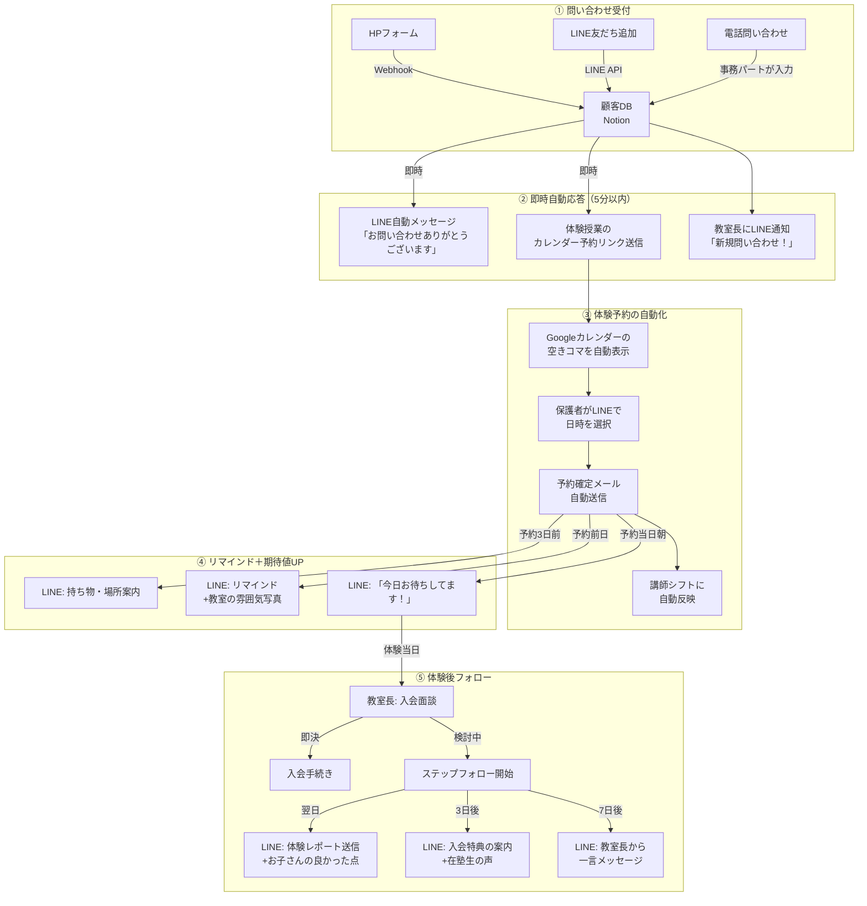

# 【学習塾】問い合わせ→体験→入会のCVR最適化で入会率+15%

> POSTCABINETS 業務自動化コンサルティング｜提案用事例資料

> ※本事例は業界データに基づく想定です。実際の効果はクライアントの状況により異なります。

---

## 企業プロフィール

| 項目 | 内容 |
|------|------|
| 社名 | 進学ゼミ・ステップアップ（仮名） |
| 所在地 | 大阪府吹田市（JR吹田駅 徒歩3分） |
| 設立 | 2011年（教室長の中村が個人で開業、2018年に法人化） |
| 教室数 | 2教室（吹田本校・千里丘校） |
| 年商 | 約3,600万円 |
| 生徒数 | 95名（小学生20名・中学生55名・高校生20名） |
| 講師 | 教室長1名・正社員講師2名・大学生アルバイト講師8名 |
| 事務 | パート1名（受付・電話・事務） |
| 指導形態 | 個別指導（講師1:生徒2）がメイン。中3受験コースのみ集団（1クラス8名） |
| 月謝 | 小学生：15,000円/月、中学生：22,000円/月、高校生：28,000円/月（週2回の場合） |
| 使用システム | Comiru Free（無料プラン）、LINE公式アカウント（友だち数280名） |

**なぜこの規模か：** 個人経営〜2教室の個別指導塾は全国に約3万教室（出典：経済産業省「特定サービス産業動態統計調査」2024年 https://www.meti.go.jp/statistics/tyo/tokusabido/ 及び 矢野経済研究所「学習塾・予備校市場に関する調査」2024年版）。生徒数80〜120名は「教室長が授業もやりながら経営もやる」ゾーン。集客は口コミとチラシに依存し、Web集客はやっているがデータ分析まで手が回らない。入会率の改善で最も効果が出やすい規模帯。

---

## 経営者の生の悩み（中村教室長・44歳・元大手塾講師の言葉で）

> 「うちの売上は月300万。講師のアルバイト代が80万、正社員2人の給料で60万、家賃が2教室で35万、教材費とシステム代で15万。残りの110万から俺の給料と税金を払ったら、手元に50万くらい。95人の生徒がいて、月に3〜4人は辞める。だから毎月3〜4人は入会してもらわないと現状維持もできない。」

> 「問い合わせは月に12〜15件ある。チラシとか、Googleで"吹田 個別指導"って検索して来る人とか。でもね、問い合わせから体験授業に来てくれるのが6割くらい。そこから実際に入会するのが5割。トータルで見ると、問い合わせの3割しか入会しない。月15件×30%で4〜5人。辞める人と差し引きでトントン。これじゃ成長できない。」

> 「体験に来ない4割の人が気になるんですよ。電話で"じゃあ体験授業の日程を…"って言うと"ちょっと考えます"って。そのまま連絡が来ない。たぶん他の塾にも問い合わせて、先に体験に行ったところで決めてる。うちの対応が遅いんです。電話が授業中にかかってくると出られない。折り返しが2〜3時間後になる。その間にライバル塾に取られてる。」

> 「LINE公式アカウントは一応あるんですけど、友だち登録してもらって"お知らせ配信"に使ってるだけ。在塾生の保護者向け。新規の集客には全然活かせてない。LINEで体験予約ができるようにしたいけど、やり方がわからない。Comiruも無料プランだから、できることが限られてる。」

> 「大手の明光義塾とかスクールIEは、ホームページで体験予約できて、すぐ自動返信が来て、翌日にはフォローの電話がかかってくる。うちは俺が全部やってるから、そんなスピード感は出せない。でも大手に負けてるのは"仕組み"だけだと思ってる。授業の質では負けてない。」

---

## 現場のオペレーション

### 中村教室長の1日（月曜日・授業日）

| 時刻 | 行動 | 入会CVRとの関係 |
|------|------|----------------|
| 10:00 | 出勤。メール確認。**新規問い合わせが2件**（日曜の夜にHPフォームから） | 問い合わせから14時間経過。まだ対応できていない |
| 10:15 | 問い合わせ①に電話。つながる。「中1の息子の数学が…」→ヒアリング15分 | 体験授業の日程を提案→「今週の土曜は？」→「部活があって…」→来週に |
| 10:30 | 問い合わせ②に電話。**つながらない**（仕事中と思われる） | SMSで「お電話しました。ご都合のよい時間にご連絡ください」 |
| 10:45 | 今週の授業準備。中間テスト対策プリントの作成 | — |
| 12:00 | 昼食。事務パートの田中さんに「②の人から折り返しあったら日程聞いて」 | — |
| 13:00 | **授業開始**（13:00〜14:30 中学生コマ） | **この時間は電話に出られない** |
| 14:30 | 休憩。田中さん「②の人から折り返しありましたけど、授業中だったので"折り返します"って伝えました」 | **問い合わせから18時間。まだ話せていない** |
| 14:45 | 問い合わせ②に再度電話。**またつながらない** | — |
| 15:00 | **授業**（15:00〜16:30 小学生コマ） | — |
| 16:30 | 保護者面談（在塾生の母親）。「先生、うちの子の成績が…」→30分 | — |
| 17:00 | **授業**（17:00〜18:30 中学生コマ） | — |
| 18:30 | 休憩。**ここでやっと問い合わせ②に電話**。つながる | **問い合わせから22時間**。ヒアリング。「もう他の塾の体験に行くことにしました」→**失注** |
| 19:00 | **授業**（19:00〜20:30 中3受験コマ） | — |
| 20:30 | 授業後。生徒の質問対応、片付け | — |
| 21:00 | **ここから事務作業**。体験授業に来た生徒の報告書作成、来月の時間割作成 | — |
| 21:30 | LINE公式で在塾生の保護者にテスト対策講座のお知らせ配信 | **新規向けの配信はゼロ** |
| 22:00 | 退勤 | — |

### 問い合わせ→体験→入会のプロセス（分単位で描写）

**ステップ1：問い合わせ受付（全体のうち100%）**

| 時間経過 | 起きていること | 問題 |
|---------|-------------|------|
| 0分 | HPフォーム or 電話で問い合わせ | HPフォームは24h受付だが、対応は営業時間のみ |
| 0〜30分 | 大手塾はこの間に自動返信メール＋翌営業日に電話 | **うちは何も起きない** |
| 2〜3時間後 | 授業の合間に折り返し電話を試みる | 平日昼間は保護者もつながりにくい |
| 6〜24時間後 | やっと電話がつながる | **この時点で保護者は2〜3塾に問い合わせ済み** |

**ステップ2：体験授業日程の調整（問い合わせの60%が到達）**

| 所要時間 | 作業 | 問題 |
|---------|------|------|
| 電話15分 | 保護者ヒアリング（学年・科目・悩み・希望曜日） | 授業中だと十分なヒアリングができない |
| 電話後30分 | 空きコマと講師のシフトを確認 | **紙のシフト表を見ながら手動で確認** |
| 電話5分 | 保護者に日程を連絡 | 「その日は子供の予定が…」→再調整 |
| 計：1〜3日 | 日程確定まで | **平均2往復。日程確定まで2〜3日かかる** |

**ステップ3：体験授業の実施（問い合わせの60%×95%=57%が到達）**

| 時間 | 内容 | 問題 |
|------|------|------|
| 体験当日-1日 | リマインド連絡（電話 or LINE） | **忘れがち。ドタキャン率15%** |
| 体験授業80分 | 授業実施。教室長が担当 | — |
| 授業後20分 | 保護者に授業報告＋入会案内 | **ここが最大のクロージングポイントだが、次の授業が控えていて十分に話せないことがある** |

**ステップ4：入会クロージング（体験参加者の50%が入会）**

| 時間経過 | 起きていること | 問題 |
|---------|-------------|------|
| 体験当日 | 「入会します」→即決：30% | 最も成約率が高い |
| 1〜3日後 | 「家族と相談して…」→フォロー電話 | **授業中で電話できない→タイミングを逃す** |
| 1週間後 | 「まだ考え中です」 | **ここでフォローが途切れる→他塾に流れる** |
| 2週間後 | 音信不通 | — |

### CVRの壁（数字で見る）

```
問い合わせ 15件/月（100%）
  │
  ├→ 体験日程確定: 9件（60%）──── 壁①: 初回対応の遅れで40%が離脱
  │     │
  │     ├→ 体験に来る: 8件（53%）── 壁②: ドタキャン率15%（リマインド不足）
  │     │     │
  │     │     ├→ 入会: 4件（27%）── 壁③: 体験後のクロージング不足で50%が離脱
  │     │     │
  │     │     └→ 離脱: 4件 ──── 「もう少し考えます」→他塾へ
  │     │
  │     └→ ドタキャン: 1件
  │
  └→ 体験に進まず: 6件 ──── 電話がつながらない、対応が遅い、他塾が先に対応

最終入会率: 27%（4件/15件）
```

---

## ボトルネック分析

### 3つの壁と改善余地

| 壁 | 現状の数値 | 業界上位の数値 | ギャップ | 原因 |
|----|-----------|-------------|---------|------|
| ①問い合わせ→体験 | 60% | 80% | **+20pt** | 初回対応が遅い（平均6〜24時間）。体験予約のハードルが高い（電話のみ） |
| ②体験ドタキャン率 | 15% | 5% | **▲10pt** | リマインド連絡の漏れ。体験への期待値が上がっていない |
| ③体験→入会 | 50% | 65% | **+15pt** | 体験後のフォロー不足。「家族と相談」の期間に何もしていない |

### 改善後のシミュレーション

```
問い合わせ 15件/月（100%）
  │
  ├→ 体験日程確定: 12件（80%）── 壁①解消: LINE即時応答+体験予約フォーム
  │     │
  │     ├→ 体験に来る: 11件（73%）── 壁②解消: 前日リマインド+当日朝のLINE
  │     │     │
  │     │     ├→ 入会: 7件（47%）── 壁③解消: 体験後3日間のステップフォロー
  │     │     │
  │     │     └→ 離脱: 4件
  │     │
  │     └→ ドタキャン: 1件
  │
  └→ 体験に進まず: 3件

改善後の入会率: 47%（7件/15件）→ +20pt
月間入会増: +3件
```

### 年間の経営インパクト

| 指標 | 現状 | 改善後 | 差分 |
|------|------|--------|------|
| 月間入会数 | 4件 | 7件 | +3件 |
| 年間入会数 | 48件 | 84件 | **+36件** |
| 年間退塾数 | 40件 | 36件（退塾率も改善） | ▲4件 |
| 年間純増 | 8件 | 48件 | +40件 |
| 生徒数（1年後） | 103名 | 143名 | +40名 |
| 月間売上（1年後） | 320万円 | 440万円 | **+120万円/月** |

**LTV計算：**
- 平均月謝：22,000円（中学生が最多）
- 平均在籍期間：18ヶ月（塾業界の平均。中2春入会→中3受験終了が典型）
- 1人あたりLTV：22,000円×18ヶ月 = **396,000円**
- 入会+3人/月のLTV効果：396,000円×3人×12ヶ月 = **年間1,425万円**（生涯売上ベース）

---

## 導入による経営インパクト

### Before / After 比較表

| 指標 | Before | After | 改善幅 |
|------|--------|-------|--------|
| 問い合わせ→体験率 | 60% | 80% | **+20pt** |
| 体験ドタキャン率 | 15% | 5% | **▲10pt** |
| 体験→入会率 | 50% | 65% | **+15pt** |
| トータル入会率（問い合わせ→入会） | 27% | 47% | **+20pt** |
| 初回応答時間 | 6〜24時間 | **5分以内** | — |
| 体験日程調整の所要日数 | 2〜3日 | **即日** | — |
| 教室長の事務作業時間/日 | 2時間 | 0.5時間 | ▲75% |
| 月間入会数 | 4件 | 7件 | **+3件** |

### ROI計算

**3シナリオ:**

| シナリオ | 月間入会増 | 年間売上増（累積） | 初年度ROI | 投資回収 |
|----------|----------|-------------------|----------|---------|
| 保守的（入会率27%→35%） | +1件 | 約171万円 | **65%** | 7ヶ月 |
| 標準（入会率27%→47%） | +3件 | 約514万円 | **394%** | 2.4ヶ月 |
| 楽観的（入会率27%→55%） | +4件 | 約685万円 | **558%** | 1.8ヶ月 |

| 項目 | 金額 |
|------|------|
| 初期構築費（POSTCABINETS） | 80万円 |
| 月額運用費（LINE配信＋システム保守） | 2万円/月 = 24万円/年 |
| **月間の入会増（月謝ベース・標準）** | +3件×22,000円 = **+66,000円/月** |
| **年間の売上増（累積効果・標準）** | 初月+6.6万→12ヶ月目+79.2万 = **年間約514万円** |
| **初年度ROI（標準）** | (514-80-24) / 104 = **394%** |
| **投資回収** | **2.4ヶ月** |

**ROI計算の根拠：** 入会は月+3件で毎月積み上がる。退塾は月3.3件（退塾率改善後）。初月は純増+3名で+6.6万円、2ヶ月目は純増+6名で+13.2万円…12ヶ月目は累積純増36名で+79.2万円。12ヶ月の合計が約514万円。

---

## 自動化の全体設計



---

## 構築手順

### Phase 1：LINE即時応答＋体験予約フォーム（2週間）

> **つまずきポイント:**
> - LINE Messaging APIのWebhookは**HTTPSのみ**対応。ローカル開発時は `ngrok` でトンネリングするか、最初からクラウドにデプロイする。
> - LINE公式アカウントの「応答設定」で**Webhook**をONにし、**自動応答メッセージ**をOFFにする。両方ONだとメッセージが二重に送られる。
> - Flex Messageのテンプレート（ボタン型）は**画像URLが必須ではない**が、`thumbnailImageUrl` を指定する場合はHTTPS必須・1MBまで。

> **Flaskのデプロイ先:**
> 小規模塾向けの場合、以下の選択肢が現実的:
> - **Google Cloud Run**（推奨）: 月間リクエスト200万回まで無料。Dockerfileを書いてデプロイ。コールドスタートが2〜3秒あるがWebhookには問題ない。
> - **Render.com**: 無料プランあり。GitHubと連携して自動デプロイ。ただし無料プランは15分無アクセスでスリープ→初回応答に10秒かかる。
> - **Railway**: 月5ドル〜。簡単なデプロイ。

```python
"""
LINE公式アカウントのWebhookで問い合わせを受け、
即時応答 + 体験授業予約のリッチメニューを送信する。
Flask + LINE Messaging API で実装。
"""
import os
import json
import hmac
import hashlib
import base64
from datetime import datetime, timedelta

from flask import Flask, request, abort
import httpx

app = Flask(__name__)

LINE_CHANNEL_SECRET = os.environ["LINE_CHANNEL_SECRET"]
LINE_CHANNEL_TOKEN = os.environ["LINE_CHANNEL_ACCESS_TOKEN"]
NOTION_TOKEN = os.environ["NOTION_TOKEN"]
NOTION_DB_ID = os.environ["NOTION_INQUIRY_DB_ID"]


def verify_signature(body: bytes, signature: str) -> bool:
    """LINE Webhookの署名検証"""
    hash_val = hmac.new(
        LINE_CHANNEL_SECRET.encode("utf-8"), body, hashlib.sha256
    ).digest()
    return signature == base64.b64encode(hash_val).decode("utf-8")


@app.route("/webhook", methods=["POST"])
def webhook():
    signature = request.headers.get("X-Line-Signature", "")
    body = request.get_data()

    if not verify_signature(body, signature):
        abort(400)

    events = json.loads(body)["events"]

    for event in events:
        if event["type"] == "follow":
            # 友だち追加時の自動応答
            handle_follow(event)
        elif event["type"] == "message":
            handle_message(event)

    return "OK"


def handle_follow(event: dict):
    """
    友だち追加時：自動で挨拶メッセージ＋体験授業の案内を送信。
    ここが最大のCVRポイント。友だち追加した瞬間が最も温度が高い。
    """
    user_id = event["source"]["userId"]

    messages = [
        {
            "type": "text",
            "text": (
                "友だち登録ありがとうございます！\n"
                "進学ゼミ・ステップアップです。\n\n"
                "お子さまの学習でお悩みのことはありますか？\n"
                "まずは無料体験授業でお子さまに合った\n"
                "学習プランをご提案します。"
            ),
        },
        {
            "type": "template",
            "altText": "体験授業のご案内",
            "template": {
                "type": "buttons",
                "title": "無料体験授業のご案内",
                "text": "80分の体験授業を無料で受けられます。お気軽にどうぞ！",
                "actions": [
                    {
                        "type": "uri",
                        "label": "体験授業を予約する",
                        "uri": "https://example.com/booking",  # 予約フォームURL
                    },
                    {
                        "type": "message",
                        "label": "まず相談したい",
                        "text": "相談希望",
                    },
                    {
                        "type": "message",
                        "label": "料金を知りたい",
                        "text": "料金について",
                    },
                ],
            },
        },
    ]

    send_line_reply(event["replyToken"], messages)


def handle_message(event: dict):
    """メッセージ受信時の処理"""
    user_id = event["source"]["userId"]
    text = event["message"].get("text", "")

    if "相談希望" in text:
        # 相談希望の場合は教室長に通知＋ヒアリング
        messages = [
            {
                "type": "text",
                "text": (
                    "ありがとうございます！\n"
                    "教室長の中村から、本日中にご連絡させていただきます。\n\n"
                    "事前に教えていただけると助かります：\n"
                    "① お子さまの学年\n"
                    "② 気になっている教科\n"
                    "③ ご連絡可能な時間帯"
                ),
            },
        ]
        send_line_reply(event["replyToken"], messages)

        # Notionに問い合わせを登録
        register_inquiry_to_notion(user_id, text)

        # 教室長にプッシュ通知
        notify_teacher(user_id, text)

    elif "料金について" in text:
        messages = [
            {
                "type": "text",
                "text": (
                    "【月謝の目安（週2回の場合）】\n\n"
                    "小学生：15,000円/月\n"
                    "中学生：22,000円/月\n"
                    "高校生：28,000円/月\n\n"
                    "※ 教科数・コマ数で変動します。\n"
                    "※ 入会金：15,000円（体験後1週間以内のご入会で無料）\n\n"
                    "詳しくは体験授業時にご説明します！"
                ),
            },
            {
                "type": "template",
                "altText": "体験授業のご案内",
                "template": {
                    "type": "buttons",
                    "text": "まずは無料体験で、お子さまに合うかお試しください。",
                    "actions": [
                        {
                            "type": "uri",
                            "label": "体験授業を予約する",
                            "uri": "https://example.com/booking",
                        },
                    ],
                },
            },
        ]
        send_line_reply(event["replyToken"], messages)

    else:
        # 自由テキストの場合は教室長に転送
        notify_teacher(user_id, text)
        messages = [
            {
                "type": "text",
                "text": "ありがとうございます！教室長に確認して、ご連絡しますね。",
            },
        ]
        send_line_reply(event["replyToken"], messages)


def send_line_reply(reply_token: str, messages: list[dict]):
    """LINEの返信"""
    httpx.post(
        "https://api.line.me/v2/bot/message/reply",
        headers={
            "Authorization": f"Bearer {LINE_CHANNEL_TOKEN}",
            "Content-Type": "application/json",
        },
        json={"replyToken": reply_token, "messages": messages},
    )


def register_inquiry_to_notion(line_user_id: str, message: str):
    """問い合わせをNotionに登録"""
    payload = {
        "parent": {"database_id": NOTION_DB_ID},
        "properties": {
            "名前": {"title": [{"text": {"content": f"LINE:{line_user_id[:8]}..."}}]},
            "チャネル": {"select": {"name": "LINE"}},
            "ステータス": {"select": {"name": "新規問い合わせ"}},
            "問い合わせ日": {"date": {"start": datetime.now().isoformat()}},
            "メモ": {"rich_text": [{"text": {"content": message}}]},
        },
    }
    httpx.post(
        "https://api.notion.com/v1/pages",
        headers={
            "Authorization": f"Bearer {NOTION_TOKEN}",
            "Content-Type": "application/json",
            "Notion-Version": "2022-06-28",
        },
        json=payload,
    )


def notify_teacher(line_user_id: str, message: str):
    """教室長のLINEに通知（教室長個人のLINEにプッシュ）"""
    teacher_line_id = os.environ["TEACHER_LINE_USER_ID"]
    httpx.post(
        "https://api.line.me/v2/bot/message/push",
        headers={
            "Authorization": f"Bearer {LINE_CHANNEL_TOKEN}",
            "Content-Type": "application/json",
        },
        json={
            "to": teacher_line_id,
            "messages": [
                {
                    "type": "text",
                    "text": f"🔔 新規問い合わせ！\nLINE ID: {line_user_id[:8]}...\n内容: {message}",
                },
            ],
        },
    )


if __name__ == "__main__":
    app.run(port=8080, debug=True)
```

### Phase 1.5：体験予約フォーム連携（1週間）

> **つまずきポイント:**
> - Googleカレンダーの空きコマ取得には `Google Calendar API` の権限が必要。GASで実装する場合は `CalendarApp` を使えばOAuth不要。
> - 講師のシフトと教室の空きコマは別管理になりがち。**Googleカレンダーに「教室の空きコマ」を事前に予定として登録**し、予約が入ったら「教室の空き」を削除する方式が最もシンプル。

```python
"""
体験授業の予約フォームをLINEのリッチメニューから呼び出し、
Googleカレンダーの空きコマと連動して予約を確定する。
"""
import os
from datetime import datetime, timedelta
from google.oauth2.credentials import Credentials
from googleapiclient.discovery import build


def get_available_trial_slots(
    classroom_calendar_id: str,
    credentials: Credentials,
    days_ahead: int = 14,
) -> list[dict]:
    """
    Googleカレンダーから体験授業の空き枠を取得する。
    「体験可能」というタイトルの予定が入っている時間帯を空き枠として返す。
    """
    service = build("calendar", "v3", credentials=credentials)
    now = datetime.now()
    time_max = now + timedelta(days=days_ahead)

    events_result = service.events().list(
        calendarId=classroom_calendar_id,
        timeMin=now.isoformat() + "Z",
        timeMax=time_max.isoformat() + "Z",
        q="体験可能",
        singleEvents=True,
        orderBy="startTime",
    ).execute()

    slots = []
    for event in events_result.get("items", []):
        start = event["start"].get("dateTime", "")
        slots.append({
            "event_id": event["id"],
            "date": start[:10],
            "time": start[11:16],
            "label": f"{start[:10]} {start[11:16]}〜",
        })

    return slots[:6]  # 最大6枠を提示


def book_trial_slot(
    classroom_calendar_id: str,
    event_id: str,
    child_name: str,
    parent_name: str,
    credentials: Credentials,
):
    """
    空き枠の予定を「体験予約：{child_name}」に更新して確定する。
    """
    service = build("calendar", "v3", credentials=credentials)
    event = service.events().get(
        calendarId=classroom_calendar_id,
        eventId=event_id,
    ).execute()

    event["summary"] = f"体験予約：{child_name}（{parent_name}様）"
    event["colorId"] = "11"  # 赤色で目立たせる

    service.events().update(
        calendarId=classroom_calendar_id,
        eventId=event_id,
        body=event,
    ).execute()
```

### Phase 2：体験前リマインド＋体験後ステップフォロー（2週間）

```python
"""
体験授業の予約者に対して、
- 3日前：持ち物・場所の案内
- 前日：リマインド
- 当日朝：「お待ちしてます！」
- 翌日：体験レポート（教室長が記入したテンプレートを送信）
- 3日後：入会特典・在塾生の声
- 7日後：教室長からの一言（入会していなければ）
を自動送信するスクリプト。
"""
import os
import httpx
from datetime import date, timedelta, datetime


NOTION_TOKEN = os.environ["NOTION_TOKEN"]
LINE_TOKEN = os.environ["LINE_CHANNEL_ACCESS_TOKEN"]


REMINDER_SCHEDULE = [
    {
        "days_before": 3,
        "template": "pre_trial_info",
        "message": (
            "【体験授業のご案内】\n\n"
            "{child_name}さんの体験授業は{trial_date}です。\n\n"
            "📍 場所：{classroom_address}\n"
            "🕐 時間：{trial_time}（80分）\n"
            "📝 持ち物：筆記用具、学校のテスト（あれば）\n\n"
            "当日は教室長の中村が担当します。\n"
            "お気軽にご質問ください！"
        ),
    },
    {
        "days_before": 1,
        "template": "reminder",
        "message": (
            "明日は{child_name}さんの体験授業です！\n\n"
            "🕐 {trial_time}からお待ちしています。\n"
            "📍 {classroom_address}\n\n"
            "お気をつけてお越しください。"
        ),
    },
    {
        "days_before": 0,
        "template": "day_of",
        "message": (
            "おはようございます！\n"
            "今日は{child_name}さんの体験授業ですね。\n"
            "{trial_time}にお待ちしています！\n\n"
            "何かご不明な点があればお気軽にLINEください。"
        ),
    },
]


FOLLOW_UP_SCHEDULE = [
    {
        "days_after": 1,
        "template": "trial_report",
        "message": (
            "{parent_name}様\n\n"
            "昨日は{child_name}さんの体験授業にお越しいただき、"
            "ありがとうございました。\n\n"
            "【体験授業レポート】\n"
            "担当：{teacher_name}\n"
            "教科：{subject}\n"
            "内容：{trial_content}\n\n"
            "💡 {child_name}さんの良かった点：\n"
            "{good_points}\n\n"
            "📈 今後の学習アドバイス：\n"
            "{advice}\n\n"
            "何かご質問がありましたら、お気軽にLINEください。"
        ),
    },
    {
        "days_after": 3,
        "template": "benefits",
        "message": (
            "{parent_name}様\n\n"
            "体験授業はいかがでしたか？\n\n"
            "【今月の入会特典】\n"
            "✅ 入会金15,000円 → 無料\n"
            "✅ 初月の教材費 → 無料\n"
            "※ 体験授業から1週間以内のご入会が対象です\n\n"
            "【在塾生の保護者の声】\n"
            "「中2の秋に入塾して、3ヶ月で数学が20点上がりました。"
            "先生が子供のペースに合わせてくれるので、嫌がらずに通ってます」"
            "（中3男子の母）\n\n"
            "ご入会をご検討中でしたら、いつでもご相談ください。"
        ),
    },
    {
        "days_after": 7,
        "template": "personal_message",
        "message": (
            "{parent_name}様\n\n"
            "教室長の中村です。\n"
            "{child_name}さんの体験授業から1週間が経ちましたが、"
            "その後お子さまの学習の様子はいかがですか？\n\n"
            "体験で見つかった{child_name}さんの課題は、\n"
            "早めに対策すれば十分に改善できます。\n\n"
            "もしよろしければ、一度お電話でお話しさせていただけませんか？\n"
            "ご都合のよい日時をLINEでお知らせください。"
        ),
    },
]


def run_daily_reminders(booking_db_id: str):
    """毎日実行：リマインドとフォローアップの送信"""
    today = date.today()

    # リマインド（体験前）
    for schedule in REMINDER_SCHEDULE:
        target_date = today + timedelta(days=schedule["days_before"])
        bookings = get_bookings_by_date(booking_db_id, target_date.isoformat())

        for booking in bookings:
            message = schedule["message"].format(**booking)
            send_line_push(booking["line_user_id"], message)
            print(f"[リマインド] {booking['child_name']} ({schedule['template']})")

    # フォローアップ（体験後）
    for schedule in FOLLOW_UP_SCHEDULE:
        target_date = today - timedelta(days=schedule["days_after"])
        completed = get_completed_trials(booking_db_id, target_date.isoformat())

        for trial in completed:
            # 既に入会済みならスキップ
            if trial.get("status") == "入会済":
                continue
            message = schedule["message"].format(**trial)
            send_line_push(trial["line_user_id"], message)
            print(f"[フォロー] {trial['child_name']} ({schedule['template']})")


def get_bookings_by_date(db_id: str, target_date: str) -> list[dict]:
    """指定日に体験予約がある生徒を取得"""
    resp = httpx.post(
        f"https://api.notion.com/v1/databases/{db_id}/query",
        headers={
            "Authorization": f"Bearer {NOTION_TOKEN}",
            "Content-Type": "application/json",
            "Notion-Version": "2022-06-28",
        },
        json={
            "filter": {
                "property": "体験日",
                "date": {"equals": target_date},
            }
        },
    )
    resp.raise_for_status()
    # Notion→dict変換は省略
    return []


def get_completed_trials(db_id: str, trial_date: str) -> list[dict]:
    """指定日に体験を実施した生徒を取得"""
    resp = httpx.post(
        f"https://api.notion.com/v1/databases/{db_id}/query",
        headers={
            "Authorization": f"Bearer {NOTION_TOKEN}",
            "Content-Type": "application/json",
            "Notion-Version": "2022-06-28",
        },
        json={
            "filter": {
                "and": [
                    {"property": "体験日", "date": {"equals": trial_date}},
                    {"property": "ステータス", "select": {"does_not_equal": "入会済"}},
                ]
            }
        },
    )
    resp.raise_for_status()
    return []


def send_line_push(user_id: str, message: str):
    """LINEプッシュ送信"""
    httpx.post(
        "https://api.line.me/v2/bot/message/push",
        headers={
            "Authorization": f"Bearer {LINE_TOKEN}",
            "Content-Type": "application/json",
        },
        json={
            "to": user_id,
            "messages": [{"type": "text", "text": message}],
        },
    )
```

### Phase 3：入会率ダッシュボード（1週間）

```python
"""
問い合わせ→体験→入会のCVRをリアルタイムで可視化する
ダッシュボード用のデータ集計スクリプト。
NotionのDB → 集計 → Discord通知。
"""
import os
import httpx
from datetime import date, timedelta
from collections import Counter


NOTION_TOKEN = os.environ["NOTION_TOKEN"]


def calculate_monthly_cvr(inquiry_db_id: str, month: str) -> dict:
    """
    指定月の問い合わせ→体験→入会のCVRを計算する。
    month: "2026-03" 等
    """
    # 該当月の問い合わせを取得
    resp = httpx.post(
        f"https://api.notion.com/v1/databases/{inquiry_db_id}/query",
        headers={
            "Authorization": f"Bearer {NOTION_TOKEN}",
            "Content-Type": "application/json",
            "Notion-Version": "2022-06-28",
        },
        json={
            "filter": {
                "property": "問い合わせ日",
                "date": {"after": f"{month}-01", "before": f"{month}-31"},
            }
        },
    )
    resp.raise_for_status()
    pages = resp.json()["results"]

    status_counts = Counter()
    channel_counts = Counter()

    for page in pages:
        props = page["properties"]
        status = (
            props["ステータス"]["select"]["name"]
            if props["ステータス"]["select"]
            else "不明"
        )
        channel = (
            props["チャネル"]["select"]["name"]
            if props["チャネル"]["select"]
            else "不明"
        )
        status_counts[status] += 1
        channel_counts[channel] += 1

    total = len(pages)
    trial_booked = status_counts.get("体験予約", 0) + status_counts.get("体験済", 0) + status_counts.get("入会済", 0)
    trial_done = status_counts.get("体験済", 0) + status_counts.get("入会済", 0)
    enrolled = status_counts.get("入会済", 0)

    return {
        "month": month,
        "total_inquiries": total,
        "trial_booked": trial_booked,
        "trial_done": trial_done,
        "enrolled": enrolled,
        "cvr_inquiry_to_trial": f"{trial_booked / total * 100:.1f}%" if total else "N/A",
        "cvr_trial_to_enroll": f"{enrolled / trial_done * 100:.1f}%" if trial_done else "N/A",
        "cvr_total": f"{enrolled / total * 100:.1f}%" if total else "N/A",
        "channel_breakdown": dict(channel_counts),
    }


def format_cvr_report(data: dict) -> str:
    """CVRレポートのフォーマット"""
    return f"""
## 📊 {data['month']} 入会CVRレポート

| ステージ | 件数 | 率 |
|----------|------|-----|
| 問い合わせ | {data['total_inquiries']}件 | 100% |
| 体験予約 | {data['trial_booked']}件 | {data['cvr_inquiry_to_trial']} |
| 体験実施 | {data['trial_done']}件 | — |
| 入会 | {data['enrolled']}件 | {data['cvr_total']} |

**体験→入会率**: {data['cvr_trial_to_enroll']}

**チャネル別**:
{chr(10).join(f"- {ch}: {cnt}件" for ch, cnt in data['channel_breakdown'].items())}
"""
```

---

## 提案トークスクリプト

### 刺さる一言（初回面談で使う）

> 「先生、月に何件くらい問い合わせがありますか？ 15件。そのうち入会するのは？ 4件。……ということは、11人の保護者が"先生の塾に興味を持って、わざわざ連絡してきた"のに、入会しなかったわけですよね。その11人、もし3人でも入会してくれたら、年間で1,400万円の売上増です。広告費を増やすより、今来てる問い合わせの"取りこぼし"を減らすほうが、圧倒的にコスパがいいです。」

### 想定される反論と切り返し

| 反論 | 切り返し |
|------|---------|
| 「うちは口コミで生徒が集まってるから、LINEとか要らない」 | 「口コミで来るお客さんこそ大事にしたいですよね。口コミで聞いて、HPを見て、問い合わせてくれた保護者が、電話がつながらなくて他に行く。口コミを出してくれた人にも申し訳ない。LINEは"口コミの受け皿"として使います」 |
| 「システムにお金をかける余裕がない」 | 「月2万円です。入会1人分の月謝より安い。今より月1人でも多く入会したら、余裕で回収できます。しかも生徒は平均18ヶ月在籍するので、1人入会するとLTVは約40万円です」 |
| 「大手塾みたいなシステムは合わない」 | 「大手は画一的なシステムですが、これは先生の塾に合わせてカスタマイズします。体験後のフォローメッセージの文面も、先生の言葉で書きます。"中村先生だから通いたい"というお子さん・保護者に、先生の温かみが伝わる仕組みです」 |
| 「忙しくて新しいことを覚える暇がない」 | 「先生が覚えることは"体験レポートを5分で入力する"だけです。あとは全部自動。問い合わせ対応、日程調整、リマインド、フォロー。今、先生が授業の合間にやってることが全部なくなります。その時間を授業準備と生徒対応に使ってください」 |

### クロージングトーク

> 「先生、来週の問い合わせから試しませんか？ HPのフォームにLINEの友だち追加ボタンをつけて、友だち追加したら自動で体験予約カレンダーが送られる。これだけ設定します。1週間で準備できます。費用はかかりません。問い合わせから体験までの率が上がるか、一緒に見ましょう。」

---

## 法規制・業界特有のリスク

### 学習塾に関連する法規制

| リスク | 内容 | 対策 |
|--------|------|------|
| 特定商取引法（特商法）の適用 | 学習塾は「特定継続的役務提供」に該当（入学金2万円超 or 期間2ヶ月超 or 金額5万円超）。クーリングオフ（8日間）・中途解約の権利を顧客に説明する義務 | 自動配信メッセージに「クーリングオフ」の説明を含めるか、入会時に書面で交付。LINEでの勧誘が「迷惑な」ものにならないよう配信頻度を制限 |
| 個人情報保護法 | 生徒・保護者の個人情報（氏名・住所・成績等） | 個人情報はNotionの限定アクセス環境で管理。LINE IDと氏名の紐づけデータはアクセス制限 |
| 景品表示法 | 「入会金無料」等のキャンペーンが「有利誤認」にならないよう | 期間・条件を明示。「体験後1週間以内」等の条件をLINEメッセージに必ず記載 |

### 学習塾業界特有のリスク

| リスク | 内容 | 対策 |
|--------|------|------|
| 保護者のLINE疲れ | 塾からのLINE通知が多すぎると「しつこい」と感じる | フォローは最大3回まで。7日後のメッセージで反応がなければ追客停止。月1回の新着情報のみ |
| 季節変動 | 2〜3月（入学・進級前）に問い合わせ集中。7〜8月は夏期講習の問い合わせ | 繁忙期に合わせてLINEの配信シナリオを切り替え |
| 大学生講師のシフト変動 | 体験授業の担当講師が急に変更になる可能性 | 予約確定時に「担当講師は変更になる場合があります」を明記。体験は教室長が担当するルールに |

---

## POSTCABINETS内部メモ

### この業界の攻め方

- **入口は「体験授業の取りこぼし」**。すべての個別指導塾に共通する痛み。「問い合わせの半分が入会しない」という数字は経営者の肌感覚と一致する
- **1〜3月が最大の営業チャンス**。新学年に向けた塾探しが始まる12月〜1月に提案し、2月に仕組みを入れて3月の繁忙期に効果を出す
- **大阪北摂・阪神間の個人塾がターゲット**。明光義塾・ITTO・スクールIE等のFCは本部の仕組みがあるので入り込みにくい。1〜3教室の個人塾が狙い目
- **塾向け勉強会の主催**。「月5人入会を増やすLINE集客術」みたいなセミナーを2〜3教室集めて開催→そこから個別提案
- **CPA（1人あたり獲得コスト）の話が刺さる**。「チラシ1万枚で5万円、そこから体験3人、入会1人。1人獲得に5万円。LINEなら追客の自動化だけで月+3人。コストは月2万円。1人あたり7,000円で獲得できます」

### 既存ツールとの差別化

| 既存ツール | 月額 | できること | できないこと |
|-----------|------|-----------|------------|
| Comiru Free | 無料 | 保護者連絡・成績管理（基本機能） | 新規集客・体験予約の自動化・ステップ配信 |
| Comiru BASIC | 月額要問合せ | 上記＋請求管理等 | LINEとの連携、CVR分析ダッシュボード |
| スクパス | 月額要問合せ | 入退室管理・保護者連絡 | 新規集客の自動化は対象外 |
| LINE公式（単体） | 0〜5,000円 | メッセージ配信 | 体験予約との連携、ステップ配信のロジック、CVR追跡 |

**差別化ポイント：** Comiruやスクパスは「在塾生の管理」に強い。POSTCABINETSは「新規の問い合わせ→入会まで」のCVR最適化に特化。LINE + Notion + Googleカレンダーで、既存の無料ツールの組み合わせで低コストに実現。

### 自分たちに足りないもの

1. **学習塾の現場感覚**：授業のコマ割り、講師のシフト管理、テスト対策期間の特殊性。1教室に1ヶ月くらい張り付いて観察したい
2. **Googleカレンダー×LINE予約の実装経験**：CalendlyやTimeRex的な予約システムをLINEで完結させる仕組み。既存のLINE予約SaaS（リピッテ等）との比較検討が必要
3. **体験レポートのテンプレート**：教室長が5分で入力でき、保護者に刺さるレポートのフォーマット。教育業界の「保護者の心を動かす言い方」のノウハウ
4. **季節ごとのLINE配信シナリオ**：新学期（3月）、夏期講習（7月）、冬期講習（12月）、受験直前（1月）で配信内容を変える必要がある

### 実案件に進む時のチェックリスト

- [ ] 提案先の月間問い合わせ数・体験数・入会数をヒアリング済み
- [ ] 現在の集客チャネル（チラシ・Web・口コミ）の内訳を確認済み
- [ ] LINE公式アカウントの有無・友だち数を確認済み
- [ ] 使用中の塾管理システム（Comiru/スクパス/なし）を確認済み
- [ ] デモ用のLINE友だち追加→体験予約→リマインド→フォローの一連フローを動作確認済み
- [ ] 体験後のステップフォロー文面を3パターン準備
- [ ] 特定商取引法のクーリングオフ説明文面を準備
- [ ] 1教室あたりの導入実績orデモ結果を提示できる状態にする
- [ ] 教室長が「入力するもの」を最小限（体験レポートの5分入力のみ）に設計
