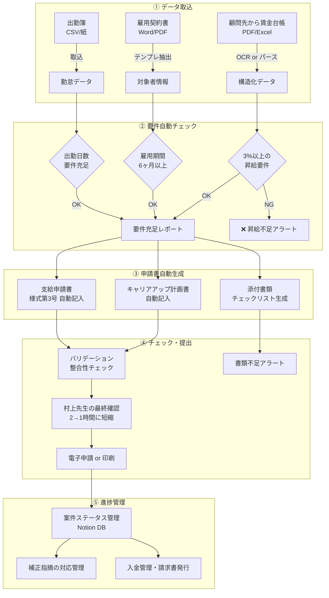

# 【士業事務所】助成金申請書作成の8割自動化で「受件数の天井」を突破

> POSTCABINETS 業務自動化コンサルティング｜提案用事例資料

> ※本事例は業界データに基づく想定です。実際の効果はクライアントの状況により異なります。

---

## 企業プロフィール

| 項目 | 内容 |
|------|------|
| 社名 | 村上社会保険労務士事務所（仮名） |
| 所在地 | 大阪府大阪市中央区 |
| 開業 | 2014年（村上代表・開業10年目） |
| 年商 | 約1,800万円 |
| 人員 | 代表1名・正社員2名（事務スタッフ）・パート1名 |
| 顧問先数 | 28社（従業員5〜80名の中小企業が中心） |
| 売上構成 | 顧問報酬55%（月額2〜5万円×28社）、助成金申請代行30%（年間20〜25件）、就業規則・手続きスポット15% |
| 主な取扱助成金 | キャリアアップ助成金（正社員化コース）、業務改善助成金、両立支援等助成金 |
| 使用システム | オフィスステーション Pro ライトプラン（月額1万円）、Excel台帳、紙の顧問先ファイル |

**なぜこの規模か：** 2024年度の社労士実態調査によると、開業社労士事務所の年間売上は平均約1,658万円、中央値550万円。顧問先数の平均は33社、中央値は10社（出典：全国社会保険労務士会連合会「社労士実態調査」2024年度版 https://www.shakaihokenroumushi.jp/ ）。年商1,500〜2,500万円・顧問先20〜40社の事務所は「1人では回しきれないが、人を雇うと利益が飛ぶ」ゾーンにあり、助成金業務の効率化で最もインパクトが出やすい。

---

## 経営者の生の悩み（村上先生・46歳・特定社労士の言葉で）

> 「顧問の仕事だけやったら、うち28社で月の売上が75万くらい。社員2人とパートさん1人の給料と社保、事務所の家賃で月50万は飛ぶ。残り25万が俺の手元。これじゃ家族4人食わせるのがやっと。だから助成金をやってるんです。キャリアアップの正社員化コースを1件通せば80万。成功報酬20%で16万入る。年間20件通せば320万。これがないとうちは成り立たん。」

> 「でもキャリアアップの申請書、1件つくるのに丸2日かかるんですよ。就業規則のどこを改定すればいいか確認して、賃金台帳と出勤簿を3%以上の昇給があるか突き合わせて、転換届を書いて、添付書類を20種類くらい揃えて。しかも要件が毎年変わる。2025年からは『重点支援対象者』って区分ができて、対象の判定がまた増えた。もう頭がパンクしそう。」

> 「正直、問い合わせは月に5〜6件来てる。でも今の体制だと月2件が限界。断ってる案件が年間30件以上ある。1件16万とすると、480万の機会損失ですよ。わかってるけど手が回らない。もう1人社労士を雇えば？って言われますけど、年収400万の社労士を雇って、その人が年間20件助成金を通せるようになるまで1年はかかる。その間の持ち出しが怖くて踏み出せない。」

> 「船井総研の助成金セミナーにも行きました。助成金で年商1億って事務所もあるらしい。でもあそこは社労士が10人いる。うちみたいな4人の事務所がどうやってスケールするんですか。申請書の"書き仕事"の部分さえなんとかなれば、俺は顧問先回りと要件確認に集中できるのに。」

---

## 現場のオペレーション

### 助成金申請業務の全体フロー（キャリアアップ助成金・正社員化コースの場合）

**工程全体：約16時間/件（2日強）**

| フェーズ | 作業 | 所要時間 | 担当 |
|----------|------|---------|------|
| ① ヒアリング | 顧問先に電話/訪問。「契約社員から正社員に転換したい人いますか？」 | 1時間 | 村上 |
| ② 要件チェック | 転換対象者の雇用契約書、賃金台帳6ヶ月分、出勤簿を取り寄せ。3%以上の昇給要件を確認 | 2時間 | 村上 |
| ③ 就業規則確認 | 正社員転換制度の条項があるか確認。なければ改定案を作成し、労基署届出 | 3時間 | 村上 |
| ④ キャリアアップ計画書 | 2025年度から届出のみでOKになったが、記載内容は従来と同等。計画期間・目標人数・転換条件を記入 | 1.5時間 | 事務A |
| ⑤ 転換届・雇用契約書作成 | 転換日の辞令、新しい雇用条件通知書を作成 | 1時間 | 事務A |
| ⑥ 支給申請書作成 | 様式第3号（正社員化コース）。対象者情報・転換前後の賃金額・事業所情報を記入 | 2時間 | 事務A→村上チェック |
| ⑦ 添付書類収集・整理 | 出勤簿写し、賃金台帳写し、雇用契約書写し、就業規則写し、転換届写し等（15〜25種類） | 3時間 | 事務B |
| ⑧ 最終チェック・提出 | 全書類のダブルチェック。不備がないか確認し、労働局に郵送 or 電子申請 | 2時間 | 村上 |
| ⑨ 補正対応 | 労働局から不備指摘（70%の確率で1回は来る）。修正して再提出 | 0.5時間 | 村上 |

### 村上先生の1日（助成金申請を抱えている日）

| 時刻 | 行動 | 助成金業務との関係 |
|------|------|-----------------|
| 7:30 | 自宅で厚労省のサイトを確認。要件変更がないかチェック | 2025年度はキャリアアップ計画書が届出制に変更 |
| 8:30 | 事務所着。メール確認。顧問先A社から「パートさんを正社員にしたい」 | 新規案件。まずヒアリング日程を調整 |
| 9:00 | 顧問先B社の助成金申請書を作成。**賃金台帳のExcelと申請様式の間を行ったり来たり** | 転換前6ヶ月と転換後6ヶ月の賃金を手計算 |
| 10:30 | 労働局に電話。B社の申請書の書き方確認。「前回と様式が変わってまして…」 | 20分待たされる |
| 11:00 | 顧問先C社訪問。月次の労務相談 | 顧問業務。助成金は中断 |
| 12:00 | 昼食。車内でコンビニ弁当 | — |
| 13:00 | 顧問先D社訪問。36協定の届出準備 | 顧問業務 |
| 14:30 | 事務所に戻る。B社の申請書の続き。**就業規則の改定箇所を特定** | 「正社員転換制度」の条文が曖昧→改定案を作成 |
| 16:00 | 事務スタッフAが作成したE社のキャリアアップ計画書をチェック | **3箇所の記載ミス発見**。計画期間の起算日が違う |
| 17:00 | 新規問い合わせの電話対応。F社「うちでも助成金使えますか？」 | 「来週お伺いしてヒアリングさせてください」→**3週間後になる** |
| 18:00 | B社の申請書の最終確認。添付書類を揃える | **賃金台帳のコピーが1ヶ月分足りない**→B社に再依頼 |
| 19:30 | 退社。**結局今日はB社の申請書が完成しなかった** | — |

### 事務スタッフAの1日（山本さん・32歳・社労士資格なし）

| 時刻 | 行動 | 助成金業務との関係 |
|------|------|-----------------|
| 9:00 | 出社。メール確認。顧問先から届いた賃金台帳のPDFをプリントアウト | — |
| 9:30 | G社のキャリアアップ計画書の作成開始。**過去の計画書をコピーして、日付と社名を書き換え** | 「前回のひな型どこだっけ…」フォルダを10分探す |
| 10:00 | 計画書の「転換条件」欄を記入。**就業規則のどこを参照すればいいかわからない**→村上先生に聞く→外出中→LINE→返信待ち | 30分のロス |
| 10:30 | 村上先生から返信「第12条の3」→該当条文を確認し記入 | — |
| 11:00 | H社の支給申請書の作成。対象者の氏名・生年月日・雇用保険番号を転記 | **手入力で雇用保険番号を1桁打ち間違い** |
| 12:00 | 昼休憩 | — |
| 13:00 | 添付書類の整理。15種類の書類をチェックリストと突き合わせ | 「出勤簿のコピーが白黒で見にくい…」 |
| 14:00 | I社の顧問業務（社会保険の取得届） | 助成金業務を中断 |
| 15:00 | 助成金業務に戻る。**さっきどこまでやったか思い出すのに10分** | — |
| 15:30 | G社の計画書をプリントアウトして村上先生のチェック待ちボックスに入れる | — |
| 16:00 | J社の就業規則のデータを探す。**2年前に改定したはずのWordファイルが見つからない** | 「改定前」「改定後」「最終版」「最終版2」…どれが最新？ |
| 17:00 | 退社 | — |

---

## ボトルネック分析

### 助成金業務の時間内訳（年間）

| 作業カテゴリ | 年間時間 | 全体に占める割合 | 自動化可能性 |
|-------------|---------|----------------|-------------|
| ヒアリング・要件判定 | 50時間 | 13% | 低（対面が必要） |
| 就業規則の確認・改定 | 80時間 | 21% | 中（テンプレ化可能） |
| 申請書の作成（転記・記入） | 100時間 | 26% | **高** |
| 添付書類の収集・整理 | 70時間 | 18% | 中（チェックリスト自動化） |
| 最終チェック・補正対応 | 40時間 | 10% | 中（バリデーション自動化） |
| 顧問先との連絡調整 | 30時間 | 8% | 低 |
| 制度変更の情報収集 | 15時間 | 4% | 中（RSS・通知） |
| **合計** | **385時間/年** | 100% | — |

### 数字で見る機会損失

| 指標 | 現状 | 説明 |
|------|------|------|
| 月間の助成金問い合わせ | 5〜6件 | 顧問先経由＋紹介 |
| 月間の受件上限 | 2件 | 村上先生の確認工数がボトルネック |
| 年間受件数 | 20〜25件 | 実績ベース |
| 年間断り件数 | 30件以上 | 受件できず他事務所を紹介 |
| 1件あたり成功報酬（平均） | 14万円 | 80万円×20%=16万円が多いが、小規模案件もあり平均14万円 |
| 年間の機会損失額 | **420万円以上** | 30件×14万円 |

### 申請書のミスが起きる構造

```
┌───────────────────────────────────────────────┐
│ 顧問先から届くデータ（バラバラの形式）           │
│                                                │
│ ● 賃金台帳 → Excel、PDF、紙のコピーが混在     │
│ ● 出勤簿 → 紙の手書き or 勤怠システムのCSV     │
│ ● 雇用契約書 → Word or 手書き                  │
│ ● 就業規則 → Word（バージョン管理なし）         │
└──────────────┬────────────────────────────────┘
               ▼
┌───────────────────────────────────────────────┐
│ 事務スタッフが手作業で転記                       │
│                                                │
│ ● 賃金台帳の数字 → 申請様式の「賃金額」欄      │
│ ● 雇用保険番号 → 申請様式の「被保険者番号」欄  │
│ ● 転換日・転換前後の雇用形態 → 複数箇所に記入  │
│                                                │
│ → 同じ情報を3〜5回手入力                       │
│ → 1件あたり2〜3箇所の転記ミスが発生            │
└──────────────┬────────────────────────────────┘
               ▼
┌───────────────────────────────────────────────┐
│ 村上先生がチェック → ミスを発見 → 差し戻し     │
│                                                │
│ → チェック自体に1件30分                         │
│ → 差し戻し〜修正で平均0.5日のロス              │
│ → 労働局からの補正指摘は信用問題                │
└───────────────────────────────────────────────┘
```

---

## 導入による経営インパクト

### Before / After 比較表

| 指標 | Before | After | 改善幅 |
|------|--------|-------|--------|
| 1件あたり作成時間 | 16時間 | 3.5時間 | **▲78%** |
| 月間受件上限 | 2件 | 5件 | **+150%** |
| 年間受件数 | 22件 | 55件 | **+150%** |
| 転記ミスによる差し戻し | 月1〜2回 | 月0〜1回 | ▲70% |
| 労働局からの補正指摘率 | 70% | 25% | ▲64% |
| 年間助成金売上 | 308万円 | 770万円 | **+462万円** |
| 制度変更の見落とし | 年2〜3回 | ほぼゼロ | — |

### ROI計算

**3シナリオ:**

| シナリオ | 月間受件 | 年間受件 | 追加売上 | 初年度ROI | 投資回収 |
|----------|---------|---------|---------|----------|---------|
| 保守的（月3件に微増） | 3件 | 36件 | +196万円 | **50%** | 12ヶ月 |
| 標準（月5件） | 5件 | 55件 | +462万円 | **153%** | 5.5ヶ月 |
| 楽観的（月7件＋顧問料UP） | 7件 | 77件 | +770万円 | **300%** | 3.3ヶ月 |

| 項目 | 金額 |
|------|------|
| 初期構築費（POSTCABINETS） | 150万円 |
| 月額運用費（システム＋保守） | 5万円/月 = 60万円/年 |
| **年間追加売上（標準）** | **+462万円** |
| **年間の時間削減効果** | 275時間（事務スタッフ人件費換算で約69万円） |
| **初年度ROI（標準）** | (462+69-150-60) / 210 = **153%** |
| **投資回収** | **5.5ヶ月** |

**根拠：**
- 1件あたり作成時間の短縮：申請書の自動生成（賃金台帳→申請様式への転記自動化）で記入作業10時間→1.5時間。チェック工程は2時間→1時間（バリデーション付き）。ヒアリング・就業規則確認は変わらず
- 月間受件5件の根拠：村上先生のヒアリング・最終確認が1件2時間に短縮→月間10時間で5件対応可能。事務スタッフの申請書作成は1件1.5時間→月間7.5時間で5件対応可能
- 成功報酬の平均14万円は据え置き

---

## 自動化の全体設計



---

## 構築手順

### Phase 1：賃金台帳パーサー＋昇給要件チェッカー（2週間）

```python
"""
賃金台帳（Excel）から転換前後の賃金を抽出し、
3%以上の昇給要件を自動チェックするスクリプト
"""
import openpyxl
from dataclasses import dataclass
from decimal import Decimal, ROUND_HALF_UP
from pathlib import Path
from datetime import date


@dataclass
class MonthlyWage:
    year_month: str       # "2025-04"
    base_salary: int      # 基本給
    allowances: int       # 諸手当（固定的賃金に含むもの）
    total_fixed: int      # 固定的賃金合計
    working_days: int     # 出勤日数
    working_hours: float  # 総労働時間


@dataclass
class WageComparison:
    employee_name: str
    conversion_date: date
    pre_avg_hourly: Decimal   # 転換前6ヶ月の平均時給
    post_avg_hourly: Decimal  # 転換後6ヶ月の平均時給
    increase_rate: Decimal    # 昇給率
    meets_requirement: bool   # 3%以上か


def parse_wage_ledger(filepath: Path, employee_name: str) -> list[MonthlyWage]:
    """
    賃金台帳Excelから月次賃金データを抽出する。
    想定レイアウト:
      A列: 年月（2025-04 等）
      B列: 基本給
      C列: 諸手当
      D列: 固定的賃金合計
      E列: 出勤日数
      F列: 総労働時間
    """
    wb = openpyxl.load_workbook(filepath, data_only=True)
    ws = wb.active
    wages = []
    for row in ws.iter_rows(min_row=2, values_only=True):
        if row[0] is None:
            break
        wages.append(MonthlyWage(
            year_month=str(row[0]),
            base_salary=int(row[1] or 0),
            allowances=int(row[2] or 0),
            total_fixed=int(row[3] or 0),
            working_days=int(row[4] or 0),
            working_hours=float(row[5] or 0),
        ))
    wb.close()
    return wages


def check_wage_increase(
    pre_months: list[MonthlyWage],
    post_months: list[MonthlyWage],
    employee_name: str,
    conversion_date: date,
) -> WageComparison:
    """
    転換前6ヶ月と転換後6ヶ月の固定的賃金を比較し、
    時間あたり3%以上の昇給があるかチェックする。

    ※ キャリアアップ助成金の昇給要件:
      「固定的賃金」を「総労働時間」で割った時間単価が3%以上アップしていること。
      賞与・残業代・通勤手当等は含まない。
    """
    def avg_hourly(months: list[MonthlyWage]) -> Decimal:
        total_wage = sum(m.total_fixed for m in months)
        total_hours = sum(m.working_hours for m in months)
        if total_hours == 0:
            raise ValueError("総労働時間が0です。出勤簿を確認してください。")
        return Decimal(str(total_wage)) / Decimal(str(total_hours))

    pre_hourly = avg_hourly(pre_months)
    post_hourly = avg_hourly(post_months)

    increase_rate = ((post_hourly - pre_hourly) / pre_hourly * 100).quantize(
        Decimal("0.01"), rounding=ROUND_HALF_UP
    )

    return WageComparison(
        employee_name=employee_name,
        conversion_date=conversion_date,
        pre_avg_hourly=pre_hourly.quantize(Decimal("0.01")),
        post_avg_hourly=post_hourly.quantize(Decimal("0.01")),
        increase_rate=increase_rate,
        meets_requirement=increase_rate >= Decimal("3.00"),
    )


def generate_wage_report(comparison: WageComparison) -> str:
    """要件チェック結果をレポート形式で出力"""
    status = "✅ 要件充足" if comparison.meets_requirement else "❌ 昇給率不足"
    return f"""
━━━━━━━━━━━━━━━━━━━━━━━━━━━━
  キャリアアップ助成金 昇給要件チェック結果
━━━━━━━━━━━━━━━━━━━━━━━━━━━━
対象者:     {comparison.employee_name}
転換日:     {comparison.conversion_date}
転換前平均時給: {comparison.pre_avg_hourly:,} 円
転換後平均時給: {comparison.post_avg_hourly:,} 円
昇給率:     {comparison.increase_rate}%
判定:       {status}
━━━━━━━━━━━━━━━━━━━━━━━━━━━━

{
    "【注意】昇給率が3%未満です。"
    + "転換前後の賃金・手当の見直しを顧問先に提案してください。"
    if not comparison.meets_requirement else
    "要件を充足しています。申請書作成に進んでください。"
}
"""


# --- 使用例 ---
if __name__ == "__main__":
    # 転換前6ヶ月の賃金データ（サンプル）
    pre = [
        MonthlyWage("2025-01", 180000, 10000, 190000, 22, 176.0),
        MonthlyWage("2025-02", 180000, 10000, 190000, 20, 160.0),
        MonthlyWage("2025-03", 180000, 10000, 190000, 21, 168.0),
        MonthlyWage("2025-04", 180000, 10000, 190000, 22, 176.0),
        MonthlyWage("2025-05", 180000, 10000, 190000, 20, 160.0),
        MonthlyWage("2025-06", 180000, 10000, 190000, 22, 176.0),
    ]
    # 転換後6ヶ月の賃金データ
    post = [
        MonthlyWage("2025-07", 195000, 10000, 205000, 22, 176.0),
        MonthlyWage("2025-08", 195000, 10000, 205000, 21, 168.0),
        MonthlyWage("2025-09", 195000, 10000, 205000, 20, 160.0),
        MonthlyWage("2025-10", 195000, 10000, 205000, 23, 184.0),
        MonthlyWage("2025-11", 195000, 10000, 205000, 20, 160.0),
        MonthlyWage("2025-12", 195000, 10000, 205000, 21, 168.0),
    ]

    result = check_wage_increase(pre, post, "田中太郎", date(2025, 7, 1))
    print(generate_wage_report(result))
```

### Phase 2：申請書自動生成エンジン（3週間）

```python
"""
キャリアアップ助成金・正社員化コースの支給申請書（様式第3号）を
自動生成するスクリプト。
python-docx で Word テンプレートに差し込み印刷する方式。
"""
from docxtpl import DocxTemplate
from dataclasses import dataclass
from datetime import date
from pathlib import Path


@dataclass
class Applicant:
    """申請事業主情報"""
    company_name: str
    representative: str
    postal_code: str
    address: str
    phone: str
    insurance_number: str       # 雇用保険適用事業所番号
    industry_code: str          # 日本標準産業分類
    employee_count: int
    capital: int                # 資本金（万円）


@dataclass
class ConversionTarget:
    """転換対象者情報"""
    name: str
    name_kana: str
    birth_date: date
    gender: str                 # "男" or "女"
    insurance_number: str       # 雇用保険被保険者番号
    pre_employment_type: str    # 転換前の雇用形態（例: "有期雇用労働者"）
    post_employment_type: str   # 転換後の雇用形態（例: "正規雇用労働者"）
    conversion_date: date
    pre_wage_monthly: int       # 転換前の固定的賃金月額
    post_wage_monthly: int      # 転換後の固定的賃金月額
    wage_increase_rate: float   # 昇給率（%）
    is_priority_target: bool    # 重点支援対象者か（2025年度〜）


@dataclass
class ApplicationForm:
    """申請書全体"""
    applicant: Applicant
    targets: list[ConversionTarget]
    career_up_plan_date: date   # キャリアアップ計画届出日
    plan_period_start: date
    plan_period_end: date
    application_date: date


def generate_application_word(
    form: ApplicationForm,
    template_path: Path,
    output_path: Path,
) -> Path:
    """
    Wordテンプレート（様式第3号の枠組み）に
    申請データを差し込んで出力する。

    テンプレートのプレースホルダ例:
      {{ company_name }}, {{ representative }},
      {{ target.name }}, {{ target.conversion_date }} 等
    """
    doc = DocxTemplate(template_path)

    context = {
        "application_date": form.application_date.strftime("%Y年%m月%d日"),
        "company_name": form.applicant.company_name,
        "representative": form.applicant.representative,
        "postal_code": form.applicant.postal_code,
        "address": form.applicant.address,
        "phone": form.applicant.phone,
        "insurance_number": form.applicant.insurance_number,
        "industry_code": form.applicant.industry_code,
        "employee_count": form.applicant.employee_count,
        "capital": form.applicant.capital,
        "plan_届出日": form.career_up_plan_date.strftime("%Y年%m月%d日"),
        "plan_start": form.plan_period_start.strftime("%Y年%m月%d日"),
        "plan_end": form.plan_period_end.strftime("%Y年%m月%d日"),
        "targets": [
            {
                "name": t.name,
                "name_kana": t.name_kana,
                "birth_date": t.birth_date.strftime("%Y年%m月%d日"),
                "gender": t.gender,
                "insurance_number": t.insurance_number,
                "pre_type": t.pre_employment_type,
                "post_type": t.post_employment_type,
                "conversion_date": t.conversion_date.strftime("%Y年%m月%d日"),
                "pre_wage": f"{t.pre_wage_monthly:,}",
                "post_wage": f"{t.post_wage_monthly:,}",
                "increase_rate": f"{t.wage_increase_rate:.1f}",
                "is_priority": "該当" if t.is_priority_target else "非該当",
            }
            for t in form.targets
        ],
        "target_count": len(form.targets),
        "total_amount": f"{len(form.targets) * 800000:,}",  # 1人80万円
    }

    doc.render(context)
    doc.save(output_path)
    print(f"申請書を生成しました: {output_path}")
    return output_path


def validate_application(form: ApplicationForm) -> list[str]:
    """
    申請書の整合性チェック。
    労働局からの補正指摘で多い項目を事前に検出する。
    """
    errors = []

    for i, t in enumerate(form.targets):
        # 昇給率3%チェック
        if t.wage_increase_rate < 3.0:
            errors.append(
                f"対象者{i+1}（{t.name}）: 昇給率が{t.wage_increase_rate}%で3%未満です"
            )

        # 転換日がキャリアアップ計画期間内か
        if not (form.plan_period_start <= t.conversion_date <= form.plan_period_end):
            errors.append(
                f"対象者{i+1}（{t.name}）: 転換日がキャリアアップ計画期間外です"
            )

        # 転換前の雇用期間チェック（6ヶ月以上）
        # ※ 2025年度から基準期間が3ヶ月→6ヶ月に変更
        # ここでは転換日のみ保持のため、雇用開始日は別途チェックが必要

        # 雇用保険番号の桁数チェック（4桁-6桁-1桁）
        parts = t.insurance_number.replace("－", "-").split("-")
        if len(parts) != 3 or len(parts[0]) != 4 or len(parts[1]) != 6 or len(parts[2]) != 1:
            errors.append(
                f"対象者{i+1}（{t.name}）: 雇用保険被保険者番号の形式が不正です"
            )

        # 重点支援対象者の判定（2025年度〜）
        if t.is_priority_target:
            # 重点支援対象者の場合、追加書類が必要
            errors.append(
                f"対象者{i+1}（{t.name}）: 重点支援対象者のため追加書類（※）の準備を確認してください"
            )

    # 申請日チェック（転換後6ヶ月の賃金支払い日の翌日〜2ヶ月以内）
    # 厳密にはここで計算するが、簡易版では警告のみ

    return errors


# --- 使用例 ---
if __name__ == "__main__":
    applicant = Applicant(
        company_name="株式会社サンプル商事",
        representative="佐藤一郎",
        postal_code="541-0053",
        address="大阪府大阪市中央区本町1-1-1",
        phone="06-1234-5678",
        insurance_number="27-123456-0",
        industry_code="I-56",
        employee_count=25,
        capital=1000,
    )

    target = ConversionTarget(
        name="田中太郎",
        name_kana="タナカタロウ",
        birth_date=date(1995, 3, 15),
        gender="男",
        insurance_number="1234-567890-1",
        pre_employment_type="有期雇用労働者",
        post_employment_type="正規雇用労働者",
        conversion_date=date(2025, 7, 1),
        pre_wage_monthly=190000,
        post_wage_monthly=205000,
        wage_increase_rate=7.89,
        is_priority_target=False,
    )

    form = ApplicationForm(
        applicant=applicant,
        targets=[target],
        career_up_plan_date=date(2025, 4, 1),
        plan_period_start=date(2025, 4, 1),
        plan_period_end=date(2028, 3, 31),
        application_date=date(2026, 2, 15),
    )

    # バリデーション
    errors = validate_application(form)
    if errors:
        print("⚠️ チェック結果:")
        for e in errors:
            print(f"  - {e}")
    else:
        print("✅ バリデーション通過")

    # Word生成（テンプレートが必要）
    # generate_application_word(form, Path("template_form3.docx"), Path("output.docx"))
```

### Phase 3：案件管理ダッシュボード（2週間）

```python
"""
Notion APIで助成金案件のパイプライン管理を構築する。
案件の進捗・期限管理・アラートをNotionデータベースで一元化。
"""
import os
import httpx
from datetime import date, timedelta


NOTION_TOKEN = os.environ["NOTION_TOKEN"]
NOTION_VERSION = "2022-06-28"
HEADERS = {
    "Authorization": f"Bearer {NOTION_TOKEN}",
    "Content-Type": "application/json",
    "Notion-Version": NOTION_VERSION,
}


def create_subsidy_pipeline_db(parent_page_id: str) -> str:
    """助成金案件管理データベースを作成"""
    payload = {
        "parent": {"type": "page_id", "page_id": parent_page_id},
        "title": [{"type": "text", "text": {"content": "助成金案件パイプライン"}}],
        "properties": {
            "案件名": {"title": {}},
            "顧問先": {"rich_text": {}},
            "助成金種別": {
                "select": {
                    "options": [
                        {"name": "キャリアアップ（正社員化）", "color": "blue"},
                        {"name": "キャリアアップ（賃金規定）", "color": "purple"},
                        {"name": "業務改善助成金", "color": "green"},
                        {"name": "両立支援", "color": "pink"},
                        {"name": "その他", "color": "gray"},
                    ]
                }
            },
            "ステータス": {
                "select": {
                    "options": [
                        {"name": "問い合わせ", "color": "default"},
                        {"name": "ヒアリング済", "color": "yellow"},
                        {"name": "要件チェック中", "color": "orange"},
                        {"name": "申請書作成中", "color": "blue"},
                        {"name": "最終チェック", "color": "purple"},
                        {"name": "提出済", "color": "green"},
                        {"name": "補正対応中", "color": "red"},
                        {"name": "支給決定", "color": "green"},
                        {"name": "入金済", "color": "green"},
                        {"name": "不支給", "color": "red"},
                    ]
                }
            },
            "対象者数": {"number": {"format": "number"}},
            "想定支給額": {"number": {"format": "yen"}},
            "成功報酬額": {"number": {"format": "yen"}},
            "転換予定日": {"date": {}},
            "申請期限": {"date": {}},
            "担当": {
                "select": {
                    "options": [
                        {"name": "村上", "color": "blue"},
                        {"name": "事務A", "color": "green"},
                        {"name": "事務B", "color": "yellow"},
                    ]
                }
            },
            "要件チェック結果": {
                "select": {
                    "options": [
                        {"name": "✅ 充足", "color": "green"},
                        {"name": "⚠️ 要確認", "color": "yellow"},
                        {"name": "❌ 不充足", "color": "red"},
                        {"name": "未チェック", "color": "default"},
                    ]
                }
            },
            "メモ": {"rich_text": {}},
        },
    }

    resp = httpx.post(
        "https://api.notion.com/v1/databases",
        headers=HEADERS,
        json=payload,
    )
    resp.raise_for_status()
    db_id = resp.json()["id"]
    print(f"データベース作成完了: {db_id}")
    return db_id


def check_deadline_alerts(database_id: str) -> list[dict]:
    """申請期限が2週間以内の案件をアラートとして抽出"""
    two_weeks_later = (date.today() + timedelta(days=14)).isoformat()

    payload = {
        "filter": {
            "and": [
                {
                    "property": "申請期限",
                    "date": {"on_or_before": two_weeks_later},
                },
                {
                    "property": "ステータス",
                    "select": {
                        "does_not_equal": "支給決定",
                    },
                },
                {
                    "property": "ステータス",
                    "select": {
                        "does_not_equal": "入金済",
                    },
                },
            ]
        },
        "sorts": [{"property": "申請期限", "direction": "ascending"}],
    }

    resp = httpx.post(
        f"https://api.notion.com/v1/databases/{database_id}/query",
        headers=HEADERS,
        json=payload,
    )
    resp.raise_for_status()

    alerts = []
    for page in resp.json()["results"]:
        props = page["properties"]
        alerts.append({
            "案件名": props["案件名"]["title"][0]["plain_text"] if props["案件名"]["title"] else "",
            "顧問先": props["顧問先"]["rich_text"][0]["plain_text"] if props["顧問先"]["rich_text"] else "",
            "申請期限": props["申請期限"]["date"]["start"] if props["申請期限"]["date"] else "",
            "ステータス": props["ステータス"]["select"]["name"] if props["ステータス"]["select"] else "",
        })

    return alerts


def send_deadline_alert_discord(alerts: list[dict], webhook_url: str):
    """期限アラートをDiscordに送信"""
    if not alerts:
        return

    lines = ["## ⚠️ 助成金申請期限アラート\n"]
    for a in alerts:
        lines.append(
            f"- **{a['案件名']}**（{a['顧問先']}）| 期限: {a['申請期限']} | {a['ステータス']}"
        )

    payload = {"content": "\n".join(lines)}
    resp = httpx.post(webhook_url, json=payload)
    resp.raise_for_status()
    print(f"Discord通知送信完了（{len(alerts)}件）")
```

### Phase 4：電子申請連携（将来対応・2週間）

> **対応予定:** 厚生労働省の助成金電子申請システム（e-Gov経由）との連携は将来バージョンで実装予定。現時点では以下の理由で紙/郵送を前提とした設計としている。
>
> - e-Govの助成金申請は2024年時点で対応助成金が限定的（キャリアアップ助成金は対応済みだが、UIが頻繁に変更される）
> - 電子証明書（GビズID）の取得が顧問先ごとに必要
> - 添付書類のPDF化・アップロードの自動化には追加開発が必要
>
> **Phase 4で実装予定の内容:**
> 1. 生成した申請書をPDF化→e-Govの所定フォーマットに変換
> 2. 添付書類のPDF一括変換ツール
> 3. GビズIDでの認証→申請書アップロードの半自動化（Playwright利用）
> 4. 申請状況の自動モニタリング（補正指摘の通知）

---

## 提案トークスクリプト

### 刺さる一言（初回面談で使う）

> 「先生、キャリアアップ助成金の申請書、1件つくるのに何時間かかってますか？ ……そうですよね、丸2日くらいですよね。うちのクライアントの社労士事務所さんでは、賃金台帳を入れたら申請書の8割が自動で出てくる仕組みをつくって、月2件だった受件を5件に増やしてます。年間で400万以上の売上増です。」

### 想定される反論と切り返し

| 反論 | 切り返し |
|------|---------|
| 「助成金の要件は毎年変わるから、自動化しても意味ない」 | 「おっしゃる通り、要件は変わります。だからこそ、"賃金計算と転記"という変わらない部分を自動化して、先生が"要件の変更対応"に集中できる仕組みをつくるんです。2025年度の重点支援対象者の判定、今すぐ全顧問先に対応できますか？」 |
| 「うちは小さい事務所だからそこまでの投資はできない」 | 「先生、今断ってる案件が年間30件あるとおっしゃいましたよね。1件14万の成功報酬として420万。初期投資150万は4ヶ月で回収できます。しかも顧問先への"助成金もっとやれますよ"という提案は、顧問料の値上げ交渉より100倍通りやすいですよ」 |
| 「オフィスステーションに助成金機能がつくんじゃないの？」 | 「オフィスステーション Proは社保・労保の手続きには強いですが、助成金の申請書自動生成はスコープ外です。先生の事務所固有の顧問先データと要件チェックロジックを組み合わせる仕組みは、汎用SaaSでは実現できません」 |
| 「電子申請もまだ使いこなせてないのに」 | 「電子申請の前段階、つまり"申請書に正しい数字を入れる"ところが一番時間かかってますよね？そこを先に解決すれば、紙で出そうが電子で出そうが効果は同じです」 |

### クロージングトーク

> 「先生、まず1つだけお願いがあります。今抱えてるキャリアアップの案件の賃金台帳を1社分だけ貸してください。2日後に、その案件の昇給要件チェックレポートと申請書のドラフトをお持ちします。"こんなの出せるんだ"って思っていただけたら、次のステップを話しましょう。無料です。」

---

## 法規制・業界特有のリスク

### 社労士法に関する注意

| リスク | 内容 | 対策 |
|--------|------|------|
| 社労士法第27条（業務制限） | 助成金の申請代行は社労士の独占業務。**POSTCABINETSが直接申請書を作成・提出することはできない** | POSTCABINETSの役割は「社労士事務所の業務効率化ツールの構築」に限定。申請書の最終確認・提出は必ず社労士が行う |
| 助成金の不正受給 | 虚偽の賃金台帳や出勤簿で申請した場合、5年間の助成金不支給＋返還命令＋事業所名公表 | 自動チェックで「元データとの不整合」を検出する仕組みを入れる。改ざん防止のため、取込データのハッシュ値を保存 |
| 個人情報保護 | 従業員の賃金・雇用保険番号は要配慮個人情報に準ずる扱いが必要 | データは社労士事務所のローカル環境で処理。クラウドに上げない。または社労士専用のセキュアな環境を構築 |

### 2025〜2026年度の制度変更リスク

| 変更 | 影響 | 対応 |
|------|------|------|
| キャリアアップ計画書が届出制に（2025年度〜） | 計画書作成の工数は若干減るが、記載内容は従来と同等 | テンプレートの「認定」→「届出」の文言を変更 |
| 重点支援対象者区分の新設（2025年度〜） | 対象者の判定ロジックが追加。3年以上の有期雇用等の条件 | チェッカーに判定ロジックを追加。追加書類リストを自動生成 |
| 業務改善助成金のコース再編（2026年度〜） | 30円・45円コースが廃止、50円・70円・90円の3コースに | 業務改善助成金モジュールの閾値設定を更新 |

---

## POSTCABINETS内部メモ

### この業界の攻め方

- **入口は「助成金」で、出口は「顧問契約」**。社労士事務所の最大の悩みは「顧問先を増やしたいが、今の顧問先の仕事で手一杯」。助成金業務の効率化で空いた時間を新規顧問先の獲得に充てられる→顧問報酬のアップセル
- **セミナー商法と連携**。社労士向けの助成金セミナー（船井総研、LEC等が主催）に参加している社労士は「助成金で売上を伸ばしたい」という意思がある。そこにリーチする
- **社労士会の支部単位でアプローチ**。大阪府社会保険労務士会は17支部。1支部あたり100〜200名。支部の勉強会で事例発表できると横展開が早い
- **年度初め（4月）が最大の営業チャンス**。制度改正の情報整理を「無料レポート」として社労士に配布→その中で自動化ツールに言及

### 既存ツールとの差別化

| 既存ツール | 価格帯 | できること | できないこと（POSTCABINETSの入り込みポイント） |
|-----------|--------|-----------|-------------------------------------------|
| オフィスステーション Pro | 月額1万円〜 | 社保・労保の電子申請 | 助成金の申請書自動生成は対象外 |
| 社労夢 | 月額3〜5万円 | 給与計算・年末調整 | 助成金業務には未対応 |
| 助成金クラウド（Minamiグループ） | 要問合せ | 助成金の検索・マッチング | 申請書の「中身を埋める」自動化はない |
| 社労士クラウド | スポット案件紹介 | 助成金案件の紹介 | 事務所内の業務効率化とは別軸 |

**差別化ポイント：** 既存ツールは「どの助成金が使えるか」の検索・マッチングまで。POSTCABINETSは「申請書の中身を埋める」転記・計算・整合性チェックの自動化。社労士の「書き仕事」を直接削減する。

### 自分たちに足りないもの

1. **社労士業務の深い理解**：助成金の要件は複雑で、毎年変わる。最低1名は社労士資格者（または元社労士事務所スタッフ）をアドバイザーに入れたい
2. **申請様式のテンプレートDB**：厚労省の様式は頻繁に改訂される。改訂を追跡し、テンプレートを更新する運用体制が必要
3. **個人情報の取り扱い体制**：従業員の賃金データを扱うため、プライバシーマークまでは不要だが、情報セキュリティのポリシーと契約書の雛型は必須
4. **社労士業界のネットワーク**：社労士会の支部、社労士向け研修、社労士向けメディア（PSRネットワーク等）へのアクセス

### 実案件に進む時のチェックリスト

- [ ] 提案先の社労士事務所の顧問先数と助成金取扱実績をヒアリング済み
- [ ] 主要取扱助成金（キャリアアップ/業務改善/両立支援）の最新要件を確認済み
- [ ] 社労士法第27条に抵触しないスコープ（ツール提供に限定）を契約書に明記
- [ ] 個人情報の取り扱いに関する覚書を準備
- [ ] デモ用の申請書自動生成テンプレート（キャリアアップ正社員化コース）を動作確認済み
- [ ] 賃金台帳のサンプルデータ（架空）を準備し、昇給要件チェックのデモが可能
- [ ] 初回無料診断の提案トーク・資料を準備
- [ ] 社労士事務所のPC環境（Windows/Mac、Officeバージョン）を事前確認
