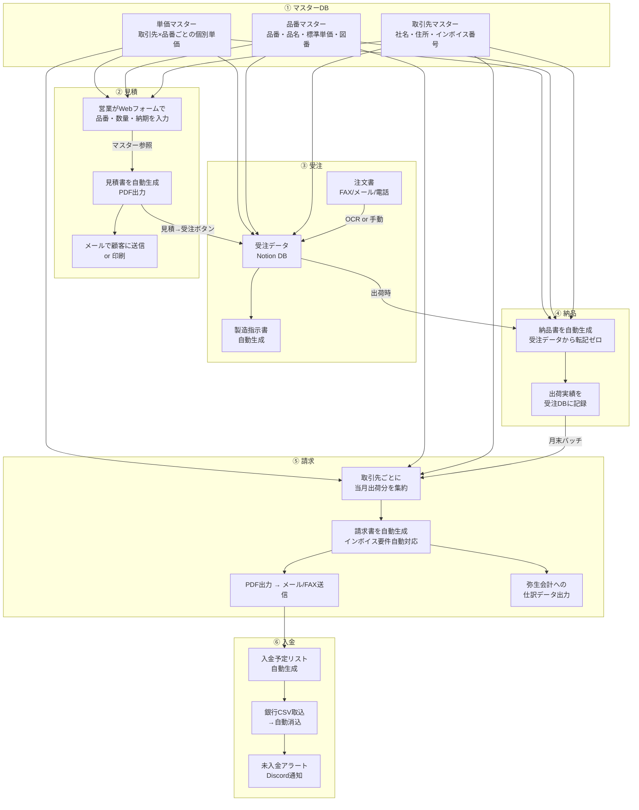

# 【製造業】見積→注文→納品書の帳票自動化で年200時間削減

> POSTCABINETS 業務自動化コンサルティング｜提案用事例資料

> ※本事例は業界データに基づく想定です。実際の効果はクライアントの状況により異なります。

---

## 企業プロフィール

| 項目 | 内容 |
|------|------|
| 社名 | 大和精工株式会社（仮名） |
| 所在地 | 大阪府東大阪市（「モノづくりの街」） |
| 設立 | 1978年（現社長が2代目、2015年に事業承継） |
| 年商 | 約3.2億円 |
| 従業員 | 22名（製造15名・営業3名・事務2名・品管1名・社長） |
| 事業内容 | 金属プレス加工、板金加工。自動車部品の2次サプライヤーが売上の60%、産業機械部品25%、その他（建材・什器）15% |
| 年間受注件数 | 約1,200件（月100件前後。1件あたりの単価は数千円〜500万円と幅広い） |
| 主要取引先 | 自動車Tier1メーカー3社、産業機械メーカー2社、商社4社 |
| 使用システム | 弥生会計、Excel台帳（見積・受注・売上管理）、FAX、メール |
| インボイス登録 | 適格請求書発行事業者として登録済（T1234567890123） |

**なぜこの規模か：** 東大阪市だけで約6,000の製造業事業所があり、うち従業員20〜50名の中小企業が約800社（出典：総務省・経済産業省「経済センサス-活動調査」2021年 https://www.stat.go.jp/data/e-census/ ）。年商2〜5億の金属加工業者は「見積書・納品書・請求書を全部Excelで手作業」が大半。インボイス制度の開始（2023年10月）で帳票の記載要件が厳格化し、事務負担が増えている。IT投資の目安は売上の1%（年間320万円）だが、実際に使っているのは弥生会計の年額5万円程度。

---

## 経営者の生の悩み（大和社長・48歳・元旋盤工の言葉で）

> 「うちは月に100件の注文をこなしてる。1件ごとに見積書出して、注文書もらって、納品書つけて出荷して、月末に請求書を出す。この帳票を全部、事務の佐藤さんと松田さんの2人がExcelで作ってる。見積は営業がExcelで作るけど、注文が来たらまた事務が別のExcelに打ち直す。同じ品番、同じ金額を3回も4回も手で入力してる。そりゃミスも出るわ。」

> 「去年の10月からインボイス制度が始まったやろ。適格請求書には登録番号とか税率ごとの消費税額とか、今までなかったもんを全部書かなあかん。佐藤さんが"社長、今の請求書のフォーマットじゃインボイスの要件満たしてません"って言ってきて、慌ててExcelのテンプレートを直した。でも端数処理のルールが変わって、"1つの請求書で税率ごとに1回だけ端数処理"とかいう細かい話になって、佐藤さんが泣きそうになっとった。」

> 「転記ミスは月に4〜5件は出る。先月も○○精機さんへの請求書で、単価を1個180円のところ108円で打ってた。180件納品してるから、差額が12,960円。気づかず請求して、入金が少なくて"おかしいな"ってなった。佐藤さんが請求書を見直して、修正の請求書を出して、お詫びの電話を入れて。このやり取りで半日潰れた。」

> 「もっと怖いのは過大請求や。これやったら取引先の信用を失う。自動車メーカーの仕事は品質だけやなくて、事務処理の正確さも見られてる。大手の購買部に"御社の請求書、また間違ってますよ"って2回言われたら、次の見積で呼ばれんくなる。」

> 「楽楽販売とかのシステムは知ってる。でも月7万やろ。年間84万。うちの事務員2人の給料で年間600万かかってるから、84万で効率化できるなら安いのかもしれんけど、導入に3ヶ月かかるとか、うちの業務フローに合わせるカスタマイズが別料金とか言われると、腰が引ける。それに、うちの取引先はまだFAXで注文書を送ってくる。システム入れても、FAXを手で打ち直すなら意味ない。」

---

## 現場のオペレーション

### 帳票業務の全体フロー（1件の受注〜請求）

```
[営業が見積作成] → [顧客から注文書] → [事務が受注台帳に入力] →
[製造指示書] → [製造] → [納品書作成・出荷] → [月末に請求書作成] → [入金確認]
```

**同じ情報の入力回数：**

| 情報 | 入力箇所 | 回数 |
|------|---------|------|
| 品番・品名 | 見積書→受注台帳→納品書→請求書 | **4回** |
| 単価 | 見積書→受注台帳→納品書→請求書 | **4回** |
| 数量 | 注文書→受注台帳→納品書→請求書 | **4回** |
| 取引先名・住所 | 見積書→受注台帳→納品書→請求書 | **4回** |
| 納期 | 見積書→受注台帳→製造指示書 | **3回** |

**1件あたりの事務作業時間：合計32分**

| 帳票 | 作成時間 | 担当 |
|------|---------|------|
| 見積書（Excel） | 8分 | 営業 |
| 受注台帳への入力 | 5分 | 事務・佐藤 |
| 製造指示書 | 3分 | 事務・佐藤 |
| 納品書 | 6分 | 事務・松田 |
| 請求書（月末一括） | 5分/件 | 事務・佐藤 |
| 入金確認・消込 | 5分 | 事務・松田 |

### 事務員・佐藤さんの1日（月末以外の通常日）

| 時刻 | 行動 | 帳票業務との関係 |
|------|------|----------------|
| 8:00 | 出社。メール・FAXチェック。**注文書が5件届いている**（うち3件はFAX） | FAXの注文書をスキャンして画像保存 |
| 8:15 | 注文書①の内容を受注台帳（Excel）に入力。品番・品名・数量・単価・納期 | FAXが不鮮明。数量が「100」か「108」か読めない→電話確認 |
| 8:30 | 注文書②を入力。**前回と同じ品番だが単価が変わっている**→営業に確認 | 「あ、先月値上げの話して了承もらってます」→台帳を修正 |
| 8:45 | 注文書③〜⑤を入力。計5件で40分 | — |
| 9:00 | 製造指示書を5件分作成。受注台帳からコピペ | **コピペ元のセルを間違えて、品番③の数量が②のデータに** |
| 9:20 | 昨日出荷した分の納品書を3件作成。受注台帳→納品書テンプレにコピペ | — |
| 9:45 | 営業の山田から「○○商事に見積を出してほしい」→見積書のフォーマットを渡す | 「前に出した見積書はどこ…」Excel_見積_○○商事_20250901.xlsx |
| 10:00 | 電話対応。取引先から「先日の納品書の品番が違ってます」→確認→再発行 | **品番の転記ミス。手入力で1文字間違い** |
| 10:30 | 請求書の消費税計算を確認。インボイスの端数処理ルールに沿っているか | 「税率10%の合計×10%で端数切捨て…合ってるかな…」 |
| 11:00 | 取引先マスターの更新。住所変更の通知が来ていた→8つのExcelファイルに反映 | **4つのファイルに反映して、残り4つを忘れる** |
| 12:00 | 昼休憩 | — |
| 13:00 | 午後の注文書処理（3件追加） | — |
| 14:00 | 出荷伝票の作成。宅配便の送り状を手書き | — |
| 15:00 | 銀行振込の手続き。外注先への支払い | — |
| 16:00 | 明日出荷分の納品書を準備 | — |
| 17:00 | 退社 | — |

### 月末の請求書作成（分単位で描写）

**毎月25日〜月末：3日間の集中作業**

#### Day 1（25日）：データ収集・突合 — 約6時間

| 時間 | 作業 | 所要時間 |
|------|------|---------|
| 8:00 | 受注台帳から当月の出荷分を抽出（Excelフィルタ） | 30分 |
| 8:30 | 納品書の控えと受注台帳を突合。出荷漏れ・入力漏れがないか確認 | 90分 |
| 10:00 | **不一致3件発見**。納品書に記載があるのに台帳にない→受注時の入力漏れ | 30分 |
| 10:30 | 取引先ごとに出荷データを集約（ピボットテーブル） | 45分 |
| 11:15 | 単価マスターとの照合。「この品番、先月から単価改定してるけど反映してるか？」 | 60分 |
| 12:15 | 昼休憩 | — |
| 13:15 | 取引先への確認電話2件（数量の不一致） | 30分 |
| 14:00 | 仕掛品の扱い確認。「月末までに全数納品できない分は来月に回す？」→営業に確認 | 15分 |
| 14:15 | 月末締めの売上データ確定 | 30分 |

#### Day 2（26日）：請求書作成 — 約7時間

| 時間 | 作業 | 所要時間 |
|------|------|---------|
| 8:00 | 請求書テンプレート（Excel）を開く。取引先ごとに1ファイル | — |
| 8:10 | 取引先A社の請求書。明細15行を1行ずつ手入力。品番・品名・数量・単価・金額 | 25分 |
| 8:35 | 消費税の計算。**インボイス要件：税率ごとに合計し、1回だけ端数処理** | 10分 |
| 8:45 | 適格請求書の必須項目チェック（登録番号・税率・消費税額） | 5分 |
| 8:50 | 取引先B社の請求書。明細8行 | 15分 |
| 9:05 | 取引先C社…（以下、10社分を繰り返し） | — |
| 12:00 | 昼休憩。**ここまでで6社分完成** | — |
| 13:00 | 残り4社分の請求書作成 | 120分 |
| 15:00 | 全10社分の請求書を松田さんがダブルチェック | 60分 |
| 16:00 | **チェックでミス2件発見**。① 品番の転記ミス、② 数量の入力ミス | 30分 |
| 16:30 | 修正→再チェック→確定 | 30分 |

#### Day 3（27日）：発送・記帳 — 約3時間

| 時間 | 作業 | 所要時間 |
|------|------|---------|
| 8:00 | 請求書を印刷（10社分） | 15分 |
| 8:15 | 封筒に宛名を書いて封入 | 30分 |
| 8:45 | 3社はメール添付でPDF送信 | 15分 |
| 9:00 | 2社はFAXで送信 | 10分 |
| 9:10 | 弥生会計に売上仕訳を入力 | 60分 |
| 10:10 | 売掛金台帳を更新 | 30分 |

**合計：約16時間/月（月末3日間）**

---

## ボトルネック分析

### 帳票業務の年間時間コスト

| 業務 | 月間時間 | 年間時間 | 時給換算コスト |
|------|---------|---------|-------------|
| 見積書作成（営業） | 13時間 | 156時間 | 46.8万円 |
| 受注入力・台帳管理 | 10時間 | 120時間 | 24万円 |
| 納品書作成 | 10時間 | 120時間 | 24万円 |
| 請求書作成（月末） | 16時間 | 192時間 | 38.4万円 |
| 入金確認・消込 | 5時間 | 60時間 | 12万円 |
| 転記ミスの修正・やり直し | 4時間 | 48時間 | 9.6万円 |
| **合計** | **58時間** | **696時間** | **154.8万円** |

**事務員2人の年間労働時間は2人×1,920時間=3,840時間。うち696時間（18%）が帳票の転記作業。**

### 転記ミスの実態

| ミスの種類 | 月間発生数 | 年間発生数 | 影響 |
|-----------|----------|----------|------|
| 品番の入力ミス | 2件 | 24件 | 誤出荷リスク。納品書の再発行 |
| 単価の入力ミス | 1.5件 | 18件 | 過少/過大請求。平均差額8,000円/件 |
| 数量の入力ミス | 1件 | 12件 | 在庫差異。棚卸時に判明 |
| 取引先情報のミス | 0.5件 | 6件 | 請求書の宛先違い。信用問題 |
| インボイス要件の不備 | 1件 | 12件 | 取引先が仕入税額控除を受けられない |
| **合計** | **6件** | **72件** | — |

**過少請求による年間損失：18件×8,000円 = 144,000円**
**信用毀損コスト：算定困難だが、大手取引先1社失注で年間2,000〜5,000万円の影響**

### ミスが起きる構造

```
┌──────────────────────────────────────────────┐
│ 見積書（営業がExcelで作成）                      │
│  品番: PRS-A001  品名: プレス部品A  単価: 180円  │
└───────────┬──────────────────────────────────┘
            ▼ 手入力で転記
┌──────────────────────────────────────────────┐
│ 受注台帳（事務がExcelに入力）                    │
│  品番: PRS-A001  品名: プレス部品A  単価: 180円  │
│  ※ ここで注文書の数量を追加入力                  │
└───────────┬──────────────────────────────────┘
            ▼ コピペで転記
┌──────────────────────────────────────────────┐
│ 納品書（事務がExcelテンプレに貼り付け）           │
│  品番: PRS-A001  品名: プレス部品A  単価: 108円  │
│  ※ 180→108の打ち間違い（1と0が隣のキー）       │
└───────────┬──────────────────────────────────┘
            ▼ コピペで転記
┌──────────────────────────────────────────────┐
│ 請求書（月末に納品書ベースで作成）               │
│  品番: PRS-A001  品名: プレス部品A  単価: 108円  │
│  ※ 納品書のミスがそのまま請求書に伝播           │
│  ※ 月末のチェックで見落とし → 過少請求           │
└──────────────────────────────────────────────┘
```

---

## 導入による経営インパクト

### Before / After 比較表

| 指標 | Before | After | 改善幅 |
|------|--------|-------|--------|
| 1件あたり帳票作成時間（見積〜請求） | 32分 | 8分 | **▲75%** |
| 月末の請求書作成時間 | 16時間 | 3時間 | **▲81%** |
| 転記ミス件数 | 月6件 | 月0.5件 | **▲92%** |
| 年間の帳票業務時間 | 696時間 | **210時間** | **▲486時間** |
| インボイス要件の不備 | 月1件 | ほぼゼロ | — |
| 過少請求による年間損失 | 14.4万円 | 1万円以下 | ▲93% |
| 見積回答の平均リードタイム | 2〜3日 | **当日** | — |

### ROI計算

**3シナリオ:**

| シナリオ | 時間削減 | 受注増 | 年間効果 | 初年度ROI | 投資回収 |
|----------|---------|--------|---------|----------|---------|
| 保守的（時間削減のみ） | 97万円 | 0 | **111万円** | **-18%** | 初年度は赤字だが2年目に回収 |
| 標準（時間削減＋見積迅速化） | 97万円 | 162万円 | **273万円** | **101%** | 6ヶ月 |
| 楽観的（標準＋大手取引先からの信用向上） | 97万円 | 324万円 | **435万円** | **220%** | 3.8ヶ月 |

| 項目 | 金額 |
|------|------|
| 初期構築費（POSTCABINETS） | 100万円 |
| 月額運用費（システム保守） | 3万円/月 = 36万円/年 |
| **年間の時間削減効果** | 486時間×2,000円/時 = **97.2万円** |
| **転記ミス削減による損失回避** | **14万円/年** |
| **見積回答の迅速化による受注増（標準）** | 推定+5%=年間60件×平均2.7万円=**162万円** |
| **合計年間効果（標準）** | **273万円** |
| **初年度ROI（標準）** | (273-100-36) / 136 = **101%** |
| **投資回収** | **6ヶ月** |

**見積回答の迅速化がもたらす受注増の根拠：** 製造業の見積は「早い者勝ち」の側面がある。特に商社経由の案件は、見積回答が早い方に発注する傾向がある。見積回答が2〜3日→当日になることで、競合より先に回答できるケースが年間60件程度増えると推定。

---

## 自動化の全体設計



---

## 構築手順

### Phase 1：マスターDB構築＋見積書自動生成（3週間）

```python
"""
品番マスター・取引先マスター・単価マスターをNotionに構築し、
見積書をPDFで自動生成するスクリプト。
"""
import os
from datetime import date
from decimal import Decimal, ROUND_DOWN
from dataclasses import dataclass, field
from pathlib import Path

import httpx
from reportlab.lib import colors
from reportlab.lib.pagesizes import A4
from reportlab.lib.units import mm
from reportlab.platypus import SimpleDocTemplate, Table, TableStyle, Paragraph, Spacer
from reportlab.lib.styles import getSampleStyleSheet, ParagraphStyle
from reportlab.pdfbase import pdfmetrics
from reportlab.pdfbase.ttfonts import TTFont


# 日本語フォント登録（IPAexゴシック）
# IPAexゴシックの入手手順:
#   1. IPA（情報処理推進機構）のサイトからダウンロード
#      https://moji.or.jp/ipafont/ipaexfont/
#   2. ipaexg.ttf を任意のディレクトリに配置
#   3. 以下のコメントを外して有効化
pdfmetrics.registerFont(TTFont("IPAexGothic", "/usr/share/fonts/ipaexg.ttf"))
# macOSの場合: "/Library/Fonts/ipaexg.ttf"
# Windowsの場合: "C:/Windows/Fonts/ipaexg.ttf"


@dataclass
class EstimateItem:
    """見積明細"""
    item_number: str      # 品番
    item_name: str        # 品名
    quantity: int          # 数量
    unit: str             # 単位（個・kg・m等）
    unit_price: Decimal   # 単価
    tax_rate: Decimal     # 税率（0.10 or 0.08）

    @property
    def amount(self) -> Decimal:
        return self.unit_price * self.quantity

    @property
    def tax_amount(self) -> Decimal:
        return (self.amount * self.tax_rate).quantize(Decimal("1"), rounding=ROUND_DOWN)


@dataclass
class Estimate:
    """見積書"""
    estimate_number: str
    estimate_date: date
    valid_until: date
    customer_name: str
    customer_address: str
    customer_dept: str
    our_company: str
    our_address: str
    our_phone: str
    our_invoice_number: str   # 適格請求書発行事業者登録番号
    items: list[EstimateItem] = field(default_factory=list)
    delivery_date: str = ""
    payment_terms: str = "月末締め翌月末払い"
    notes: str = ""

    @property
    def subtotal(self) -> Decimal:
        return sum(item.amount for item in self.items)

    @property
    def tax_amount_by_rate(self) -> dict[str, Decimal]:
        """税率ごとの消費税額（インボイス要件：税率ごとに1回だけ端数処理）"""
        by_rate: dict[str, Decimal] = {}
        for item in self.items:
            rate_key = f"{item.tax_rate * 100}%"
            if rate_key not in by_rate:
                by_rate[rate_key] = Decimal("0")
            by_rate[rate_key] += item.amount

        result = {}
        for rate_key, subtotal in by_rate.items():
            rate = Decimal(rate_key.replace("%", "")) / 100
            # インボイス要件：税率ごとに合計した金額に対して1回だけ端数処理
            result[rate_key] = (subtotal * rate).quantize(
                Decimal("1"), rounding=ROUND_DOWN
            )
        return result

    @property
    def total_tax(self) -> Decimal:
        return sum(self.tax_amount_by_rate.values())

    @property
    def total(self) -> Decimal:
        return self.subtotal + self.total_tax


def generate_estimate_pdf(estimate: Estimate, output_path: Path) -> Path:
    """
    見積書をPDFで生成する。
    インボイス要件に準拠した記載項目を含む。
    """
    doc = SimpleDocTemplate(
        str(output_path),
        pagesize=A4,
        topMargin=20 * mm,
        bottomMargin=20 * mm,
        leftMargin=15 * mm,
        rightMargin=15 * mm,
    )

    styles = getSampleStyleSheet()
    # 日本語スタイル
    jp_style = ParagraphStyle("Japanese", parent=styles["Normal"], fontName="IPAexGothic")

    elements = []

    # ヘッダー
    elements.append(Paragraph("御 見 積 書", styles["Title"]))
    elements.append(Spacer(1, 10 * mm))

    # 宛先・発行元
    header_data = [
        [f"〒{estimate.customer_address}", "", f"見積番号: {estimate.estimate_number}"],
        [estimate.customer_name, "", f"見積日: {estimate.estimate_date}"],
        [f"{estimate.customer_dept} 御中", "", f"有効期限: {estimate.valid_until}"],
        ["", "", ""],
        ["", "", estimate.our_company],
        ["", "", estimate.our_address],
        ["", "", f"TEL: {estimate.our_phone}"],
        ["", "", f"登録番号: {estimate.our_invoice_number}"],
    ]

    header_table = Table(header_data, colWidths=[80 * mm, 20 * mm, 80 * mm])
    header_table.setStyle(TableStyle([
        ("ALIGN", (2, 0), (2, -1), "RIGHT"),
    ]))
    elements.append(header_table)
    elements.append(Spacer(1, 10 * mm))

    # 合計金額
    elements.append(Paragraph(
        f"合計金額: {estimate.total:,.0f} 円（税込）",
        styles["Heading2"],
    ))
    elements.append(Spacer(1, 5 * mm))

    # 明細
    detail_header = ["No.", "品番", "品名", "数量", "単位", "単価", "金額", "税率"]
    detail_data = [detail_header]

    for i, item in enumerate(estimate.items, 1):
        detail_data.append([
            str(i),
            item.item_number,
            item.item_name,
            f"{item.quantity:,}",
            item.unit,
            f"{item.unit_price:,.0f}",
            f"{item.amount:,.0f}",
            f"{item.tax_rate * 100:.0f}%",
        ])

    detail_table = Table(
        detail_data,
        colWidths=[10 * mm, 25 * mm, 40 * mm, 15 * mm, 10 * mm, 20 * mm, 25 * mm, 12 * mm],
    )
    detail_table.setStyle(TableStyle([
        ("BACKGROUND", (0, 0), (-1, 0), colors.grey),
        ("TEXTCOLOR", (0, 0), (-1, 0), colors.whitesmoke),
        ("ALIGN", (0, 0), (-1, 0), "CENTER"),
        ("ALIGN", (3, 1), (3, -1), "RIGHT"),
        ("ALIGN", (5, 1), (6, -1), "RIGHT"),
        ("ALIGN", (7, 1), (7, -1), "CENTER"),
        ("GRID", (0, 0), (-1, -1), 0.5, colors.black),
        ("FONTSIZE", (0, 0), (-1, -1), 8),
    ]))
    elements.append(detail_table)
    elements.append(Spacer(1, 5 * mm))

    # 小計・消費税・合計（インボイス要件対応）
    summary_data = [
        ["小計", f"{estimate.subtotal:,.0f} 円"],
    ]
    for rate_key, tax in estimate.tax_amount_by_rate.items():
        summary_data.append([f"消費税（{rate_key}）", f"{tax:,.0f} 円"])
    summary_data.append(["合計（税込）", f"{estimate.total:,.0f} 円"])

    summary_table = Table(summary_data, colWidths=[40 * mm, 30 * mm])
    summary_table.setStyle(TableStyle([
        ("ALIGN", (1, 0), (1, -1), "RIGHT"),
        ("GRID", (0, 0), (-1, -1), 0.5, colors.black),
        ("BACKGROUND", (0, -1), (-1, -1), colors.lightgrey),
    ]))
    # 右寄せで配置
    elements.append(summary_table)
    elements.append(Spacer(1, 10 * mm))

    # 備考
    elements.append(Paragraph(f"納期: {estimate.delivery_date}", styles["Normal"]))
    elements.append(Paragraph(f"支払条件: {estimate.payment_terms}", styles["Normal"]))
    if estimate.notes:
        elements.append(Paragraph(f"備考: {estimate.notes}", styles["Normal"]))

    doc.build(elements)
    print(f"見積書を生成しました: {output_path}")
    return output_path


def fetch_unit_price_from_notion(
    customer_id: str, item_number: str, price_master_db_id: str
) -> Decimal:
    """
    Notionの単価マスターから、取引先×品番の個別単価を取得する。
    個別単価がなければ品番マスターの標準単価を返す。
    """
    NOTION_TOKEN = os.environ["NOTION_TOKEN"]

    resp = httpx.post(
        f"https://api.notion.com/v1/databases/{price_master_db_id}/query",
        headers={
            "Authorization": f"Bearer {NOTION_TOKEN}",
            "Content-Type": "application/json",
            "Notion-Version": "2022-06-28",
        },
        json={
            "filter": {
                "and": [
                    {"property": "取引先ID", "rich_text": {"equals": customer_id}},
                    {"property": "品番", "rich_text": {"equals": item_number}},
                ]
            }
        },
    )
    resp.raise_for_status()
    results = resp.json()["results"]

    if results:
        price = results[0]["properties"]["単価"]["number"]
        return Decimal(str(price))

    # 個別単価がなければ標準単価を返す（別途品番マスターを参照）
    return Decimal("0")


# --- 使用例 ---
if __name__ == "__main__":
    estimate = Estimate(
        estimate_number="EST-2026-0342",
        estimate_date=date(2026, 3, 25),
        valid_until=date(2026, 4, 24),
        customer_name="株式会社○○精機",
        customer_address="577-0011 大阪府東大阪市荒本北1-1-1",
        customer_dept="購買部",
        our_company="大和精工株式会社",
        our_address="〒577-0000 大阪府東大阪市高井田1-2-3",
        our_phone="06-1234-5678",
        our_invoice_number="T1234567890123",
        delivery_date="受注後2週間",
        items=[
            EstimateItem("PRS-A001", "プレス部品A（SUS304）", 500, "個", Decimal("180"), Decimal("0.10")),
            EstimateItem("PRS-A002", "プレス部品B（SPCC）", 1000, "個", Decimal("95"), Decimal("0.10")),
            EstimateItem("BND-C010", "板金加工品C", 200, "個", Decimal("450"), Decimal("0.10")),
        ],
    )

    generate_estimate_pdf(estimate, Path("estimate_sample.pdf"))
    print(f"小計: {estimate.subtotal:,.0f} 円")
    print(f"消費税: {estimate.tax_amount_by_rate}")
    print(f"合計: {estimate.total:,.0f} 円")
```

### Phase 2：見積→受注→納品書のリレー自動化（3週間）

```python
"""
見積が受注に変わったら、受注台帳・納品書・製造指示書を
一切の再入力なしで自動生成するリレー式帳票エンジン。
"""
import os
import httpx
from datetime import date, datetime
from dataclasses import dataclass
from decimal import Decimal


NOTION_TOKEN = os.environ["NOTION_TOKEN"]
HEADERS = {
    "Authorization": f"Bearer {NOTION_TOKEN}",
    "Content-Type": "application/json",
    "Notion-Version": "2022-06-28",
}


def convert_estimate_to_order(
    estimate_page_id: str,
    order_db_id: str,
    order_quantity: int | None = None,
    delivery_date: str | None = None,
) -> str:
    """
    見積データをNotionの受注DBにコピーする。
    手入力ゼロ。見積→受注のボタン1つで完了。
    """
    # 見積データを取得
    resp = httpx.get(
        f"https://api.notion.com/v1/pages/{estimate_page_id}",
        headers=HEADERS,
    )
    resp.raise_for_status()
    est = resp.json()["properties"]

    # 受注データを作成（見積の内容をそのまま引き継ぐ）
    order_payload = {
        "parent": {"database_id": order_db_id},
        "properties": {
            "受注番号": {
                "title": [{"text": {"content": generate_order_number()}}]
            },
            "見積番号": {
                "rich_text": [{"text": {"content": get_title(est, "見積番号")}}]
            },
            "取引先": {
                "rich_text": [{"text": {"content": get_rich_text(est, "取引先")}}]
            },
            "品番": {
                "rich_text": [{"text": {"content": get_rich_text(est, "品番")}}]
            },
            "品名": {
                "rich_text": [{"text": {"content": get_rich_text(est, "品名")}}]
            },
            "数量": {
                "number": order_quantity or est["数量"]["number"]
            },
            "単価": {
                "number": est["単価"]["number"]
            },
            "ステータス": {
                "select": {"name": "受注確定"}
            },
            "受注日": {
                "date": {"start": date.today().isoformat()}
            },
            "納期": {
                "date": {"start": delivery_date or ""}
            },
        },
    }

    resp = httpx.post(
        "https://api.notion.com/v1/pages",
        headers=HEADERS,
        json=order_payload,
    )
    resp.raise_for_status()
    order_id = resp.json()["id"]

    # 元の見積のステータスを「受注済」に更新
    httpx.patch(
        f"https://api.notion.com/v1/pages/{estimate_page_id}",
        headers=HEADERS,
        json={
            "properties": {
                "ステータス": {"select": {"name": "受注済"}},
            }
        },
    )

    print(f"受注データ作成完了: {order_id}")
    return order_id


def generate_delivery_note(order_page_id: str) -> dict:
    """
    受注データから納品書を自動生成する。
    再入力ゼロ。受注DBのデータをそのまま使う。
    """
    resp = httpx.get(
        f"https://api.notion.com/v1/pages/{order_page_id}",
        headers=HEADERS,
    )
    resp.raise_for_status()
    order = resp.json()["properties"]

    delivery_note = {
        "delivery_number": generate_delivery_number(),
        "delivery_date": date.today().isoformat(),
        "customer": get_rich_text(order, "取引先"),
        "items": [
            {
                "item_number": get_rich_text(order, "品番"),
                "item_name": get_rich_text(order, "品名"),
                "quantity": order["数量"]["number"],
                "unit_price": order["単価"]["number"],
            }
        ],
        "order_number": get_title(order, "受注番号"),
    }

    # 受注のステータスを「出荷済」に更新
    httpx.patch(
        f"https://api.notion.com/v1/pages/{order_page_id}",
        headers=HEADERS,
        json={
            "properties": {
                "ステータス": {"select": {"name": "出荷済"}},
                "出荷日": {"date": {"start": date.today().isoformat()}},
            }
        },
    )

    return delivery_note


def generate_monthly_invoices(order_db_id: str, year_month: str) -> list[dict]:
    """
    月末一括：当月出荷分を取引先ごとに集約し、請求書データを生成する。
    インボイス要件（登録番号・税率ごとの消費税額・端数処理）を自動対応。
    """
    # 当月の出荷済データを取得
    resp = httpx.post(
        f"https://api.notion.com/v1/databases/{order_db_id}/query",
        headers=HEADERS,
        json={
            "filter": {
                "and": [
                    {
                        "property": "出荷日",
                        "date": {"after": f"{year_month}-01"},
                    },
                    {
                        "property": "出荷日",
                        "date": {"before": f"{year_month}-31"},
                    },
                    {
                        "property": "ステータス",
                        "select": {"equals": "出荷済"},
                    },
                ]
            }
        },
    )
    resp.raise_for_status()
    orders = resp.json()["results"]

    # 取引先ごとに集約
    by_customer: dict[str, list] = {}
    for order in orders:
        props = order["properties"]
        customer = get_rich_text(props, "取引先")
        if customer not in by_customer:
            by_customer[customer] = []
        by_customer[customer].append({
            "item_number": get_rich_text(props, "品番"),
            "item_name": get_rich_text(props, "品名"),
            "quantity": props["数量"]["number"],
            "unit_price": props["単価"]["number"],
            "amount": props["数量"]["number"] * props["単価"]["number"],
        })

    # 請求書データ生成
    invoices = []
    for customer, items in by_customer.items():
        subtotal = sum(item["amount"] for item in items)
        # インボイス要件：税率ごとに1回だけ端数処理（ここでは10%のみの簡略化）
        tax = int(subtotal * 0.10)  # 切り捨て
        invoices.append({
            "invoice_number": generate_invoice_number(),
            "customer": customer,
            "year_month": year_month,
            "items": items,
            "subtotal": subtotal,
            "tax_10pct": tax,
            "total": subtotal + tax,
        })

    return invoices


# ユーティリティ関数
def get_title(props: dict, key: str) -> str:
    return props[key]["title"][0]["plain_text"] if props[key]["title"] else ""

def get_rich_text(props: dict, key: str) -> str:
    return props[key]["rich_text"][0]["plain_text"] if props[key]["rich_text"] else ""

def generate_order_number() -> str:
    return f"ORD-{datetime.now().strftime('%Y%m%d-%H%M%S')}"

def generate_delivery_number() -> str:
    return f"DLV-{datetime.now().strftime('%Y%m%d-%H%M%S')}"

def generate_invoice_number() -> str:
    return f"INV-{datetime.now().strftime('%Y%m')}-{datetime.now().strftime('%H%M%S')}"
```

### Phase 3：FAX注文書のOCR取込（2週間）

```python
"""
FAXで届いた注文書をOCRで読み取り、
受注台帳に自動入力するスクリプト。
Google Cloud Vision API を使用。
"""
import os
import re
from pathlib import Path
from dataclasses import dataclass

from google.cloud import vision


@dataclass
class OrderFromFax:
    """FAX注文書から抽出した情報"""
    customer_name: str
    order_date: str
    items: list[dict]  # [{item_number, item_name, quantity, unit_price, delivery_date}]
    raw_text: str       # OCRの生テキスト（確認用）
    confidence: float   # 認識精度


def ocr_fax_order(image_path: Path) -> OrderFromFax:
    """
    FAX注文書の画像をOCRで読み取る。
    Google Cloud Vision APIのドキュメント検出を使用。
    """
    client = vision.ImageAnnotatorClient()

    with open(image_path, "rb") as f:
        content = f.read()

    image = vision.Image(content=content)
    response = client.document_text_detection(image=image)

    if response.error.message:
        raise Exception(f"OCRエラー: {response.error.message}")

    full_text = response.full_text_annotation.text
    confidence = response.full_text_annotation.pages[0].confidence if response.full_text_annotation.pages else 0

    # テキストからフィールドを抽出（注文書のフォーマットに依存）
    customer_name = extract_customer_name(full_text)
    order_date = extract_date(full_text)
    items = extract_order_items(full_text)

    return OrderFromFax(
        customer_name=customer_name,
        order_date=order_date,
        items=items,
        raw_text=full_text,
        confidence=confidence,
    )


def extract_customer_name(text: str) -> str:
    """注文書から発注元の社名を抽出"""
    patterns = [
        r"(株式会社[\w]+)",
        r"([\w]+株式会社)",
        r"(有限会社[\w]+)",
    ]
    for pattern in patterns:
        match = re.search(pattern, text)
        if match:
            return match.group(1)
    return ""


def extract_date(text: str) -> str:
    """注文書から日付を抽出"""
    patterns = [
        r"(\d{4}年\d{1,2}月\d{1,2}日)",
        r"(\d{4}/\d{1,2}/\d{1,2})",
        r"(R\d+\.\d{1,2}\.\d{1,2})",  # 令和
    ]
    for pattern in patterns:
        match = re.search(pattern, text)
        if match:
            return match.group(1)
    return ""


def extract_order_items(text: str) -> list[dict]:
    """
    注文書の明細行を抽出する。
    典型的なFAX注文書のレイアウト:
      品番 | 品名 | 数量 | 単価 | 納期
    """
    items = []
    # 品番のパターン（会社によって異なる。ここでは一般的なパターン）
    item_pattern = r"([A-Z]{2,4}-[A-Z0-9]{3,6})\s+(.+?)\s+(\d{1,6})\s+([\d,]+)\s*"
    matches = re.finditer(item_pattern, text)

    for match in matches:
        items.append({
            "item_number": match.group(1),
            "item_name": match.group(2).strip(),
            "quantity": int(match.group(3)),
            "unit_price": int(match.group(4).replace(",", "")),
        })

    return items


def validate_ocr_result(
    ocr_result: OrderFromFax,
    item_master_db_id: str,
) -> list[str]:
    """
    OCR結果をマスターDBと照合し、不整合を検出する。
    人間の確認が必要な箇所をリストアップ。
    """
    warnings = []

    if ocr_result.confidence < 0.85:
        warnings.append(
            f"⚠️ OCR認識精度が低い（{ocr_result.confidence:.0%}）。原本を目視確認してください"
        )

    if not ocr_result.customer_name:
        warnings.append("⚠️ 発注元の社名を認識できませんでした")

    for item in ocr_result.items:
        # 品番マスターとの照合（実際にはNotion APIでチェック）
        # ここでは簡易チェック
        if not re.match(r"^[A-Z]{2,4}-[A-Z0-9]{3,6}$", item["item_number"]):
            warnings.append(f"⚠️ 品番 '{item['item_number']}' がマスターと一致しません")

        if item["quantity"] > 10000:
            warnings.append(
                f"⚠️ 品番 {item['item_number']} の数量が {item['quantity']} です。桁数を確認してください"
            )

    return warnings


# --- 使用例 ---
if __name__ == "__main__":
    # FAXをスキャンした画像ファイル
    fax_image = Path("fax_orders/order_20260325.png")

    if fax_image.exists():
        result = ocr_fax_order(fax_image)
        print(f"発注元: {result.customer_name}")
        print(f"注文日: {result.order_date}")
        print(f"認識精度: {result.confidence:.0%}")
        print(f"明細数: {len(result.items)}")

        warnings = validate_ocr_result(result, "dummy_db_id")
        if warnings:
            print("\n⚠️ 確認事項:")
            for w in warnings:
                print(f"  {w}")
        else:
            print("✅ 自動検証OK。受注台帳に登録します。")
```

### Phase 4：弥生会計CSVインポート連携（1週間）

```python
"""
月末に生成した請求書データを弥生会計のインポート用CSV形式に変換するスクリプト。
弥生会計の「仕訳日記帳」インポートフォーマットに準拠。
"""
import csv
from datetime import date
from decimal import Decimal
from pathlib import Path


def generate_yayoi_csv(invoices: list[dict], output_path: Path, fiscal_year: int = 2026):
    """
    請求書データから弥生会計の仕訳日記帳インポート用CSVを生成する。

    弥生会計のCSVフォーマット（仕訳日記帳形式）:
    識別フラグ, 伝票No., 決算, 取引日付, 借方勘定科目, 借方補助科目,
    借方部門, 借方税区分, 借方金額, 借方税金額, 貸方勘定科目, 貸方補助科目,
    貸方部門, 貸方税区分, 貸方金額, 貸方税金額, 摘要, 番号, 期日, タイプ

    ※ 弥生会計のバージョンによりカラム順が異なる場合がある。
      インポート前に必ず「仕訳日記帳」→「ファイル」→「エクスポート」で
      自社のフォーマットを確認すること。
    """
    rows = []

    for inv in invoices:
        # 売掛金（借方）/ 売上高（貸方）の仕訳
        rows.append({
            "識別フラグ": 2000,  # 仕訳データ
            "伝票No.": "",
            "決算": "",
            "取引日付": f"{inv['year_month']}/28",  # 月末締め日
            "借方勘定科目": "売掛金",
            "借方補助科目": inv["customer"],
            "借方部門": "",
            "借方税区分": "対象外",
            "借方金額": inv["total"],
            "借方税金額": 0,
            "貸方勘定科目": "売上高",
            "貸方補助科目": "",
            "貸方部門": "",
            "貸方税区分": "課税売上10%",
            "貸方金額": inv["subtotal"],
            "貸方税金額": inv["tax_10pct"],
            "摘要": f"{inv['customer']} {inv['year_month']}月分 請求書No.{inv['invoice_number']}",
            "番号": "",
            "期日": "",
            "タイプ": 0,
        })

    # CSV出力（Shift_JIS、弥生会計の標準エンコーディング）
    fieldnames = [
        "識別フラグ", "伝票No.", "決算", "取引日付",
        "借方勘定科目", "借方補助科目", "借方部門", "借方税区分",
        "借方金額", "借方税金額",
        "貸方勘定科目", "貸方補助科目", "貸方部門", "貸方税区分",
        "貸方金額", "貸方税金額",
        "摘要", "番号", "期日", "タイプ",
    ]

    with open(output_path, "w", encoding="cp932", newline="") as f:
        writer = csv.DictWriter(f, fieldnames=fieldnames)
        # 弥生会計のインポートCSVはヘッダー行なし
        writer.writerows(rows)

    print(f"弥生会計インポートCSVを生成しました: {output_path}（{len(rows)}仕訳）")
    return output_path


# --- 使用例 ---
if __name__ == "__main__":
    # generate_monthly_invoices() の戻り値を渡す
    sample_invoices = [
        {
            "invoice_number": "INV-202603-001",
            "customer": "株式会社○○精機",
            "year_month": "2026-03",
            "subtotal": 185000,
            "tax_10pct": 18500,
            "total": 203500,
        },
    ]
    generate_yayoi_csv(sample_invoices, Path("yayoi_import_202603.csv"))
```

> **つまずきポイント（弥生会計CSVインポート）:**
> - 弥生会計のCSVは**Shift_JIS（cp932）エンコーディング**が必須。UTF-8で出力すると文字化けしてインポートエラーになる。
> - 「識別フラグ」のコードは弥生のバージョンにより異なる場合がある。一度手動でエクスポートして確認すること。
> - 弥生会計の補助科目は**事前に手動で登録**が必要。新規取引先の場合はCSVインポート前に補助科目マスターに追加する。
> - 弥生会計 オンライン版では仕訳インポートのCSVフォーマットが異なる（API連携の方が推奨）。

---

## 提案トークスクリプト

### 刺さる一言（初回面談で使う）

> 「社長、御社は月100件の注文をこなしてますよね。見積書、受注台帳、納品書、請求書。1件で同じ品番と単価を何回入力してます？ ……4回ですよね。月に400回、同じ数字を手で打ってる。そのうち何件ミスが出てます？ 月6件。年間72件。これ、1回入力したら残り3回は自動で埋まる仕組みにしたら、月6件のミスと年間500時間の作業がなくなります。」

### 想定される反論と切り返し

| 反論 | 切り返し |
|------|---------|
| 「楽楽販売とか入れたほうが早いんちゃう？」 | 「楽楽販売は月7万、年間84万です。初期費用も15万。しかも御社のFAX注文書の処理とか、弥生会計との連携は別途カスタマイズが必要。うちは御社の今のExcelの流れをベースに、"転記をゼロにする"仕組みをつくります。初期100万、月3万。使い方が変わらないので、佐藤さんも松田さんも明日から使えます」 |
| 「うちの取引先はFAXしか使わんから、システム入れても意味ない」 | 「FAXが来る前提で設計してます。FAXをスキャンしたら、OCRで品番・数量・単価を読み取って、受注台帳に自動入力。認識精度が低い部分だけ佐藤さんが確認する。FAX→手入力の部分が一番ミスが出るところなので、ここを先に潰します」 |
| 「インボイス対応はもう終わってるよ」 | 「今のExcelテンプレートで、税率ごとに1回だけ端数処理するルール、ちゃんと守れてますか？ ……怪しいですよね。取引先がインボイスの不備に気づいたら、仕入税額控除が受けられなくて、"ちゃんとした請求書を出してくれ"って言われます。自動生成なら端数処理も登録番号も絶対に漏れません」 |
| 「事務員の仕事がなくなるんちゃう？」 | 「転記の仕事はなくなります。でも佐藤さんと松田さんの本当の仕事は"数字の正確さを担保すること"と"取引先とのコミュニケーション"ですよね。今は転記に忙殺されて、単価交渉のフォローとか新規取引先の与信チェックとか、本来やるべき仕事に手が回ってない。転記から解放されたら、そっちに時間を使えます」 |

### クロージングトーク

> 「社長、まず"品番マスター"だけ一緒につくりましょう。御社が扱ってる品番と取引先ごとの単価を、Excelから1つのDBに整理する。これだけで見積書の作成が半分の時間になります。1週間でできます。費用はかかりません。これで"使えるな"と思ったら、受注→納品→請求の自動化に進みましょう。」

---

## 法規制・業界特有のリスク

### インボイス制度（適格請求書等保存方式）

| リスク | 内容 | 対策 |
|--------|------|------|
| 必須記載項目の不備 | 適格請求書に必要な6項目（①発行事業者の氏名/名称+登録番号、②取引日、③取引内容、④税率ごとの合計額、⑤税率ごとの消費税額、⑥受領者の氏名/名称）が欠けると、取引先が仕入税額控除を受けられない | テンプレートに6項目を必須化。入力漏れはバリデーションで検出 |
| 端数処理ルール | 1つの適格請求書につき、税率ごとに1回の端数処理。明細行ごとに端数処理→合計は不可 | システムで税率ごとの合計に対して端数処理を実行。Excel時代の「行ごとの切り捨て→合計」パターンを排除 |
| 電子帳簿保存法 | 2024年1月から電子取引データの電子保存が義務化。メールで受信した注文書や送付した請求書PDFは電子保存が必要 | 生成した帳票PDFを自動でクラウドストレージに保存。検索要件（日付・金額・取引先）を満たすファイル名規則を設定 |

### 下請法

| リスク | 内容 | 対策 |
|--------|------|------|
| 書面の交付義務（第3条） | 親事業者は下請事業者に対し、発注内容を記載した書面（3条書面）を交付する義務がある | 受注確認書の自動生成。発注内容（品名・数量・単価・納期・支払条件）を明記 |
| 支払期日（第2条の2） | 下請代金の支払期日は、給付を受領した日から60日以内 | 納品日→支払期限を自動計算。60日超過のアラートを設定 |

### 製造業特有のリスク

| リスク | 内容 | 対策 |
|--------|------|------|
| 図面・仕様の管理 | 同じ品番でもリビジョンが変わることがある。旧仕様で見積→新仕様で製造→単価差異 | 品番マスターに図番リビジョンを持たせ、見積時のリビジョンと受注時のリビジョンを照合 |
| 材料費の変動 | 鉄・ステンレス等の素材価格は月次で変動。見積時と納品時で原価が変わる | 見積書に有効期限を設定（30日）。単価マスターに「最終見直し日」を持たせ、3ヶ月以上未更新の品番をアラート |

---

## POSTCABINETS内部メモ

### この業界の攻め方

- **入口は「同じ品番を何回入力してますか？」**。製造業の事務員は全員共感する。Excelの転記地獄が共通の痛み
- **東大阪が最強のテスト市場**。約6,000の製造業事業所が集中。1社で実績を出せば、社長同士の口コミで横展開できる。東大阪市の異業種交流会（MOBIOのイベント等）に参加してリレーションをつくる
- **インボイス制度を切り口にする**。「請求書、ちゃんとインボイス要件満たしてますか？」は2023年10月以降、すべての事業者に刺さる
- **「弥生会計との連携」が決め手**。中小製造業の8割は弥生を使っている。「弥生に手で入力してますよね？ 請求データを弥生にワンクリックで流し込めますよ」が強い
- **IT導入補助金の活用**。2024年度のIT導入補助金は最大450万円。150万円以下の案件なら2/3補助で実質50万円

### 既存ツールとの差別化

| 既存ツール | 月額 | できること | できないこと |
|-----------|------|-----------|------------|
| 楽楽販売 | 7万円〜（初期15万） | 受発注の一元管理・請求書発行 | FAXのOCR取込。弥生会計との直接連携（CSV経由は可）。中小製造業の「品番＋図番」管理 |
| board | 月3,980円〜 | 見積→請求の帳票リレー。小規模向け | 製造指示書の生成。品番マスター。FAX注文書の取込 |
| TECHS（テクノア） | 要見積 | 生産管理・原価管理・帳票 | 高機能すぎて20名規模には過剰。導入に6ヶ月〜1年 |
| 弥生販売 | 年5万円〜 | 売上・仕入管理 | 製造業の品番管理。見積→受注のリレー自動化 |

**差別化ポイント：** 楽楽販売は汎用的すぎて製造業の「品番＋図番＋取引先別単価」に最適化されていない。TECHSは高機能すぎて導入が重い。POSTCABINETSは「今のExcelの流れを変えずに、転記だけをゼロにする」というアプローチ。Notion + Python + PDF生成で、軽く・安く・早く構築する。

### 自分たちに足りないもの

1. **製造業の帳票の現物**：見積書・注文書・納品書・請求書の実物を10社分くらい集めて、フォーマットのバリエーションを把握したい
2. **弥生会計の仕訳インポートフォーマット**：弥生のCSVインポート仕様を正確に理解する。仕訳パターン（売掛金/売上、消費税の区分等）
3. **FAX OCRの精度検証**：Google Cloud Vision APIで、実際のFAX注文書（かすれ・傾き・手書き混在）がどこまで読めるかのPoCが必要
4. **品番体系の知識**：製造業の品番は会社ごとにルールが異なる。少なくとも3社分の品番体系を理解しておく
5. **インボイス制度の正確な理解**：端数処理ルール、返還インボイスの扱い、媒介者交付特例等の細かいルールを税理士に確認

### 実案件に進む時のチェックリスト

- [ ] 提案先の月間受注件数・取引先数・主要品番数をヒアリング済み
- [ ] 現在の帳票フロー（見積→受注→納品→請求→入金）を図式化済み
- [ ] 使用中の会計ソフト（弥生/freee/マネーフォワード）を確認済み
- [ ] 注文書の受領方法（FAX/メール/電話）の割合を確認済み
- [ ] インボイス登録番号と現在の請求書フォーマットを入手済み
- [ ] デモ用の見積書PDF自動生成（品番マスター→PDF）を動作確認済み
- [ ] FAX OCRのPoC（5枚程度のFAX注文書でテスト）を実施済み
- [ ] 弥生会計のCSVインポート仕様を確認済み
- [ ] IT導入補助金の申請要件を確認し、活用可能か判定済み
- [ ] 初回無料で「品番マスター構築」を提供するオファーを準備
