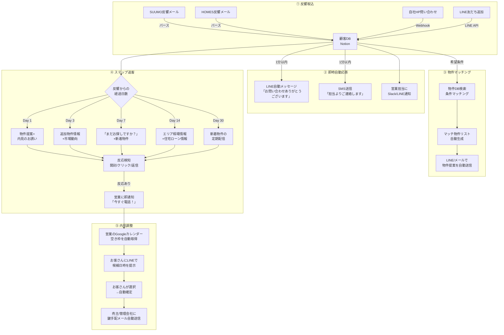

# 【不動産仲介】物件提案・追客・内見調整の自動化で年間成約+8件

> POSTCABINETS 業務自動化コンサルティング｜提案用事例資料

> ※本事例は業界データに基づく想定です。実際の効果はクライアントの状況により異なります。

---

## 企業プロフィール

| 項目 | 内容 |
|------|------|
| 社名 | 株式会社ホームリンク不動産（仮名） |
| 所在地 | 大阪府豊中市（阪急沿線・北摂エリア） |
| 設立 | 2016年 |
| 年商 | 約8,500万円 |
| 従業員 | 代表1名・営業3名・事務パート1名（計5名） |
| 免許 | 宅地建物取引業（大阪府知事免許） |
| 事業構成 | 売買仲介60%（年間25件前後・平均仲介手数料120万円）、賃貸仲介35%（年間180件前後・平均仲介手数料8万円）、管理5% |
| 集客チャネル | SUUMO（月額15万円）、HOMES（月額5万円）、自社HP（年間30万円）、紹介 |
| 月間反響数 | 売買：15〜20件/月、賃貸：40〜50件/月 |
| 使用システム | いえらぶCLOUD ライトプラン（月額5万円）、LINE公式アカウント（無料プラン） |

**なぜこの規模か：** 従業員5名前後の不動産仲介会社は全国に約3万社（出典：国土交通省「宅地建物取引業者数の推移」2024年3月末 https://www.mlit.go.jp/totikensangyo/const/sosei_const_fr3_000048.html ）。売買仲介の1件あたりの手数料は大きいが成約までのリードタイムが3〜6ヶ月と長く、その間の追客（フォローアップ営業）が成約率を左右する。営業3名体制だと「新規反響の対応」と「既存見込客の追客」の両立が難しく、追客が後回しになって成約を逃すパターンが構造的に発生する。

---

## 経営者の生の悩み（藤田社長・38歳・宅建士の言葉で）

> 「うちの売上の6割が売買仲介。1件決まれば120万の手数料が入る。でも問い合わせから成約まで平均4ヶ月かかる。その間に何回連絡するか。最初の1週間は電話もLINEもするんですよ。でも2週間過ぎると、次の新規反響に対応せなあかんから、どうしても"追客"が手薄になる。」

> 「SUUMOの反響が月に15件くらい来るんですけど、うちの成約率は8%くらい。業界でちゃんとやってるところは12〜15%いくらしい。差の4〜7%が何かって言うと、追客の質と量なんですよ。反響から1時間以内に連絡できてるかとか、2週間後にまだ物件探してますかってフォローできてるかとか。わかってるけどできてない。」

> 「SUUMOに月15万払ってる。1件の反響を獲るのに1万円くらいかかってる計算。それを追客しきれずに逃すのは、1万円をドブに捨ててるのと同じ。年間で考えたら100万くらいの広告費をムダにしてる感覚。」

> 「ノマドクラウドとかの追客ツールは知ってます。でも月額5万〜10万でしょう？いえらぶCLOUDに月5万払って、SUUMOに15万、HOMESに5万。もう固定費だけで25万。これ以上システムに金を使うと利益が飛ぶ。それより"今ある反響を確実に成約に変える仕組み"がほしい。営業が楽になって、なおかつ成約が増える。そういうのがないかなって。」

> 「内見の日程調整だけでも1件20分はかかる。お客さんの希望日を聞いて、売主さんか管理会社に空きを確認して、また折り返して。3件内見するなら3回それをやる。営業3人がそれぞれ1日3件やったら、日程調整だけで3時間消える。この時間を提案に使えたら、もっと決まるのに。」

---

## 現場のオペレーション

### 営業マンの1日（佐々木さん・28歳・宅建士・入社3年目・売買担当）

| 時刻 | 行動 | 追客との関係 |
|------|------|------------|
| 9:00 | 出社。いえらぶCLOUDで昨夜〜今朝の反響を確認 | SUUMOから3件、HOMESから1件の新規問い合わせ |
| 9:15 | 新規反響①に電話。**つながらない**（仕事中）。SMSで「お問い合わせありがとうございます」 | 反響から12時間経過。理想は1時間以内 |
| 9:20 | 新規反響②に電話。つながる。希望条件をヒアリング15分 | 「豊中で3LDK、3,500万以内、駅徒歩10分」 |
| 9:35 | 反響②のお客さんに合う物件をSUUMOとレインズで検索 | 条件に合う物件を5件ピックアップ→LINEで送付 |
| 10:00 | 新規反響③に電話。つながるが「とりあえず資料だけ」 | 温度感低い。**ここで追客リストに入れるが、次いつ連絡するかは"感覚"** |
| 10:15 | 新規反響④に電話。つながらない。メール送信 | — |
| 10:30 | **2週間前の反響客Aに追客電話**。つながらない。**ここで追客を諦めがち** | 「前も出なかったし、もういいか…」 |
| 11:00 | 内見のアテンド準備。物件資料を印刷、ルート確認 | — |
| 11:30 | 内見①（中古マンション・豊中駅徒歩8分・築15年・2,980万円） | お客さんBを案内。「いいですね、でも他も見たい」 |
| 12:30 | 昼食 | — |
| 13:30 | 内見②（戸建・服部天神駅徒歩12分・新築・3,480万円） | お客さんBの2件目。「予算オーバーかな…」 |
| 14:30 | 事務所に戻る。内見後のフォロー電話をお客さんBに | 「もう少し考えます」→**次のアクションが決まらない** |
| 15:00 | **ここから内見の日程調整タイム** | お客さんCの希望日：土曜午前。物件の売主に鍵の手配を電話→留守電→折り返し待ち |
| 15:20 | お客さんDの内見調整。3物件をまとめて見たい→3つの管理会社/売主に連絡 | 1件ずつ電話。1件は「折り返します」。**結局2時間かけて3件分の調整** |
| 17:00 | 物件情報の入力。SUUMOへの掲載用写真を撮りに行く | — |
| 18:00 | **1ヶ月前の反響客E・Fへの追客メールを書く**。「何か良い物件ありましたら…」 | **テンプレ感のあるメール**。お客さんの希望条件に合った物件を探す時間がない |
| 19:00 | 退社。帰り際に「明日の追客リスト、あとで考えよう」→**考えない** | — |

### 1ヶ月の反響→成約フロー（売買仲介）

```
月間反響 15件
    │
    ├── 電話つながる: 10件（67%）
    │       │
    │       ├── 内見に進む: 5件（反響の33%）
    │       │       │
    │       │       ├── 1回目で決まる: 0.5件
    │       │       ├── 2〜3回目で決まる: 0.5件
    │       │       └── 流れる: 4件（「もう少し考えます」→フェードアウト）
    │       │
    │       └── 内見まで行かない: 5件
    │               ├── 条件に合う物件がなく離脱: 2件
    │               └── 追客不足で連絡途絶: 3件 ← ★ ここが最大の損失
    │
    └── 電話つながらない: 5件（33%）
            ├── SMS/メールで反応あり: 2件
            └── 音信不通: 3件 ← ★ 初回対応の遅れが原因
```

**月間成約: 約1件（成約率6.7%→業界平均の8〜10%を下回る）**
**年間成約: 約12件 → 目標: 20件**

### 追客が止まるメカニズム（分単位で描写）

**Day 1（反響当日）:**
- 9:15 反響メール着信。9:20に電話→つながらない
- 9:25 SMSで「お問い合わせありがとうございます。ご都合のよい時間にお電話させていただきます」
- 17:00 再度電話→つながらない。メール「本日お電話しましたがお出になられませんでした」
- **ここまでは100%やる**

**Day 2〜3:**
- 10:00 再度電話→つながる or つながらない
- つながった場合：ヒアリング→物件提案→内見日程調整
- つながらない場合：「また明日かけよう」→**新規反響が3件来て後回しに**

**Day 4〜7:**
- **新規反響の対応に追われ、Day 1のお客さんは"追客リスト"に沈む**
- リストはいえらぶCLOUDにあるが、「いつ・何を・どうフォローするか」が属人的

**Day 8〜30:**
- **完全に追客が止まる**。営業は「あのお客さん、どうなったっけ」と思い出すが、連絡するきっかけがない
- お客さんは他社の営業マンから追客されて、他社で成約

**Day 30〜:**
- 反響から1ヶ月以上経過した見込客は「死にリスト」に。**実は40%のお客さんは半年以内に物件を購入する**が、追客が途絶えて他社に流れる

---

## ボトルネック分析

### 営業3人の時間配分（1日8時間）

| 業務 | 時間/日 | 割合 | 自動化可能性 |
|------|---------|------|-------------|
| 新規反響対応（電話・LINE） | 1.5時間 | 19% | 中（初回応答の自動化） |
| 物件検索・提案書作成 | 1.5時間 | 19% | **高**（条件マッチング自動化） |
| 内見日程調整 | 1.0時間 | 13% | **高**（カレンダー連携） |
| 内見アテンド | 2.0時間 | 25% | 低（対面が必要） |
| 追客（電話・LINE・メール） | 0.5時間 | 6% | **高**（ステップ配信） |
| 契約事務・物件入力 | 1.0時間 | 13% | 中 |
| 移動 | 0.5時間 | 6% | 低 |
| **合計** | **8.0時間** | 100% | — |

**追客に使えている時間は1日わずか30分。これが成約率の低さの根本原因。**

### 数字で見る機会損失

| 指標 | 数値 | 根拠 |
|------|------|------|
| 年間反響数（売買） | 180件 | 月15件×12ヶ月 |
| 現在の成約率 | 6.7% | 12件/180件 |
| 業界上位の成約率 | 11〜12% | 反響後1時間以内に連絡＋定期追客を実施している会社（出典：不動産流通経営協会（FRK）「不動産流通業に関する消費者動向調査」2024年版） |
| 追客改善で到達可能な成約率 | 11% | +4.3ポイント |
| 成約増加数 | +8件/年 | 180件×4.3% |
| 1件あたり手数料（売買平均） | 120万円 | 3,500万円の物件で両手仲介の場合 |
| **年間の機会損失額** | **960万円** | 8件×120万円 |

---

## 導入による経営インパクト

### Before / After 比較表

| 指標 | Before | After | 改善幅 |
|------|--------|-------|--------|
| 初回連絡の平均レスポンス時間 | 6〜12時間 | **15分以内** | — |
| 反響後1週間以降の追客継続率 | 20% | 85% | +65pt |
| 月間の追客接触回数/見込客 | 1.5回 | 6回 | +4.5回 |
| 売買成約率（反響→成約） | 6.7% | 11% | +4.3pt |
| 年間売買成約数 | 12件 | 20件 | **+8件** |
| 内見日程調整にかかる時間/件 | 20分 | 5分 | ▲75% |
| 年間売買仲介売上 | 1,440万円 | 2,400万円 | **+960万円** |

### ROI計算

**3シナリオ:**

| シナリオ | 成約増 | 年間追加売上 | 初年度ROI | 投資回収 |
|----------|--------|------------|----------|---------|
| 保守的（成約率8%→9.5%） | +3件 | +360万円 | **246%** | 5ヶ月 |
| 標準（成約率8%→11%） | +8件 | +960万円 | **631%** | 1.9ヶ月 |
| 楽観的（成約率8%→13%） | +11件 | +1,320万円 | **862%** | 1.4ヶ月 |

| 項目 | 金額 |
|------|------|
| 初期構築費（POSTCABINETS） | 120万円 |
| 月額運用費（LINE配信＋システム保守） | 3万円/月 = 36万円/年 |
| **年間追加売上（標準）** | **+960万円** |
| **年間の時間削減効果** | 営業1人あたり1時間/日→3人×年間720時間（人件費換算180万円） |
| **初年度ROI（標準）** | (960+180-120-36) / 156 = **631%** |
| **投資回収** | **1.9ヶ月**（成約2件で回収） |

---

## 自動化の全体設計



---

## 構築手順

### Phase 1：反響自動取込＋即時応答（2週間）

> **つまずきポイント:**
> - SUUMOの反響メールのフォーマットは**予告なく変更される**ことがある。パース用の正規表現が壊れたら即座にアラートを飛ばす仕組みを入れておく。
> - LINE公式アカウントの友だち追加とSUUMOの反響は**別経路**。SUUMOからの問い合わせ客がLINE友だちでない場合は、SMS経由でLINE友だち追加を促す導線が必要。
> - いえらぶCLOUDとの二重管理にならないよう、**Notionをマスター、いえらぶは物件掲載専用**と役割を分ける。

```python
"""
SUUMOからの反響メール（Gmail）をパースし、
顧客DBに登録 + LINE自動応答を送信するスクリプト。
Google Apps Script（GAS）での実装を想定。
"""
import re
import json
from datetime import datetime
from dataclasses import dataclass, asdict


@dataclass
class SuumoInquiry:
    """SUUMOからの反響データ"""
    received_at: str
    customer_name: str
    customer_email: str
    customer_phone: str
    inquiry_type: str        # "購入" or "賃貸"
    property_name: str       # 問い合わせ物件名
    property_price: str      # 価格
    property_area: str       # エリア
    customer_message: str    # お客さんのコメント


def parse_suumo_inquiry_email(email_body: str) -> SuumoInquiry:
    """
    SUUMOからの反響通知メールをパースする。
    メール本文のフォーマット（2025年現在）:
      お名前: 田中太郎
      メールアドレス: tanaka@example.com
      電話番号: 090-1234-5678
      お問い合わせ種別: 購入希望
      物件名: ○○マンション
      ...
    """
    def extract(pattern: str, text: str) -> str:
        match = re.search(pattern, text)
        return match.group(1).strip() if match else ""

    return SuumoInquiry(
        received_at=datetime.now().isoformat(),
        customer_name=extract(r"お名前[：:]\s*(.+)", email_body),
        customer_email=extract(r"メールアドレス[：:]\s*(.+)", email_body),
        customer_phone=extract(r"電話番号[：:]\s*(.+)", email_body),
        inquiry_type=extract(r"お問い合わせ種別[：:]\s*(.+)", email_body),
        property_name=extract(r"物件名[：:]\s*(.+)", email_body),
        property_price=extract(r"価格[：:]\s*(.+)", email_body),
        property_area=extract(r"所在地[：:]\s*(.+)", email_body),
        customer_message=extract(r"ご要望[：:]\s*(.+)", email_body),
    )


def register_to_notion(inquiry: SuumoInquiry, database_id: str, notion_token: str):
    """
    パースした反響データをNotionの顧客DBに登録する。
    """
    import httpx

    payload = {
        "parent": {"database_id": database_id},
        "properties": {
            "顧客名": {"title": [{"text": {"content": inquiry.customer_name}}]},
            "電話番号": {"phone_number": inquiry.customer_phone},
            "メール": {"email": inquiry.customer_email},
            "反響元": {"select": {"name": "SUUMO"}},
            "反響日時": {"date": {"start": inquiry.received_at}},
            "問い合わせ物件": {"rich_text": [{"text": {"content": inquiry.property_name}}]},
            "希望価格": {"rich_text": [{"text": {"content": inquiry.property_price}}]},
            "希望エリア": {"rich_text": [{"text": {"content": inquiry.property_area}}]},
            "ステータス": {"select": {"name": "新規反響"}},
            "担当": {"select": {"name": "未割当"}},
            "次回アクション日": {
                "date": {"start": datetime.now().strftime("%Y-%m-%d")}
            },
            "メモ": {"rich_text": [{"text": {"content": inquiry.customer_message}}]},
        },
    }

    resp = httpx.post(
        "https://api.notion.com/v1/pages",
        headers={
            "Authorization": f"Bearer {notion_token}",
            "Content-Type": "application/json",
            "Notion-Version": "2022-06-28",
        },
        json=payload,
    )
    resp.raise_for_status()
    return resp.json()["id"]


def send_line_auto_response(customer_line_id: str, customer_name: str, property_name: str):
    """
    LINE公式アカウントのMessaging APIで即時自動応答を送信する。
    ※ LINE友だち追加済みのお客さんに限る。
    """
    import httpx
    import os

    LINE_CHANNEL_TOKEN = os.environ["LINE_CHANNEL_ACCESS_TOKEN"]

    messages = [
        {
            "type": "text",
            "text": (
                f"{customer_name}様\n\n"
                f"この度は{property_name}にお問い合わせいただき、"
                "ありがとうございます。\n\n"
                "担当の佐々木より、本日中にお電話させていただきます。\n"
                "ご都合のよいお時間帯がございましたら、"
                "このLINEでお知らせください。\n\n"
                "ホームリンク不動産"
            ),
        },
        {
            "type": "template",
            "altText": "ご希望の連絡方法を教えてください",
            "template": {
                "type": "buttons",
                "text": "ご希望の連絡方法を教えてください",
                "actions": [
                    {"type": "message", "label": "電話がいい", "text": "電話希望"},
                    {"type": "message", "label": "LINEがいい", "text": "LINE希望"},
                    {"type": "message", "label": "メールがいい", "text": "メール希望"},
                ],
            },
        },
    ]

    resp = httpx.post(
        "https://api.line.me/v2/bot/message/push",
        headers={
            "Authorization": f"Bearer {LINE_CHANNEL_TOKEN}",
            "Content-Type": "application/json",
        },
        json={
            "to": customer_line_id,
            "messages": messages,
        },
    )
    resp.raise_for_status()
```

### Phase 1.5：物件マッチングエンジン（1週間）

> **つまずきポイント:**
> - レインズ（REINS）はWeb APIを公開していない。物件データの自動取得は宅建業者のアカウントでログイン→スクレイピングが必要だが、利用規約に抵触する可能性がある。現実的には**いえらぶCLOUDのCSVエクスポート**または**手動でNotionに物件を登録**する運用を推奨。
> - SUUMOやHOMESの物件データは著作権で保護されており、スクレイピングは利用規約違反。自社掲載物件のみ対象にする。

```python
"""
顧客の希望条件と物件DBを突き合わせ、
マッチする物件を自動でリストアップするスクリプト。
"""
import os
import httpx
from dataclasses import dataclass


NOTION_TOKEN = os.environ["NOTION_TOKEN"]

@dataclass
class CustomerCondition:
    """顧客の希望条件"""
    area: str           # 希望エリア（例: "豊中市"）
    max_price: int      # 上限価格（万円）
    min_price: int      # 下限価格（万円）
    layout: str         # 間取り（例: "3LDK"）
    station_walk: int   # 駅徒歩（分）
    inquiry_type: str   # "売買" or "賃貸"


def match_properties(
    condition: CustomerCondition,
    property_db_id: str,
    max_results: int = 5,
) -> list[dict]:
    """
    Notionの物件DBから希望条件にマッチする物件を検索する。
    """
    filters = {
        "and": [
            {"property": "エリア", "rich_text": {"contains": condition.area}},
            {"property": "価格（万円）", "number": {"less_than_or_equal_to": condition.max_price}},
            {"property": "価格（万円）", "number": {"greater_than_or_equal_to": condition.min_price}},
            {"property": "ステータス", "select": {"equals": "募集中"}},
        ]
    }

    # 間取りフィルタ（指定があれば）
    if condition.layout:
        filters["and"].append(
            {"property": "間取り", "select": {"equals": condition.layout}}
        )

    resp = httpx.post(
        f"https://api.notion.com/v1/databases/{property_db_id}/query",
        headers={
            "Authorization": f"Bearer {NOTION_TOKEN}",
            "Content-Type": "application/json",
            "Notion-Version": "2022-06-28",
        },
        json={
            "filter": filters,
            "sorts": [{"property": "登録日", "direction": "descending"}],
            "page_size": max_results,
        },
    )
    resp.raise_for_status()

    results = []
    for page in resp.json()["results"]:
        props = page["properties"]
        results.append({
            "name": props["物件名"]["title"][0]["plain_text"] if props["物件名"]["title"] else "",
            "price": f"{props['価格（万円）']['number']:,}",
            "layout": props["間取り"]["select"]["name"] if props["間取り"]["select"] else "",
            "station": props["最寄り駅"]["rich_text"][0]["plain_text"] if props["最寄り駅"]["rich_text"] else "",
            "detail_url": props["詳細URL"]["url"] if props["詳細URL"]["url"] else "",
            "image_url": props["写真URL"]["url"] if props.get("写真URL", {}).get("url") else "",
        })

    return results
```

### Phase 2：ステップ追客エンジン（3週間）

```python
"""
反響日からの経過日数に応じて、最適なタイミングで
追客メッセージを自動送信するスクリプト。
Notion DBから対象者を取得し、LINE Messaging APIで配信。
"""
import os
import httpx
from datetime import date, timedelta, datetime
from dataclasses import dataclass


NOTION_TOKEN = os.environ["NOTION_TOKEN"]
LINE_TOKEN = os.environ["LINE_CHANNEL_ACCESS_TOKEN"]


# ステップ配信のシナリオ定義
FOLLOW_UP_SCENARIOS = {
    "売買": [
        {
            "day": 0,
            "action": "即時応答",
            "message_template": "auto_response",  # Phase 1で対応済み
        },
        {
            "day": 1,
            "action": "物件提案",
            "message_template": "property_suggestion",
            "description": "お問い合わせ物件＋類似物件3件をLINEで送信",
        },
        {
            "day": 3,
            "action": "追加情報",
            "message_template": "area_info",
            "description": "希望エリアの相場情報・新着物件をLINEで送信",
        },
        {
            "day": 7,
            "action": "内見お誘い",
            "message_template": "viewing_invitation",
            "description": "「週末にご案内できます」＋日程候補を提示",
        },
        {
            "day": 14,
            "action": "住宅ローン情報",
            "message_template": "loan_info",
            "description": "「今の金利で月々いくら？」シミュレーション付き",
        },
        {
            "day": 30,
            "action": "新着物件",
            "message_template": "new_listing",
            "description": "条件に合う新着物件があれば自動送信",
        },
        {
            "day": 60,
            "action": "近況伺い",
            "message_template": "check_in",
            "description": "「お部屋探しの状況はいかがですか？」",
        },
    ],
    "賃貸": [
        {"day": 0, "action": "即時応答", "message_template": "auto_response"},
        {"day": 1, "action": "物件提案", "message_template": "property_suggestion"},
        {"day": 3, "action": "内見お誘い", "message_template": "viewing_invitation"},
        {"day": 7, "action": "新着物件", "message_template": "new_listing"},
        {"day": 14, "action": "最終確認", "message_template": "check_in"},
    ],
}


def get_follow_up_targets(database_id: str, target_day: int) -> list[dict]:
    """
    Notion DBから、反響日から指定日数が経過した顧客を取得する。
    かつ、該当ステップのメッセージがまだ送信されていない顧客。
    """
    target_date = (date.today() - timedelta(days=target_day)).isoformat()

    payload = {
        "filter": {
            "and": [
                {
                    "property": "反響日時",
                    "date": {"equals": target_date},
                },
                {
                    "property": "ステータス",
                    "select": {"does_not_equal": "成約"},
                },
                {
                    "property": "ステータス",
                    "select": {"does_not_equal": "失注"},
                },
                {
                    "property": "追客停止",
                    "checkbox": {"equals": False},
                },
            ]
        },
    }

    resp = httpx.post(
        f"https://api.notion.com/v1/databases/{database_id}/query",
        headers={
            "Authorization": f"Bearer {NOTION_TOKEN}",
            "Content-Type": "application/json",
            "Notion-Version": "2022-06-28",
        },
        json=payload,
    )
    resp.raise_for_status()
    return resp.json()["results"]


def generate_property_suggestion_message(
    customer_name: str,
    area: str,
    budget: str,
    matched_properties: list[dict],
) -> list[dict]:
    """
    条件マッチした物件をLINEのカルーセルメッセージで送信する。
    """
    columns = []
    for prop in matched_properties[:5]:  # 最大5件
        columns.append({
            "thumbnailImageUrl": prop.get("image_url", ""),
            "title": prop["name"][:40],
            "text": f"{prop['price']}万円 / {prop['layout']} / {prop['station']}",
            "actions": [
                {
                    "type": "uri",
                    "label": "詳細を見る",
                    "uri": prop["detail_url"],
                },
                {
                    "type": "message",
                    "label": "内見したい",
                    "text": f"【内見希望】{prop['name']}",
                },
            ],
        })

    messages = [
        {
            "type": "text",
            "text": (
                f"{customer_name}様\n\n"
                f"ご希望の{area}エリア・{budget}以内で、"
                f"おすすめの物件を{len(matched_properties)}件ご紹介します。"
            ),
        },
    ]

    if columns:
        messages.append({
            "type": "template",
            "altText": "おすすめ物件のご案内",
            "template": {
                "type": "carousel",
                "columns": columns,
            },
        })

    return messages


def run_daily_follow_up(database_id: str):
    """
    毎日実行: 各ステップに該当する顧客を取得し、メッセージを送信する。
    cron or launchd で毎朝 8:00 に実行。
    """
    for inquiry_type, scenarios in FOLLOW_UP_SCENARIOS.items():
        for step in scenarios:
            if step["day"] == 0:
                continue  # 即時応答はPhase 1で別途処理

            targets = get_follow_up_targets(database_id, step["day"])

            for target in targets:
                props = target["properties"]
                customer_name = (
                    props["顧客名"]["title"][0]["plain_text"]
                    if props["顧客名"]["title"]
                    else "お客様"
                )

                print(
                    f"[{step['action']}] {customer_name}（反響{step['day']}日後）"
                    f"→ {step['description']}"
                )

                # 実際のLINE送信は省略（テンプレートに応じてメッセージを生成・送信）
                # send_line_message(line_id, messages)


if __name__ == "__main__":
    DB_ID = os.environ["NOTION_CUSTOMER_DB_ID"]
    run_daily_follow_up(DB_ID)
```

### Phase 3：内見日程調整の半自動化（2週間）

```python
"""
内見の日程調整をLINE + Googleカレンダーで半自動化する。
営業の空き枠をお客さんに提示 → 選択 → 自動確定。
"""
import os
from datetime import datetime, timedelta
from google.oauth2.credentials import Credentials
from googleapiclient.discovery import build


def get_available_slots(
    sales_email: str,
    credentials: Credentials,
    days_ahead: int = 7,
    slot_duration_min: int = 90,
) -> list[dict]:
    """
    Googleカレンダーから営業担当の空き枠を取得する。
    平日10:00〜18:00、土日10:00〜17:00で、
    既存予定のない時間帯を90分単位で抽出。
    """
    service = build("calendar", "v3", credentials=credentials)

    now = datetime.now()
    time_max = now + timedelta(days=days_ahead)

    # 既存の予定を取得
    events_result = service.events().list(
        calendarId=sales_email,
        timeMin=now.isoformat() + "Z",
        timeMax=time_max.isoformat() + "Z",
        singleEvents=True,
        orderBy="startTime",
    ).execute()

    busy_times = []
    for event in events_result.get("items", []):
        start = event["start"].get("dateTime", event["start"].get("date"))
        end = event["end"].get("dateTime", event["end"].get("date"))
        busy_times.append((
            datetime.fromisoformat(start.replace("Z", "+00:00")),
            datetime.fromisoformat(end.replace("Z", "+00:00")),
        ))

    # 空き枠を計算
    available = []
    for day_offset in range(days_ahead):
        check_date = now.date() + timedelta(days=day_offset)
        weekday = check_date.weekday()

        if weekday < 5:  # 平日
            start_hour, end_hour = 10, 18
        else:  # 土日
            start_hour, end_hour = 10, 17

        # 火・水曜は定休日（不動産業界の慣習）
        if weekday in (1, 2):
            continue

        slot_start = datetime.combine(check_date, datetime.min.time()).replace(
            hour=start_hour
        )
        slot_end_limit = datetime.combine(check_date, datetime.min.time()).replace(
            hour=end_hour
        )

        current = slot_start
        while current + timedelta(minutes=slot_duration_min) <= slot_end_limit:
            slot_end = current + timedelta(minutes=slot_duration_min)
            is_free = True
            for busy_start, busy_end in busy_times:
                if current < busy_end and slot_end > busy_start:
                    is_free = False
                    break

            if is_free:
                available.append({
                    "date": check_date.strftime("%m/%d(%a)"),
                    "start": current.strftime("%H:%M"),
                    "end": slot_end.strftime("%H:%M"),
                    "datetime_iso": current.isoformat(),
                })
            current += timedelta(minutes=30)  # 30分刻みで候補を出す

    return available[:6]  # 最大6枠を提示


def generate_scheduling_line_message(
    customer_name: str,
    property_name: str,
    available_slots: list[dict],
) -> dict:
    """
    LINEで日程候補を提示するFlexメッセージを生成する。
    """
    buttons = []
    for i, slot in enumerate(available_slots):
        buttons.append({
            "type": "button",
            "action": {
                "type": "message",
                "label": f"{slot['date']} {slot['start']}〜",
                "text": f"【内見予約】{slot['date']} {slot['start']}〜 {property_name}",
            },
            "style": "primary" if i == 0 else "secondary",
        })

    flex_message = {
        "type": "flex",
        "altText": f"{property_name}の内見日程候補",
        "contents": {
            "type": "bubble",
            "header": {
                "type": "box",
                "layout": "vertical",
                "contents": [
                    {
                        "type": "text",
                        "text": "内見の日程候補",
                        "weight": "bold",
                        "size": "lg",
                    },
                    {
                        "type": "text",
                        "text": property_name,
                        "size": "sm",
                        "color": "#666666",
                    },
                ],
            },
            "body": {
                "type": "box",
                "layout": "vertical",
                "contents": [
                    {
                        "type": "text",
                        "text": f"{customer_name}様\n下記の日程でご案内可能です。\nご都合のよい日時をタップしてください。",
                        "wrap": True,
                        "size": "sm",
                    },
                ]
                + buttons,
                "spacing": "md",
            },
        },
    }

    return flex_message
```

---

## 提案トークスクリプト

### 刺さる一言（初回面談で使う）

> 「社長、SUUMOに月15万払ってますよね。そこから月に15件の問い合わせが来て、成約するのは何件ですか？ ……1件ですよね。残りの14件のお客さんに、"2週間後にもう一度連絡"できてますか？ できてないですよね。その14件のうち3〜4人は、半年以内にどこかで家を買ってます。ただ、御社からではなく。」

### 想定される反論と切り返し

| 反論 | 切り返し |
|------|---------|
| 「うちの営業は対面が強い。ツールで売れるわけない」 | 「おっしゃる通りです。対面の内見で決める力は御社の強み。だからこそ、"内見に連れてくるまで"の追客を自動化して、営業さんが内見に集中できる環境をつくりたいんです。今、営業さんは1日の何割を日程調整と追客メールに使ってますか？」 |
| 「いえらぶCLOUDでだいたいのことはできてる」 | 「いえらぶCLOUDは物件管理と反響の受け皿としてはいいツールですよね。ただ、反響が来た後の"お客さん一人ひとりに合わせた追客の自動化"は、いえらぶではカバーしきれません。"3日後に類似物件を送る""2週間後に住宅ローン情報を送る"というステップ配信は、別途つくる必要があります」 |
| 「LINEの配信って、宅建業法的に大丈夫？」 | 「いいご質問です。宅建業法の広告規制では、"誇大広告の禁止"と"おとり広告の禁止"が核心です。AIが生成した物件説明文がこれに抵触しないよう、テンプレートは御社の営業さんに監修いただきます。また、配信はあくまで"お客さんが問い合わせた後のフォロー"なので、一方的な広告メールとは性質が異なります」 |
| 「ノマドクラウド入れるのとどう違うの？」 | 「ノマドクラウドは月額5〜10万円で、追客に特化した良いツールです。ただ御社の場合、すでにいえらぶCLOUDがある。そこに別のSaaSを足すより、今あるいえらぶ＋LINE＋Notionの組み合わせで、御社の営業フローに完全にフィットした仕組みをつくるほうが、コストも学習コストも低い。しかも月額3万円です」 |

### クロージングトーク

> 「まず1つだけやりましょう。SUUMOの反響メールが来たら、1分以内に自動でお客さんにLINEが届く仕組み。これだけで初回レスポンスが12時間→1分になります。1週間で設定できます。これで問い合わせからの来店率が上がったら、次のステップ追客を本格的に組みましょう。」

---

## 法規制・業界特有のリスク

### 宅建業法の広告規制

| リスク | 内容 | 対策 |
|--------|------|------|
| 誇大広告の禁止（宅建業法第32条） | 物件の利便性・環境等について著しく事実に相違する表示、実際のものよりも著しく優良であると誤認させる表示を禁止 | AI生成の物件紹介文は必ず営業担当がレビューしてから配信。「日当たり良好」「閑静な住宅街」等の定型表現は物件ごとに確認 |
| おとり広告の禁止（宅建業法第32条） | 実際には取引できない物件を広告することを禁止 | 追客メッセージに含める物件情報は、配信時点でレインズ上「活動中」のもののみ。成約済物件は自動除外するロジックを実装 |
| 個人情報保護法 | 反響者の個人情報（氏名・電話番号・メールアドレス）の適切な管理 | Notionの顧客DBはワークスペースのアクセス制限を設定。LINE IDとの紐づけデータは暗号化 |
| 特定電子メール法 | 事前承諾のない者への広告メール送信を禁止 | ステップ配信は「問い合わせ」という能動的アクションをした顧客のみ。配信停止リンクを全メールに含める |

### 不動産業界特有のリスク

| リスク | 内容 | 対策 |
|--------|------|------|
| 火曜・水曜定休 | 不動産業界の多くは火・水曜定休。自動配信がこの日に当たると対応できない | 配信スケジュールから火・水を除外。or 「営業担当は本日定休日のため、木曜以降のご連絡となります」の自動応答を設定 |
| 物件情報の鮮度 | 不動産物件は日々変動。3日前にあった物件がなくなることも | 物件マッチングは配信直前にレインズ/ポータルの最新情報と照合 |

---

## POSTCABINETS内部メモ

### この業界の攻め方

- **入口は「SUUMOの反響、ちゃんと追客できてますか？」**。ほぼ100%の不動産会社がSUUMOかHOMESに掲載しており、反響の取りこぼしは共通の痛み。具体的な数字（成約率6%→12%）で刺す
- **売買仲介に集中**。賃貸は1件8万円、売買は1件120万円。同じ自動化投資でも売買のほうがROIが15倍高い。賃貸メインの会社は後回し
- **北摂・阪神間の中小仲介がターゲット**。大阪市内は大手（住友・東急等）が強いが、豊中・箕面・西宮・芦屋は地場の中小仲介が多い。5〜15名規模の会社が狙い目
- **季節性を活用**。1〜3月（引越しシーズン）の前に提案。「繁忙期に追客が追いつかなくなる前に仕組みを入れましょう」

### 既存ツールとの差別化

| 既存ツール | 月額 | できること | できないこと（POSTCABINETSの入り込みポイント） |
|-----------|------|-----------|-------------------------------------------|
| いえらぶCLOUD | 5万円〜 | 物件管理・ポータル一括入稿・反響管理 | ステップ追客の自動化。物件マッチング→自動提案 |
| ノマドクラウド | 5〜10万円 | 追客自動化・マイページ・内見予約 | 既にいえらぶを使っている会社には二重投資。カスタマイズ性が低い |
| Facilo | 3〜5万円 | 物件提案書の自動作成・顧客コミュニケーション | ステップ配信の自由度が低い |
| LINE公式（単体） | 0〜5,000円 | メッセージ配信 | 顧客DBとの連携・物件マッチング・ステップ配信のロジックがない |

**差別化ポイント：** 既存のいえらぶCLOUD + LINE公式を活かしつつ、その間を「ステップ追客ロジック」と「物件マッチング→自動提案」でつなぐ。新しいSaaSを導入するのではなく、今あるツールの"間"を埋める。

### 自分たちに足りないもの

1. **不動産業界のオペレーション知識**：火水定休、レインズの仕組み、重要事項説明のタイミング等。最低1名は不動産業界経験者のアドバイスが必要
2. **レインズAPIへのアクセス**：レインズは宅建業者しかアクセスできない。物件マッチングの自動化には、顧客の不動産会社のレインズアカウントを使った運用が必要
3. **LINE Messaging APIの実装経験**：Flex MessageやCarouselの実装経験。デモ環境を先に作っておく
4. **宅建業法の広告規制の正確な理解**：AI生成文がどこまで許されるかのラインを、宅建業法に詳しい弁護士に確認しておく

### 実案件に進む時のチェックリスト

- [ ] 提案先の月間反響数（売買/賃貸別）と現在の成約率をヒアリング済み
- [ ] SUUMOの掲載プラン・月額費用を確認済み
- [ ] 現在の追客フロー（誰が・いつ・どのチャネルで）を可視化済み
- [ ] いえらぶCLOUDのプラン・利用状況を確認済み
- [ ] LINE公式アカウントの有無・友だち数を確認済み
- [ ] 宅建業法の広告規制に抵触しない配信テンプレートを準備
- [ ] デモ用のステップ配信シナリオ（売買7ステップ）を動作確認済み
- [ ] 初回無料で「反響→LINE自動応答」の仕組みを1週間で構築するオファーを準備
- [ ] 不動産業界の定休日（火水）を考慮した提案スケジュールを設定
