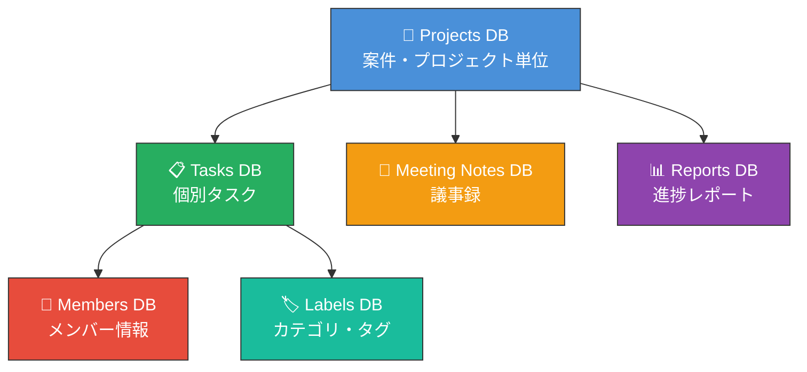
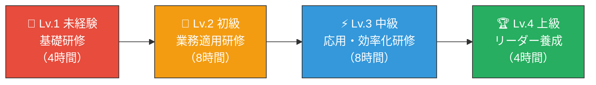
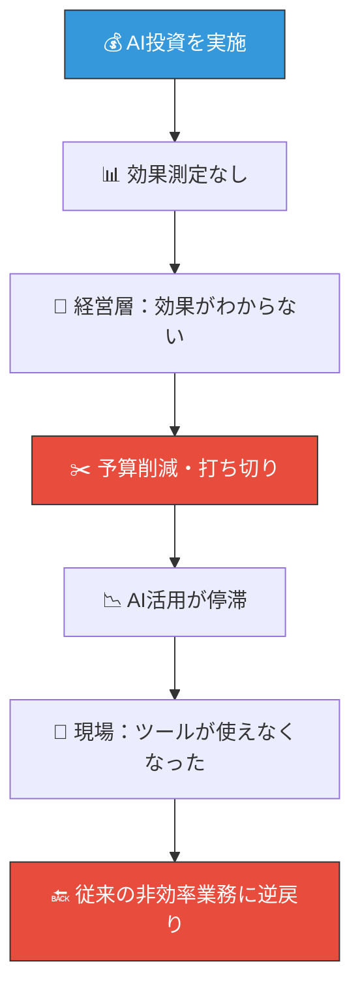
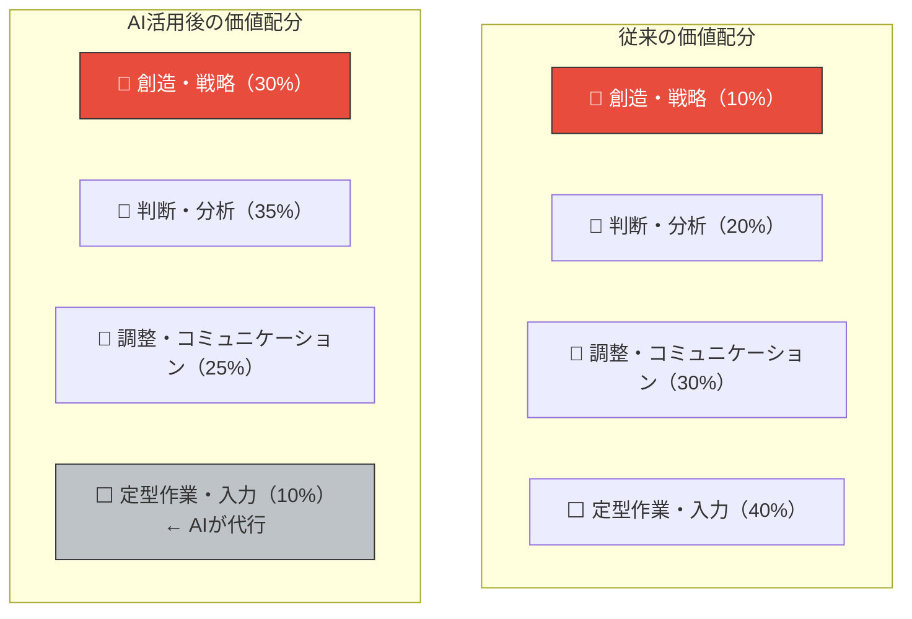
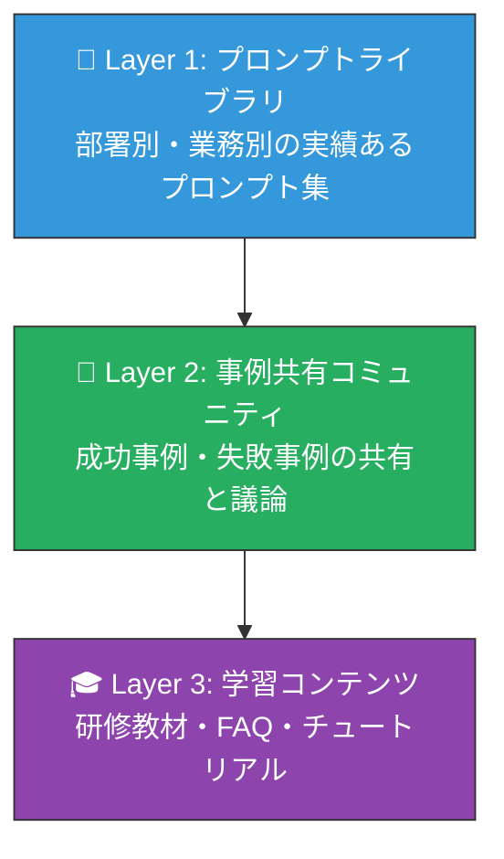
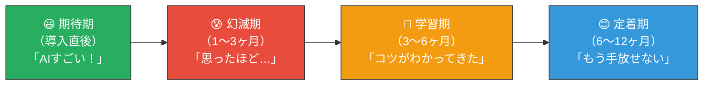

====== 講義3 ======


---
## 📋 本講義のゴール
<callout icon="🎯">
	**Notion AIを活用して、プロジェクト管理業務を大幅に効率化し、チーム全体の生産性を向上させるスキルを身につける**
</callout>
### この講義で得られること
- Notion AIを活用した **タスク自動整理・分類** の手法を実践できる
- **進捗レポートの自動生成** により報告業務を80%削減する方法を習得する
- **ステータスダッシュボード** の設計・構築ができる
- チーム横断の **情報共有基盤** をNotionで構築できる
---
## 📑 今日のアジェンダ
<table fit-page-width="true" header-row="true">
<tr color="blue_bg">
<td>**時間**</td>
<td>**内容**</td>
<td>**形式**</td>
</tr>
<tr>
<td>0:00〜0:10</td>
<td>PART 1: なぜプロジェクト管理をAI化するのか</td>
<td>講義</td>
</tr>
<tr>
<td>0:10〜0:25</td>
<td>PART 2: NotionのDB設計とAI活用の基盤づくり</td>
<td>講義＋デモ</td>
</tr>
<tr>
<td>0:25〜0:40</td>
<td>PART 3: AIによるタスク自動整理・進捗レポート生成</td>
<td>講義＋実演</td>
</tr>
<tr>
<td>0:40〜0:55</td>
<td>PART 4: 実践演習 — 自社プロジェクトDB構築</td>
<td>ハンズオン</td>
</tr>
<tr>
<td>0:55〜1:00</td>
<td>まとめ＆次回予告</td>
<td>講義</td>
</tr>
</table>
---
## 🔍 PART 1: なぜプロジェクト管理をAI化するのか
### プロジェクト管理の現状と課題
<table fit-page-width="true" header-row="true">
<tr color="red_bg">
<td>**課題**</td>
<td>**従来の対処法**</td>
<td>**問題点**</td>
<td>**AI活用後**</td>
</tr>
<tr>
<td>タスクの抜け漏れ</td>
<td>手動でExcelに記入</td>
<td>更新忘れ、二重管理</td>
<td>自動抽出＆リマインド</td>
</tr>
<tr>
<td>進捗報告に時間がかかる</td>
<td>週次MTGで口頭報告</td>
<td>準備に1〜2時間/回</td>
<td>ワンクリックでレポート生成</td>
</tr>
<tr>
<td>情報が散在する</td>
<td>メール＋Slack＋Excel</td>
<td>必要な情報が見つからない</td>
<td>Notionに一元化＋AI検索</td>
</tr>
<tr>
<td>ステータスが不透明</td>
<td>聞かないとわからない</td>
<td>問題の発見が遅れる</td>
<td>リアルタイムダッシュボード</td>
</tr>
</table>
### Before / After 比較
<columns>
	<column>
		<callout icon="😰" color="red_bg">
			**Before: 従来のプロジェクト管理**
			- 月曜の朝: Excelの進捗表を更新（30分）
			- 各メンバーにSlackで確認（往復30分）
			- 週次報告書をPowerPointで作成（1時間）
			- 「あの資料どこ？」の対応（1日3回以上）
			- **→ 週あたり管理業務: 約5時間**
		</callout>
	</column>
	<column>
		<callout icon="😊" color="green_bg">
			**After: Notion AI活用後**
			- Notionのステータスが自動更新
			- 進捗レポートはAIがワンクリック生成
			- 情報は全てNotion内で検索可能
			- ダッシュボードでリアルタイム把握
			- **→ 週あたり管理業務: 約1時間（80%削減）**
		</callout>
	</column>
</columns>
<callout icon="💡" color="yellow_bg">
	**ポイント**: AI化の目的は「管理者をラクにする」だけではありません。**チーム全員が必要な情報に即アクセスでき、自律的に動ける環境**を作ることが真のゴールです。
</callout>
---
## 🏗️ PART 2: NotionのDB設計とAI活用の基盤づくり
### プロジェクト管理に必要なDB構成

### Projects DB のプロパティ設計
<table fit-page-width="true" header-row="true">
<tr color="purple_bg">
<td>**プロパティ名**</td>
<td>**タイプ**</td>
<td>**説明**</td>
<td>**AI活用ポイント**</td>
</tr>
<tr>
<td>プロジェクト名</td>
<td>タイトル</td>
<td>案件・プロジェクトの名称</td>
<td>—</td>
</tr>
<tr>
<td>ステータス</td>
<td>セレクト</td>
<td>計画中 / 進行中 / レビュー / 完了 / 保留</td>
<td>AIが進捗からステータス変更を提案</td>
</tr>
<tr>
<td>優先度</td>
<td>セレクト</td>
<td>🔴緊急 / 🟡高 / 🔵中 / ⚪低</td>
<td>AIが締切・依存関係から優先度を判定</td>
</tr>
<tr>
<td>担当者</td>
<td>ユーザー</td>
<td>プロジェクトオーナー</td>
<td>—</td>
</tr>
<tr>
<td>開始日〜期限</td>
<td>日付</td>
<td>期間管理</td>
<td>AIが遅延リスクを検知しアラート</td>
</tr>
<tr>
<td>進捗率</td>
<td>数値（%）</td>
<td>完了タスク数から自動計算</td>
<td>AIがボトルネックを分析</td>
</tr>
<tr>
<td>Tasks</td>
<td>リレーション</td>
<td>Tasks DBへの紐付け</td>
<td>AIが未割当タスクを検出</td>
</tr>
<tr>
<td>概要</td>
<td>テキスト</td>
<td>プロジェクトの説明</td>
<td>AIが議事録から概要を自動生成</td>
</tr>
</table>
### Tasks DB のプロパティ設計
<table fit-page-width="true" header-row="true">
<tr color="green_bg">
<td>**プロパティ名**</td>
<td>**タイプ**</td>
<td>**説明**</td>
<td>**AI活用ポイント**</td>
</tr>
<tr>
<td>タスク名</td>
<td>タイトル</td>
<td>具体的なアクション</td>
<td>AIが曖昧なタスクを具体化提案</td>
</tr>
<tr>
<td>ステータス</td>
<td>セレクト</td>
<td>未着手 / 進行中 / レビュー / 完了</td>
<td>—</td>
</tr>
<tr>
<td>担当者</td>
<td>ユーザー</td>
<td>実行者</td>
<td>AIがスキル・負荷から担当提案</td>
</tr>
<tr>
<td>期限</td>
<td>日付</td>
<td>完了期日</td>
<td>AIが依存関係を考慮して期限提案</td>
</tr>
<tr>
<td>見積時間</td>
<td>数値</td>
<td>想定作業時間（h）</td>
<td>AIが過去実績から見積を補正</td>
</tr>
<tr>
<td>Project</td>
<td>リレーション</td>
<td>Projects DBへの紐付け</td>
<td>—</td>
</tr>
<tr>
<td>ブロッカー</td>
<td>テキスト</td>
<td>阻害要因</td>
<td>AIがブロッカーを検出し対策を提案</td>
</tr>
</table>
<callout icon="💡" color="yellow_bg">
	**設計のコツ**: プロパティは「後からAIに分析させたい軸」で設計します。**ステータス・担当者・期限・優先度**の4つは最低限必要です。最初からプロパティを増やしすぎると運用が破綻するので、まず4〜6個から始めましょう。
</callout>
---
## 🤖 PART 3: AIによるタスク自動整理・進捗レポート生成
### 3-1: 会議メモからタスクを自動抽出
<callout icon="🤖" color="blue_bg">
	**実践プロンプト①: 議事録→タスク自動抽出**
</callout>
```javascript
以下の会議メモからタスクを抽出し、Notionのタスクデータベースに登録できる形式で整理してください。

【会議メモ】
{会議メモをペースト}

【出力形式】テーブル形式で以下のカラムを含めてください：
| タスク名 | 担当者 | 期限 | 優先度 | 関連プロジェクト | 備考 |

【ルール】
- タスクは「動詞＋目的語」の形式（例: ○「提案書を作成する」 ×「提案書」）
- 期限が明示されていない場合は「要確認」と記載
- 担当者が不明な場合は「未割当」と記載
- 依存関係がある場合は備考に記載
```
### 3-2: 進捗レポートの自動生成
<callout icon="🤖" color="blue_bg">
	**実践プロンプト②: 週次進捗レポート自動生成**
</callout>
```javascript
以下のプロジェクトデータから、経営層向けの週次進捗レポートを作成してください。

【プロジェクトデータ】
- プロジェクト名: [名称]
- 今週完了したタスク: [リスト]
- 進行中のタスク: [リスト]
- ブロッカー・リスク: [リスト]
- 来週の予定: [リスト]

【出力形式】
1. サマリー（3行以内で全体像）
2. 進捗ハイライト（完了事項のインパクトを説明）
3. リスク・課題（影響度と対策案を併記）
4. 来週のフォーカスポイント（優先順位付き）
5. 数値サマリー（完了率、残タスク数、遅延タスク数）

【トーン】
- 経営層が2分で把握できる簡潔さ
- 問題点は「原因→影響→対策」のセットで提示
```
### 3-3: ステータスダッシュボードの設計
<callout icon="🤖" color="blue_bg">
	**実践プロンプト③: Notionダッシュボードの設計支援**
</callout>
```javascript
Notionでプロジェクト管理ダッシュボードを設計したいです。以下の要件で、最適なビュー構成を提案してください。

【管理対象】
- プロジェクト数: [数]
- チームメンバー: [人数]
- 主な関心事: 遅延検知、リソース配分、優先度管理

【欲しいビュー】
1. 全体サマリービュー（経営層向け）
2. チームリーダー向けビュー（担当者別の負荷）
3. タイムラインビュー（ガントチャート的な表示）
4. アラートビュー（遅延・ブロッカーのみ表示）

各ビューについて以下を教えてください：
- Notionのビュータイプ（テーブル/ボード/カレンダー/タイムライン/ギャラリー）
- フィルタ条件
- ソート条件
- グループ化の設定
```
### Notion AIの具体的な活用テクニック
<table fit-page-width="true" header-row="true">
<tr color="blue_bg">
<td>**機能**</td>
<td>**使い方**</td>
<td>**効果**</td>
</tr>
<tr>
<td>AIオートフィル</td>
<td>DBのプロパティで「AIで自動入力」を設定</td>
<td>タスクの説明から優先度・カテゴリを自動分類</td>
</tr>
<tr>
<td>AI要約</td>
<td>議事録ページで「要約」を選択</td>
<td>長文の議事録を3行に要約＋アクションアイテム抽出</td>
</tr>
<tr>
<td>AIライティング</td>
<td>ページ内で「/ai」コマンド</td>
<td>進捗報告文やメール下書きを自動生成</td>
</tr>
<tr>
<td>AI Q&A</td>
<td>サイドバーのAIアシスタント</td>
<td>「今週遅延しているタスクは？」など自然言語で検索</td>
</tr>
<tr>
<td>AIデータベース分析</td>
<td>DBビューでAI分析を実行</td>
<td>ボトルネック検出、負荷バランス分析</td>
</tr>
</table>
<callout icon="⚠️" color="red_bg">
	**注意**: Notion AIは社内のNotion内データを参照します。**外部のAIに社内データを送信するのとは異なり**、Notion AIはワークスペース内で閉じて動作します。ただし、Notionの利用プランによってAI機能の範囲が異なるため、Enterprise版の利用を推奨します。
</callout>
---
## 🛠️ PART 4: 実践演習
### 【演習①】プロジェクトDBを設計しよう（10分）
<callout icon="📝" color="green_bg">
	**自社の1つのプロジェクトを題材に、Notionのプロジェクト管理DBを設計してください**
</callout>
> **プロジェクト名**: [　　]
>
> **Projects DBのプロパティ（最低5つ）**:
> 1. プロパティ名: [　] / タイプ: [　]
> 2. プロパティ名: [　] / タイプ: [　]
> 3. プロパティ名: [　] / タイプ: [　]
> 4. プロパティ名: [　] / タイプ: [　]
> 5. プロパティ名: [　] / タイプ: [　]
>
> **Tasks DBのプロパティ（最低4つ）**:
> 1. プロパティ名: [　] / タイプ: [　]
> 2. プロパティ名: [　] / タイプ: [　]
> 3. プロパティ名: [　] / タイプ: [　]
> 4. プロパティ名: [　] / タイプ: [　]
>
> **ビュー構成（最低3つ）**:
> 1. ビュー名: [　] / タイプ: [　] / 目的: [　]
> 2. ビュー名: [　] / タイプ: [　] / 目的: [　]
> 3. ビュー名: [　] / タイプ: [　] / 目的: [　]

### 【演習②】AIで進捗レポートを生成しよう（5分）
<callout icon="🤖" color="blue_bg">
	**以下のサンプルデータを使って、実践プロンプト②を試してみましょう**
</callout>
```
【サンプルプロジェクトデータ】
- プロジェクト名: 新規ECサイト構築
- 今週完了したタスク:
  - デザインカンプの最終確認 → 承認済み
  - 商品DB設計 → 完了、200商品登録済み
  - 決済システムAPI連携 → テスト環境で動作確認完了
- 進行中のタスク:
  - フロントエンド実装（進捗60%、担当: 佐藤）
  - SEO対策の実施（進捗30%、担当: 田中）
  - 物流システム連携（進捗10%、担当: 鈴木）→ API仕様書の入手待ち
- ブロッカー:
  - 物流会社からのAPI仕様書が2週間遅延中
  - テスト用のクレジットカード情報の手配が未完了
- 来週の予定:
  - フロントエンド実装の完了（目標）
  - ステージング環境での統合テスト開始
  - 物流会社への催促と代替手段の検討
```
---
## 📋 まとめ＆次回予告
### 今日のキーポイント
<callout icon="✅" color="green_bg">
	1. プロジェクト管理のAI化で **管理業務を最大80%削減** できる
	2. DB設計は「**ステータス・担当者・期限・優先度**」の4軸を最低限押さえる
	3. Notion AIの**オートフィル機能**でタスクの自動分類・優先度判定が可能
	4. **議事録→タスク抽出→進捗レポート**のAI自動化フローを構築する
	5. ダッシュボードは**閲覧者の役割別**（経営層/リーダー/メンバー）に設計する
</callout>
### 次回予告
> 📘 **次回: 社内研修プログラムの設計と実施**
>
> プロジェクト管理のAI化ができたら、次はこのスキルをチーム全体に展開する番です。AI活用スキルを社内に浸透させるための研修プログラムの設計方法、レベル別カリキュラム、効果測定まで実践的に学びます。
---
## 🎛️ コントロールパネル
<table fit-page-width="true" header-row="true">
<tr color="blue_bg">
<td>**項目**</td>
<td>**内容**</td>
</tr>
<tr>
<td>講義ID</td>
<td>Pack 3 - 講義3</td>
</tr>
<tr>
<td>タイトル</td>
<td>プロジェクト管理のAI化：Notion AI徹底活用</td>
</tr>
<tr>
<td>想定時間</td>
<td>60分（講義40分＋演習15分＋まとめ5分）</td>
</tr>
<tr>
<td>対象者</td>
<td>管理職・プロジェクトマネージャー</td>
</tr>
<tr>
<td>前提知識</td>
<td>Pack 3-2（AI活用ルール＆ガイドライン設計）修了推奨、Notionの基本操作</td>
</tr>
<tr>
<td>使用ツール</td>
<td>Notion AI</td>
</tr>
<tr>
<td>配布資料</td>
<td>DB設計テンプレート、進捗レポートプロンプト集</td>
</tr>
</table>


====== 講義4 ======


---
## 📋 本講義のゴール
<callout icon="🎯">
	**AI活用スキルを組織全体に展開するための研修プログラムを自社で設計・実施できるようになる**
</callout>
### この講義で得られること
- 社員のAIスキルを **4段階で診断** し、レベル別の学習パスを設計できる
- **段階別カリキュラム** のテンプレートを使って自社研修を構築できる
- AIを活用して **研修コンテンツ自体を効率的に生成** できる
- 研修の **効果測定** と **フォローアップ体制** を構築できる
---
## 📑 今日のアジェンダ
<table fit-page-width="true" header-row="true">
<tr color="blue_bg">
<td>**時間**</td>
<td>**内容**</td>
<td>**形式**</td>
</tr>
<tr>
<td>0:00〜0:10</td>
<td>PART 1: なぜ社内AI研修が不可欠なのか</td>
<td>講義</td>
</tr>
<tr>
<td>0:10〜0:25</td>
<td>PART 2: スキルレベル診断と学習パス設計</td>
<td>講義＋ワーク</td>
</tr>
<tr>
<td>0:25〜0:40</td>
<td>PART 3: カリキュラム設計とコンテンツのAI生成</td>
<td>講義＋実演</td>
</tr>
<tr>
<td>0:40〜0:55</td>
<td>PART 4: 効果測定とフォローアップ＋実践演習</td>
<td>講義＋ハンズオン</td>
</tr>
<tr>
<td>0:55〜1:00</td>
<td>まとめ＆次回予告</td>
<td>講義</td>
</tr>
</table>
---
## 🔍 PART 1: なぜ社内AI研修が不可欠なのか
### AI研修の現状と課題
<table fit-page-width="true" header-row="true">
<tr color="blue_bg">
<td>**調査項目**</td>
<td>**数値**</td>
<td>**示唆**</td>
</tr>
<tr>
<td>AI研修を実施している企業</td>
<td>約35%</td>
<td>過半数はまだ未実施</td>
</tr>
<tr>
<td>研修後にAI活用率が上がった企業</td>
<td>約70%</td>
<td>研修の効果は高い</td>
</tr>
<tr>
<td>自己学習だけでAIを使いこなせる社員</td>
<td>約15%</td>
<td>体系的な研修が必要</td>
</tr>
<tr>
<td>「AIが怖い・不安」と感じる社員</td>
<td>約45%</td>
<td>心理的バリアの解消が先</td>
</tr>
</table>
### 研修なしで起きる3つの問題
<columns>
	<column>
		<callout icon="📉" color="red_bg">
			**1. スキル格差の拡大**
			- 得意な人だけが活用
			- 部署間で生産性格差
			- 「AI使える人」に仕事が集中
			- **結果**: 組織全体の生産性は上がらない
		</callout>
	</column>
	<column>
		<callout icon="⚠️" color="red_bg">
			**2. セキュリティリスク**
			- ルールを知らずに機密情報を入力
			- 無料版ツールを業務利用
			- AI出力を無検証で使用
			- **結果**: 情報漏洩・品質事故
		</callout>
	</column>
	<column>
		<callout icon="🚫" color="red_bg">
			**3. 投資の無駄**
			- ツール契約しても使われない
			- 「便利だとは思うけど…」で止まる
			- 経営層がROIを実感できない
			- **結果**: AI投資が打ち切り
		</callout>
	</column>
</columns>
<callout icon="💡" color="yellow_bg">
	**ポイント**: AI研修は「ITリテラシー研修」ではありません。**全社員が自分の業務にAIを適用できる「実践力」を身につける**ためのプログラムです。座学だけでは意味がなく、必ず**自分の業務での実践**を組み込みましょう。
</callout>
---
## 📊 PART 2: スキルレベル診断と学習パス設計
### AIスキル4段階モデル
<table fit-page-width="true" header-row="true">
<tr color="purple_bg">
<td>**レベル**</td>
<td>**名称**</td>
<td>**特徴**</td>
<td>**典型的な行動**</td>
<td>**想定割合**</td>
</tr>
<tr color="red_bg">
<td>**Lv.1**</td>
<td>🔰 未経験</td>
<td>AIを使ったことがない or 数回試した程度</td>
<td>「ChatGPTって何？」「使い方がわからない」</td>
<td>約20%</td>
</tr>
<tr color="yellow_bg">
<td>**Lv.2**</td>
<td>📝 初級</td>
<td>基本的な質問・指示はできる</td>
<td>簡単な質問をする、翻訳に使う程度</td>
<td>約40%</td>
</tr>
<tr color="blue_bg">
<td>**Lv.3**</td>
<td>⚡ 中級</td>
<td>業務に定常的に活用している</td>
<td>プロンプトを工夫、複数ツールを使い分け</td>
<td>約30%</td>
</tr>
<tr color="green_bg">
<td>**Lv.4**</td>
<td>🏆 上級</td>
<td>チーム・組織のAI活用をリードできる</td>
<td>業務プロセスの設計、他メンバーの指導</td>
<td>約10%</td>
</tr>
</table>
### スキル診断チェックシート
<callout icon="📝" color="blue_bg">
	**【演習①】以下のチェックシートで、自分（またはチームメンバー）のAIスキルレベルを診断してください**
</callout>
- [ ] AIチャットツール（ChatGPT等）にアカウントを持っている
- [ ] 週に1回以上、業務でAIを使っている
- [ ] 「役割設定」「条件指定」を含むプロンプトが書ける
- [ ] AI出力の正確性を検証する習慣がある
- [ ] 3つ以上のAIツールを業務で使い分けている
- [ ] 自分の業務フローにAIを組み込んでいる
- [ ] 同僚にAIの使い方を教えたことがある
- [ ] AIを使った業務改善提案を行ったことがある
- [ ] AI活用のガイドライン・ルールを理解している
- [ ] 新しいAIツール・機能を自主的に試している
> **診断基準**: 0〜2個→Lv.1 / 3〜5個→Lv.2 / 6〜8個→Lv.3 / 9〜10個→Lv.4
### レベル別学習パス

<table fit-page-width="true" header-row="true">
<tr color="blue_bg">
<td>**レベル**</td>
<td>**研修内容**</td>
<td>**時間**</td>
<td>**形式**</td>
<td>**ゴール**</td>
</tr>
<tr>
<td>Lv.1→Lv.2</td>
<td>AI入門：基本操作、安全な使い方、初めてのプロンプト</td>
<td>4時間</td>
<td>ハンズオン</td>
<td>週1回以上AIを業務で使える</td>
</tr>
<tr>
<td>Lv.2→Lv.3</td>
<td>業務適用：プロンプト設計、業務別活用法、ツール連携</td>
<td>8時間（2日）</td>
<td>ワークショップ</td>
<td>自分の業務フローにAIを組み込める</td>
</tr>
<tr>
<td>Lv.3→Lv.4</td>
<td>応用：業務プロセス設計、自動化、データ分析</td>
<td>8時間（2日）</td>
<td>PBL（課題解決型）</td>
<td>部署のAI活用をリードできる</td>
</tr>
<tr>
<td>Lv.4（リーダー）</td>
<td>指導法：研修設計、メンタリング、変革推進</td>
<td>4時間</td>
<td>セミナー＋OJT</td>
<td>社内AIコーチとして活動できる</td>
</tr>
</table>
---
## 📚 PART 3: カリキュラム設計とコンテンツのAI生成
### カリキュラム設計の5ステップ
<table fit-page-width="true" header-row="true">
<tr color="purple_bg">
<td>**Step**</td>
<td>**アクション**</td>
<td>**ポイント**</td>
<td>**AI活用**</td>
</tr>
<tr>
<td>**1**</td>
<td>現状診断</td>
<td>全社員のスキルレベルを把握</td>
<td>AIで診断アンケートを自動生成</td>
</tr>
<tr>
<td>**2**</td>
<td>ゴール設定</td>
<td>レベル別の到達目標を定義</td>
<td>AIで業種別の到達目標例を生成</td>
</tr>
<tr>
<td>**3**</td>
<td>コンテンツ設計</td>
<td>座学＋実践の組み合わせ</td>
<td>AIで研修スライド・演習問題を生成</td>
</tr>
<tr>
<td>**4**</td>
<td>スケジュール策定</td>
<td>業務に支障がない計画</td>
<td>AIで最適スケジュールを提案</td>
</tr>
<tr>
<td>**5**</td>
<td>効果測定設計</td>
<td>KPIを事前に決める</td>
<td>AIで測定指標・アンケートを生成</td>
</tr>
</table>
### AIで研修コンテンツを生成する
<callout icon="🤖" color="blue_bg">
	**実践プロンプト①: レベル別研修カリキュラムの自動生成**
</callout>
```javascript
あなたは企業研修の設計専門家です。以下の条件でAI活用研修のカリキュラムを設計してください。

【会社情報】
- 業種: [業種]
- 従業員数: [人数]
- 現在のAI活用状況: [Lv.1が○%、Lv.2が○%、Lv.3が○%、Lv.4が○%]
- 研修に使える時間: [1人あたり月○時間]
- 予算: [研修全体で○万円]

【要件】
- 全4レベル（未経験→初級→中級→上級）のカリキュラム
- 各レベル: 研修タイトル、目的、内容（箇条書き）、時間、形式、成果物
- 12ヶ月のスケジュール（どの月に何を実施するか）
- 各研修で使う具体的な演習問題を3つ以上

【出力形式】
レベルごとにセクション分けし、テーブル形式で整理してください。
```
<callout icon="🤖" color="blue_bg">
	**実践プロンプト②: 研修スライドの骨子生成**
</callout>
```javascript
以下の研修テーマで、60分の研修スライドの構成案を作成してください。

【研修テーマ】: [テーマ名]
【対象者】: [AIスキルLv.○の社員]
【研修ゴール】: [ゴール]

【出力形式】
各スライドについて以下を記載：
- スライド番号
- タイトル
- キーメッセージ（1〜2文）
- 含める要素（図表、事例、演習など）
- 想定時間
- 講師のスクリプト（話す内容の要点、3〜5行）

【条件】
- 座学と実践の比率を4:6にする
- 最初の5分でアイスブレイクを入れる
- 各パートの最後に「今日からできること」を提示
- 最後に振り返りワーク（5分）を入れる
```
<callout icon="🤖" color="blue_bg">
	**実践プロンプト③: 研修効果測定アンケートの生成**
</callout>
```javascript
AI活用研修の効果を測定するためのアンケートを作成してください。

【研修内容】: [研修テーマ]
【対象者】: [対象者]
【測定したいこと】:
1. 知識の習得度合い
2. 実務での活用意欲
3. 研修内容の満足度
4. 改善点・追加ニーズ

【出力形式】
- 定量評価: 5段階評価の質問を10問
- 定性評価: 自由記述の質問を5問
- スキル確認: 実技テスト形式の問題を3問
```
---
## 📈 PART 4: 効果測定とフォローアップ
### 研修効果の4段階評価モデル（カークパトリックモデル）
<table fit-page-width="true" header-row="true">
<tr color="purple_bg">
<td>**Level**</td>
<td>**評価内容**</td>
<td>**測定方法**</td>
<td>**タイミング**</td>
<td>**KPI例**</td>
</tr>
<tr>
<td>**L1: 反応**</td>
<td>受講者の満足度</td>
<td>研修直後アンケート</td>
<td>研修直後</td>
<td>満足度4.0以上/5.0</td>
</tr>
<tr>
<td>**L2: 学習**</td>
<td>知識・スキルの習得</td>
<td>テスト、実技チェック</td>
<td>研修直後〜1週間</td>
<td>テスト正答率80%以上</td>
</tr>
<tr>
<td>**L3: 行動**</td>
<td>業務での活用度合い</td>
<td>利用ログ、上長ヒアリング</td>
<td>1〜3ヶ月後</td>
<td>週3回以上のAI利用</td>
</tr>
<tr>
<td>**L4: 成果**</td>
<td>業績への貢献</td>
<td>業務時間計測、成果物品質</td>
<td>3〜6ヶ月後</td>
<td>月10時間以上の時間削減</td>
</tr>
</table>
### フォローアップ体制の設計
<columns>
	<column>
		<callout icon="👥" color="blue_bg">
			**AIチャンピオン制度**
			- 各部署にAI推進者を1名配置
			- 週1回のオフィスアワー実施
			- 活用事例の収集・共有
			- 困りごとの一次対応
		</callout>
	</column>
	<column>
		<callout icon="💬" color="green_bg">
			**ナレッジ共有の仕組み**
			- Slackの#ai-tipsチャンネル
			- 月1回のAI活用事例共有会
			- プロンプトテンプレート集
			- FAQ・トラブルシュート集
		</callout>
	</column>
	<column>
		<callout icon="🔄" color="purple_bg">
			**継続学習プログラム**
			- 月1回のスキルアップ研修
			- 新ツール・機能のアップデート情報
			- レベルアップチャレンジ（四半期）
			- 外部セミナー・カンファレンス参加
		</callout>
	</column>
</columns>
### 【演習②】自社の研修プログラムを設計しよう（15分）
<callout icon="📝" color="green_bg">
	**以下のテンプレートを使って、自社のAI研修プログラム（概要版）を設計してください**
</callout>
> **\\[会社名\\] AI活用研修プログラム**
>
> **1. 現状分析**
> - 全社員数: [　] 名
> - 推定レベル分布: Lv.1 [　]% / Lv.2 [　]% / Lv.3 [　]% / Lv.4 [　]%
> - 現在の課題: [　]
>
> **2. 研修ゴール（6ヶ月後）**
> - Lv.1の社員を全員Lv.2以上にする
> - Lv.2以上の社員の [　]% をLv.3に引き上げる
> - AIチャンピオンを [　] 名育成する
>
> **3. カリキュラム（優先度順）**
> - 第1弾: [対象] [内容] [時期]
> - 第2弾: [対象] [内容] [時期]
> - 第3弾: [対象] [内容] [時期]
>
> **4. 効果測定**
> - L1指標: [　]
> - L3指標: [　]
> - L4指標: [　]
>
> **5. フォローアップ体制**
> - AIチャンピオン: [　] 名（各部署から [　] 名）
> - ナレッジ共有方法: [　]
> - 継続学習: [　]
---
## 📋 まとめ＆次回予告
### 今日のキーポイント
<callout icon="✅" color="green_bg">
	1. AI研修は「知識の教育」ではなく **「実践力の養成」** — 必ず自分の業務での実践を組み込む
	2. **4段階スキル診断** で社員の現在地を把握し、レベル別の学習パスを設計する
	3. 研修コンテンツ自体を **AIで効率的に生成** し、研修担当者の負荷を軽減する
	4. **カークパトリックモデル**（反応→学習→行動→成果）で効果を多層的に測定する
	5. **AIチャンピオン制度** と **ナレッジ共有の仕組み** で研修後の定着を支援する
</callout>
### 次回予告
> 📘 **次回: AI活用のROI測定と経営報告**
>
> 研修を実施し、AI活用が広がったら、次はその効果を数値で示す番です。KPIの設計から、データ収集方法、ROI計算、経営層へのわかりやすい報告書作成まで、AI推進担当者の必須スキルを学びます。
---
## 🎛️ コントロールパネル
<table fit-page-width="true" header-row="true">
<tr color="blue_bg">
<td>**項目**</td>
<td>**内容**</td>
</tr>
<tr>
<td>講義ID</td>
<td>Pack 3 - 講義4</td>
</tr>
<tr>
<td>タイトル</td>
<td>社内研修プログラムの設計と実施</td>
</tr>
<tr>
<td>想定時間</td>
<td>60分（講義40分＋演習15分＋まとめ5分）</td>
</tr>
<tr>
<td>対象者</td>
<td>人事・研修担当者・AI推進リーダー</td>
</tr>
<tr>
<td>前提知識</td>
<td>Pack 3-3（プロジェクト管理のAI化）修了推奨</td>
</tr>
<tr>
<td>使用ツール</td>
<td>ChatGPT / その他AIツール</td>
</tr>
<tr>
<td>配布資料</td>
<td>スキル診断シート、カリキュラム設計テンプレート、効果測定アンケート</td>
</tr>
</table>


====== 講義5 ======


---
## 📋 本講義のゴール
<callout icon="🎯">
	**AI導入の効果を定量的に測定し、経営層に「投資を続ける価値がある」と納得させる報告書を作成できるようになる**
</callout>
### この講義で得られること
- AI活用の **KPI設計フレームワーク** を使い、自社に最適な指標を設定できる
- **データ収集の仕組み** を構築し、効果測定を自動化できる
- **ROI計算テンプレート** を使い、投資対効果を正確に算出できる
- 経営層向けの **効果報告書をAIで自動生成** できる
---
## 📑 今日のアジェンダ
<table fit-page-width="true" header-row="true">
<tr color="blue_bg">
<td>**時間**</td>
<td>**内容**</td>
<td>**形式**</td>
</tr>
<tr>
<td>0:00〜0:10</td>
<td>PART 1: なぜROI測定が重要なのか</td>
<td>講義</td>
</tr>
<tr>
<td>0:10〜0:25</td>
<td>PART 2: KPI設計フレームワーク</td>
<td>講義＋ワーク</td>
</tr>
<tr>
<td>0:25〜0:40</td>
<td>PART 3: ROI計算とダッシュボード構築</td>
<td>講義＋実演</td>
</tr>
<tr>
<td>0:40〜0:55</td>
<td>PART 4: 経営報告書のAI生成＋実践演習</td>
<td>ハンズオン</td>
</tr>
<tr>
<td>0:55〜1:00</td>
<td>まとめ＆次回予告</td>
<td>講義</td>
</tr>
</table>
---
## 🔍 PART 1: なぜROI測定が重要なのか
### ROI測定なしで起きる悪循環

### 経営層が知りたい3つの問い
<columns>
	<column>
		<callout icon="💰" color="blue_bg">
			**Q1: いくら投資して、いくら返ってきたか？**
			- 直接的な金額換算
			- 投資回収期間
			- 他のIT投資との比較
		</callout>
	</column>
	<column>
		<callout icon="📈" color="green_bg">
			**Q2: 業務はどれだけ良くなったか？**
			- 時間削減の実績
			- 品質向上の実績
			- 社員の活用度合い
		</callout>
	</column>
	<column>
		<callout icon="🔮" color="purple_bg">
			**Q3: 今後どうすべきか？**
			- 追加投資の判断材料
			- 拡大すべき領域
			- 改善すべき点
		</callout>
	</column>
</columns>
<callout icon="💡" color="yellow_bg">
	**ポイント**: 経営層は「AIってすごい」という話を聞きたいのではなく、**「この投資は正しかったか？ 次はどうするか？」**の判断材料を求めています。数字で語ることがROI報告の本質です。
</callout>
---
## 📊 PART 2: KPI設計フレームワーク
### AI活用KPIの4カテゴリ
<table fit-page-width="true" header-row="true">
<tr color="purple_bg">
<td>**カテゴリ**</td>
<td>**KPI例**</td>
<td>**測定方法**</td>
<td>**目標値の目安**</td>
</tr>
<tr color="blue_bg">
<td>**📊 活用度**</td>
<td></td>
<td></td>
<td></td>
</tr>
<tr>
<td>AI利用率</td>
<td>月間アクティブユーザー率</td>
<td>ツールのログインログ</td>
<td>導入6ヶ月後に70%以上</td>
</tr>
<tr>
<td>AI利用頻度</td>
<td>1人あたりの月間セッション数</td>
<td>ツールの利用ログ</td>
<td>週3回以上</td>
</tr>
<tr>
<td>活用業務数</td>
<td>AIを適用した業務プロセス数</td>
<td>棚卸し調査</td>
<td>四半期ごとに+3業務</td>
</tr>
<tr color="green_bg">
<td>**⏰ 効率化**</td>
<td></td>
<td></td>
<td></td>
</tr>
<tr>
<td>時間削減量</td>
<td>AI活用による月間削減時間</td>
<td>Before/Afterの計測</td>
<td>1人あたり月10時間</td>
</tr>
<tr>
<td>処理速度向上</td>
<td>特定業務の所要時間変化</td>
<td>業務タイマー計測</td>
<td>50%短縮</td>
</tr>
<tr>
<td>自動化率</td>
<td>AI自動化された工程の割合</td>
<td>プロセスマッピング</td>
<td>定型業務の30%</td>
</tr>
<tr color="orange_bg">
<td>**✨ 品質**</td>
<td></td>
<td></td>
<td></td>
</tr>
<tr>
<td>エラー率</td>
<td>ミス・やり直しの発生率</td>
<td>品質チェック記録</td>
<td>50%削減</td>
</tr>
<tr>
<td>顧客満足度</td>
<td>NPS、CSAT等の変化</td>
<td>顧客アンケート</td>
<td>5ポイント以上改善</td>
</tr>
<tr color="red_bg">
<td>**💰 財務**</td>
<td></td>
<td></td>
<td></td>
</tr>
<tr>
<td>コスト削減額</td>
<td>AI活用で削減された経費</td>
<td>時間単価×削減時間</td>
<td>投資額の2倍以上</td>
</tr>
<tr>
<td>売上貢献額</td>
<td>AI活用による売上増加分</td>
<td>因果分析</td>
<td>案件別に計測</td>
</tr>
</table>
### KPI選定のポイント
<callout icon="⚠️" color="red_bg">
	**よくある失敗: KPIを多く設定しすぎる** — 最初は**3〜5個**に絞りましょう。「活用度」「時間削減」「コスト削減」の3つから始めるのが定石です。
</callout>
### データ収集の仕組み
<table fit-page-width="true" header-row="true">
<tr color="blue_bg">
<td>**データソース**</td>
<td>**取得できるKPI**</td>
<td>**取得方法**</td>
<td>**頻度**</td>
</tr>
<tr>
<td>AIツールの管理画面</td>
<td>利用率、セッション数、トークン使用量</td>
<td>管理者ダッシュボード or API</td>
<td>月次</td>
</tr>
<tr>
<td>業務計測（Before/After）</td>
<td>時間削減量、処理速度</td>
<td>タイムトラッキングツール or 自己申告</td>
<td>月次</td>
</tr>
<tr>
<td>社員アンケート</td>
<td>満足度、活用実感、課題</td>
<td>Googleフォーム or Notion</td>
<td>四半期</td>
</tr>
<tr>
<td>品質チェック記録</td>
<td>エラー率、やり直し率</td>
<td>既存の品質管理システム</td>
<td>月次</td>
</tr>
<tr>
<td>財務データ</td>
<td>コスト、売上への影響</td>
<td>会計システム</td>
<td>四半期</td>
</tr>
</table>
---
## 💰 PART 3: ROI計算とダッシュボード構築
### ROI計算の3ステップ
<callout icon="📊" color="blue_bg">
	**Step 1: 投資コストの算出** — AI導入に関わる全コストを洗い出す
</callout>
<table fit-page-width="true" header-row="true">
<tr color="orange_bg">
<td>**コスト項目**</td>
<td>**内訳例**</td>
<td>**月額**</td>
<td>**年額**</td>
</tr>
<tr>
<td>AIツール利用料</td>
<td>ChatGPT Team ×30名（$25/人/月）</td>
<td>¥120,000</td>
<td>¥1,440,000</td>
</tr>
<tr>
<td>Notion AI</td>
<td>Business ×30名（$10/人/月 追加）</td>
<td>¥48,000</td>
<td>¥576,000</td>
</tr>
<tr>
<td>研修費用</td>
<td>外部講師、教材、会場費</td>
<td>—</td>
<td>¥1,200,000</td>
</tr>
<tr>
<td>研修参加者の人件費</td>
<td>30名×24h×時間単価¥3,000</td>
<td>—</td>
<td>¥2,160,000</td>
</tr>
<tr>
<td>推進チーム人件費</td>
<td>2名×月20%稼働</td>
<td>¥200,000</td>
<td>¥2,400,000</td>
</tr>
<tr color="red_bg">
<td>**合計**</td>
<td></td>
<td></td>
<td>**¥7,776,000**</td>
</tr>
</table>
<callout icon="📊" color="green_bg">
	**Step 2: リターンの算出** — 効果を金額に換算する
</callout>
<table fit-page-width="true" header-row="true">
<tr color="green_bg">
<td>**リターン項目**</td>
<td>**計算式**</td>
<td>**年額**</td>
</tr>
<tr>
<td>時間削減効果</td>
<td>30名 × 月10h削減 × 12ヶ月 × ¥3,000/h</td>
<td>¥10,800,000</td>
</tr>
<tr>
<td>エラー削減効果</td>
<td>年間エラーコスト¥3,000,000 × 50%削減</td>
<td>¥1,500,000</td>
</tr>
<tr>
<td>外注費削減</td>
<td>内製化した業務の外注費削減分</td>
<td>¥2,000,000</td>
</tr>
<tr>
<td>売上貢献</td>
<td>AI活用で獲得した追加案件</td>
<td>¥3,000,000</td>
</tr>
<tr color="green_bg">
<td>**合計**</td>
<td></td>
<td>**¥17,300,000**</td>
</tr>
</table>
<callout icon="📊" color="purple_bg">
	**Step 3: ROI算出**
	ROI = (リターン − 投資コスト) ÷ 投資コスト × 100
	= (17,300,000 − 7,776,000) ÷ 7,776,000 × 100
	= **+122%**
	投資回収期間 = 7,776,000 ÷ (17,300,000 ÷ 12) = **約5.4ヶ月**
</callout>
### Notion AIでダッシュボードを構築する
<callout icon="🤖" color="blue_bg">
	**実践プロンプト①: KPIダッシュボードの設計支援**
</callout>
```javascript
NotionでAI活用のKPIダッシュボードを作成したいです。以下の要件で最適な設計を提案してください。

【追跡するKPI】
1. AI利用率（月間アクティブユーザー率）: 目標70%
2. 時間削減量（月間合計）: 目標300時間/月
3. コスト削減額（累計）: 目標年間1,000万円
4. 社員満足度スコア: 目標4.0/5.0
5. エラー削減率: 目標50%

【要件】
- 経営層が月次会議で使えるビュー
- 前月比・目標比がひと目でわかる
- 部署別の内訳がドリルダウンできる
- グラフ表示を含む

各KPIについて以下を提案してください：
1. NotionのDBプロパティ設計
2. 推奨ビュータイプ
3. フィルタ・ソート条件
4. 関数プロパティの計算式（Notion formula）
```
---
## 📝 PART 4: 経営報告書のAI生成
### 経営報告書の構成テンプレート
<table fit-page-width="true" header-row="true">
<tr color="purple_bg">
<td>**セクション**</td>
<td>**内容**</td>
<td>**ページ数目安**</td>
</tr>
<tr>
<td>1. エグゼクティブサマリー</td>
<td>結論と推奨アクション（最初に読まれる）</td>
<td>0.5ページ</td>
</tr>
<tr>
<td>2. KPIサマリー</td>
<td>主要KPIの達成状況（表・グラフ）</td>
<td>1ページ</td>
</tr>
<tr>
<td>3. ROI分析</td>
<td>投資額、リターン額、ROI、投資回収期間</td>
<td>1ページ</td>
</tr>
<tr>
<td>4. 部署別活用状況</td>
<td>部署ごとの活用度・成果のハイライト</td>
<td>1ページ</td>
</tr>
<tr>
<td>5. 成功事例</td>
<td>具体的なBefore/After事例（2〜3件）</td>
<td>1ページ</td>
</tr>
<tr>
<td>6. 課題と改善計画</td>
<td>現在の課題、対策、次期計画</td>
<td>0.5ページ</td>
</tr>
</table>
<callout icon="🤖" color="blue_bg">
	**実践プロンプト②: 経営向けROI報告書の自動生成**
</callout>
```javascript
あなたは経営コンサルタントです。以下のデータから、経営層向けのAI活用ROI報告書を作成してください。

【報告期間】: [○年○月〜○年○月]
【投資データ】
- AIツール費用: [金額]
- 研修費用: [金額]
- 人件費（推進チーム）: [金額]
- 投資合計: [金額]

【成果データ】
- AI利用率: [○%]（目標: [○%]）
- 月間削減時間: [○時間]（対象: [○名]）
- エラー削減率: [○%]
- コスト削減額: [金額]
- 売上貢献額: [金額]

【部署別ハイライト】
- [部署A]: [成果の概要]
- [部署B]: [成果の概要]
- [部署C]: [成果の概要]

【課題】
- [課題1]
- [課題2]

【出力形式】
- A4で5ページ以内
- 最初にエグゼクティブサマリー（経営者が1分で把握できる）
- 数値はグラフで視覚化する指示を含める
- 「次のアクション」を明確に提示
- トーンは客観的・データドリブン
```
<callout icon="🤖" color="blue_bg">
	**実践プロンプト③: 時間削減効果の見える化**
</callout>
```javascript
以下のAI活用による時間削減データを分析し、経営層向けのサマリーを作成してください。

【部署別の月間時間削減データ】
| 部署 | 対象業務 | Before（時間/月） | After（時間/月） | 削減時間 | 対象人数 |
|------|----------|-------------------|-------------------|----------|----------|
| 営業 | 提案書作成 | 8h | 3h | 5h | 15名 |
| 営業 | 顧客メール | 5h | 2h | 3h | 15名 |
| 総務 | 議事録作成 | 4h | 1h | 3h | 5名 |
| 経理 | レポート作成 | 10h | 4h | 6h | 3名 |
| 人事 | 求人原稿 | 6h | 2h | 4h | 2名 |

以下を含めてください：
1. 全社の月間削減時間の合計と年間換算
2. 金額換算（時間単価¥3,000で計算）
3. 部署別の貢献度ランキング
4. 最もインパクトの大きい業務TOP3
5. 経営層向けの1行サマリー
```
### 【演習②】自社のROI試算を行おう（10分）
<callout icon="📝" color="green_bg">
	**以下のテンプレートを使って、自社のAI活用ROIを試算してください**
</callout>
> **AI活用 ROI試算シート**
>
> **投資コスト（年間）**
> - AIツール利用料: ¥[　　]
> - 研修費用: ¥[　　]
> - 推進チーム人件費: ¥[　　]
> - その他: ¥[　　]
> - **投資合計: ¥[　　]**
>
> **リターン（年間）**
> - 時間削減: [　]名 × 月[　]h × 12ヶ月 × ¥[　]/h = ¥[　　]
> - エラー削減: 年間エラーコスト¥[　] × [　]%削減 = ¥[　　]
> - その他効果: ¥[　　]
> - **リターン合計: ¥[　　]**
>
> **ROI = (リターン − 投資) ÷ 投資 × 100 = [　]%**
> **投資回収期間 = 投資 ÷ (リターン ÷ 12) = [　]ヶ月**
---
## 📋 まとめ＆次回予告
### 今日のキーポイント
<callout icon="✅" color="green_bg">
	1. ROI測定は **AI投資を守る盾** — 数字で示せなければ予算は削られる
	2. KPIは **活用度・効率化・品質・財務** の4カテゴリから3〜5個に絞る
	3. ROI計算は **投資コスト**（ツール＋研修＋人件費）と **リターン**（時間×単価＋品質＋売上）で算出
	4. Notion AIで **KPIダッシュボード** を構築し、リアルタイムでモニタリングする
	5. 経営報告書は **エグゼクティブサマリー→数字→事例→次のアクション** の構成で
</callout>
### 次回予告
> 📘 **次回: AI時代のチームビルディング**
>
> ROIが証明できたら、次はAI活用を組織文化として定着させるフェーズです。AI時代の新しい役割分担、スキルマップの設計、ナレッジ共有の仕組みづくり、そしてAIチャンピオン制度の構築まで学びます。
---
## 🎛️ コントロールパネル
<table fit-page-width="true" header-row="true">
<tr color="blue_bg">
<td>**項目**</td>
<td>**内容**</td>
</tr>
<tr>
<td>講義ID</td>
<td>Pack 3 - 講義5</td>
</tr>
<tr>
<td>タイトル</td>
<td>AI活用のROI測定と経営報告</td>
</tr>
<tr>
<td>想定時間</td>
<td>60分（講義40分＋演習15分＋まとめ5分）</td>
</tr>
<tr>
<td>対象者</td>
<td>AI推進担当者・管理職</td>
</tr>
<tr>
<td>前提知識</td>
<td>Pack 3-4（社内研修プログラムの設計と実施）修了推奨</td>
</tr>
<tr>
<td>使用ツール</td>
<td>ChatGPT / Notion AI</td>
</tr>
<tr>
<td>配布資料</td>
<td>ROI計算テンプレート、KPI設計シート、経営報告書テンプレート</td>
</tr>
</table>


====== 講義6 ======


---
## 📋 本講義のゴール
<callout icon="🎯">
	**AIを活用するチームを作り、組織全体にAI文化を根付かせるためのマネジメント手法を身につける**
</callout>
### この講義で得られること
- AI時代に必要な **役割の再定義** と新しい職務設計ができる
- チームの **AIスキルマップ** を設計し、育成計画に活用できる
- **ナレッジ共有の仕組み** を構築し、組織学習を加速できる
- **AIチャンピオン制度** を設計・運用し、変革を推進できる
---
## 📑 今日のアジェンダ
<table fit-page-width="true" header-row="true">
<tr color="blue_bg">
<td>**時間**</td>
<td>**内容**</td>
<td>**形式**</td>
</tr>
<tr>
<td>0:00〜0:10</td>
<td>PART 1: AI時代のチームはどう変わるか</td>
<td>講義</td>
</tr>
<tr>
<td>0:10〜0:25</td>
<td>PART 2: 役割の再定義とスキルマップ</td>
<td>講義＋ワーク</td>
</tr>
<tr>
<td>0:25〜0:40</td>
<td>PART 3: ナレッジ共有とAIチャンピオン制度</td>
<td>講義＋実演</td>
</tr>
<tr>
<td>0:40〜0:55</td>
<td>PART 4: 変革マネジメント＋実践演習</td>
<td>講義＋ハンズオン</td>
</tr>
<tr>
<td>0:55〜1:00</td>
<td>まとめ＆次回予告</td>
<td>講義</td>
</tr>
</table>
---
## 🔍 PART 1: AI時代のチームはどう変わるか
### 従来型チーム vs AI活用型チームの比較
<table fit-page-width="true" header-row="true">
<tr color="purple_bg">
<td>**観点**</td>
<td>**従来型チーム**</td>
<td>**AI活用型チーム**</td>
</tr>
<tr>
<td>**業務分担**</td>
<td>作業量で均等に割り振り</td>
<td>「人がやるべきこと」と「AIに任せること」を切り分け</td>
</tr>
<tr>
<td>**スキル重視点**</td>
<td>作業の正確さ・スピード</td>
<td>AIへの指示力・判断力・創造力</td>
</tr>
<tr>
<td>**情報共有**</td>
<td>定例MTGで口頭報告</td>
<td>AIが自動要約＋ダッシュボードで可視化</td>
</tr>
<tr>
<td>**意思決定**</td>
<td>経験と勘（＋データ少し）</td>
<td>AIがデータ分析→人間が判断</td>
</tr>
<tr>
<td>**学習方法**</td>
<td>OJT＋マニュアル</td>
<td>AIアシスタント＋プロンプト共有＋実践コミュニティ</td>
</tr>
<tr>
<td>**評価基準**</td>
<td>作業量・勤務時間</td>
<td>成果・付加価値・AI活用による改善提案</td>
</tr>
</table>
### AI活用で変わる「仕事の価値ピラミッド」

<callout icon="💡" color="yellow_bg">
	**ポイント**: AIによって「なくなる仕事」を恐れるのではなく、**「人間がより価値の高い仕事に集中できるようになる」**というポジティブなメッセージを発信しましょう。定型作業が減った分、創造的な仕事・人間にしかできない仕事に時間を使えるようになります。
</callout>
---
## 👥 PART 2: 役割の再定義とスキルマップ
### AI時代の5つの新しい役割
<table fit-page-width="true" header-row="true">
<tr color="blue_bg">
<td>**役割**</td>
<td>**概要**</td>
<td>**主な責務**</td>
<td>**求められるスキル**</td>
</tr>
<tr>
<td>🎯 **AI戦略リーダー**</td>
<td>AI活用の方向性を決める</td>
<td>導入戦略策定、ROI管理、経営層との橋渡し</td>
<td>経営知識、AI理解、戦略思考</td>
</tr>
<tr>
<td>🔧 **AIプロセスデザイナー**</td>
<td>業務フローにAIを組み込む</td>
<td>業務分析、プロンプト設計、ワークフロー構築</td>
<td>業務設計力、プロンプトスキル</td>
</tr>
<tr>
<td>🛡️ **AI品質管理者**</td>
<td>AI出力の品質を保証する</td>
<td>チェック体制構築、ガイドライン運用、監査</td>
<td>品質管理、リスク管理</td>
</tr>
<tr>
<td>📚 **AIナレッジマネージャー**</td>
<td>知見を蓄積・共有する</td>
<td>ベストプラクティス集約、研修設計、FAQ管理</td>
<td>ナレッジ管理、コミュニケーション</td>
</tr>
<tr>
<td>🚀 **AIチャンピオン**</td>
<td>現場のAI活用を推進する</td>
<td>部署内のサポート、事例共有、改善提案</td>
<td>実践力、コーチング、巻き込み力</td>
</tr>
</table>
<callout icon="💡" color="yellow_bg">
	**注意**: これらは「専任」である必要はありません。**既存の役職に追加する「帽子」**として捉えましょう。例: 営業マネージャーが「AI戦略リーダー」の帽子も被る、という形です。
</callout>
### AIスキルマップの設計
<callout icon="🤖" color="blue_bg">
	**実践プロンプト①: チームのAIスキルマップ生成**
</callout>
```javascript
あなたは組織開発の専門家です。以下の条件で、チームのAIスキルマップを設計してください。

【チーム情報】
- 部署: [部署名]
- メンバー数: [人数]
- 主な業務: [業務内容]
- 現在のAI活用状況: [概要]

【スキルマップに含めるカテゴリ】
1. AI基礎リテラシー（AIの仕組み、できること・できないこと）
2. プロンプトスキル（指示の出し方、条件設定、出力制御）
3. ツール活用力（ChatGPT、Notion AI、その他業務別ツール）
4. 業務適用力（自分の業務にAIを組み込む力）
5. 品質管理力（AI出力のチェック・検証）
6. セキュリティ意識（情報区分の理解、ガイドライン遵守）
7. 改善・提案力（新しいAI活用方法の発見・提案）

【出力形式】
1. スキルマップ（テーブル形式: スキル項目 × レベル1〜5の定義）
2. 各メンバーの評価シート（テンプレート）
3. スキルギャップ分析テンプレート
4. 育成計画テンプレート（スキルごとの推奨アクション付き）
```
### 既存業務の「人間 vs AI」仕分けフレームワーク
<table fit-page-width="true" header-row="true">
<tr color="purple_bg">
<td>**業務タイプ**</td>
<td>**特徴**</td>
<td>**AI活用方針**</td>
<td>**具体例**</td>
</tr>
<tr color="green_bg">
<td>🤖 **AIに全面委任**</td>
<td>定型・反復・ルールベース</td>
<td>AIが自動実行、人間は例外対応のみ</td>
<td>データ入力、定型メール、翻訳</td>
</tr>
<tr color="blue_bg">
<td>🤝 **人間＋AI協働**</td>
<td>判断を伴うが、AIが大幅に支援</td>
<td>AIが下書き→人間が編集・判断</td>
<td>提案書作成、レポート分析、企画立案</td>
</tr>
<tr color="yellow_bg">
<td>🧠 **人間主導（AIは参考）**</td>
<td>高度な判断・交渉・共感が必要</td>
<td>人間が主導、AIは情報提供・壁打ち相手</td>
<td>顧客交渉、チームマネジメント、戦略判断</td>
</tr>
<tr color="red_bg">
<td>👤 **人間のみ**</td>
<td>倫理・法務・人の感情に直結</td>
<td>AIは使わない（補助としても慎重に）</td>
<td>懲戒判断、危機対応、メンタルケア</td>
</tr>
</table>
### 【演習①】自チームの業務仕分けワーク（10分）
<callout icon="📝" color="green_bg">
	**自チームの主要業務を5つ挙げ、上記フレームワークで仕分けしてください**
</callout>
> | 業務名 | 現在の担当 | AI活用方針 | 期待効果 |
> |--------|-----------|-----------|----------|
> | 1. [　] | [　] | 🤖 / 🤝 / 🧠 / 👤 | [　] |
> | 2. [　] | [　] | 🤖 / 🤝 / 🧠 / 👤 | [　] |
> | 3. [　] | [　] | 🤖 / 🤝 / 🧠 / 👤 | [　] |
> | 4. [　] | [　] | 🤖 / 🤝 / 🧠 / 👤 | [　] |
> | 5. [　] | [　] | 🤖 / 🤝 / 🧠 / 👤 | [　] |
---
## 🏗️ PART 3: ナレッジ共有とAIチャンピオン制度
### ナレッジ共有の3層構造

### Layer 1: プロンプトライブラリの設計
<table fit-page-width="true" header-row="true">
<tr color="blue_bg">
<td>**カテゴリ**</td>
<td>**プロンプト例（タイトル）**</td>
<td>**対象者**</td>
<td>**効果**</td>
</tr>
<tr>
<td>📝 文書作成</td>
<td>提案書テンプレート生成、議事録要約、報告書作成</td>
<td>全社員</td>
<td>作成時間70%削減</td>
</tr>
<tr>
<td>📊 データ分析</td>
<td>売上データ分析、アンケート集計、トレンド分析</td>
<td>管理職・分析担当</td>
<td>分析時間60%削減</td>
</tr>
<tr>
<td>💼 営業</td>
<td>競合分析、顧客メール、見積根拠作成</td>
<td>営業部</td>
<td>提案品質30%向上</td>
</tr>
<tr>
<td>👥 人事</td>
<td>求人原稿、面接質問、評価コメント</td>
<td>人事部</td>
<td>採用コスト20%削減</td>
</tr>
<tr>
<td>🔧 開発</td>
<td>コードレビュー、テスト設計、ドキュメント</td>
<td>開発チーム</td>
<td>開発速度40%向上</td>
</tr>
</table>
<callout icon="🤖" color="blue_bg">
	**実践プロンプト②: プロンプトライブラリの構築支援**
</callout>
```javascript
社内用のAIプロンプトライブラリを構築したいです。以下の条件で、テンプレートを設計してください。

【プロンプトテンプレートの構成要素】
各プロンプトに以下を含めてください：
1. タイトル（何に使うプロンプトか）
2. カテゴリ（業務分類）
3. 対象者（誰が使うか）
4. プロンプト本文（コピペで使える形式）
5. 変数（[　]で埋める箇所の説明）
6. 出力例（期待される結果のサンプル）
7. 注意事項（セキュリティ、品質チェックのポイント）
8. 評価（使用者からの5段階評価）

【業種】: [業種]
【最初に作るプロンプト】: 以下の5つの業務用
1. [業務1]
2. [業務2]
3. [業務3]
4. [業務4]
5. [業務5]
```
### AIチャンピオン制度の設計
<table fit-page-width="true" header-row="true">
<tr color="green_bg">
<td>**項目**</td>
<td>**内容**</td>
</tr>
<tr>
<td>**定義**</td>
<td>各部署でAI活用を推進・支援する社内エバンジェリスト</td>
</tr>
<tr>
<td>**選任基準**</td>
<td>AIスキルLv.3以上、コミュニケーション力が高い、改善意欲がある</td>
</tr>
<tr>
<td>**人数目安**</td>
<td>10〜15名に1名（部署に最低1名）</td>
</tr>
<tr>
<td>**責務（週2〜3時間）**</td>
<td>質問対応、事例共有、プロンプト作成支援、月次レポート提出</td>
</tr>
<tr>
<td>**支援体制**</td>
<td>月1回のチャンピオン会議、専用Slackチャンネル、外部研修の優先受講</td>
</tr>
<tr>
<td>**評価・報酬**</td>
<td>人事評価に反映（目標の1項目に設定）、表彰制度</td>
</tr>
<tr>
<td>**任期**</td>
<td>6ヶ月（更新あり）、次のチャンピオンを育成してバトンタッチ</td>
</tr>
</table>
<callout icon="💡" color="yellow_bg">
	**成功のコツ**: AIチャンピオンを「ボランティア」にしてはいけません。**業務時間内の活動として認め、評価に反映する**ことで、本気で取り組む人が増えます。また、チャンピオン同士の横のつながり（コミュニティ）が活動を持続させる鍵です。
</callout>
---
## 🔄 PART 4: 変革マネジメント
### AI導入の変革カーブ

### フェーズ別のマネジメント施策
<table fit-page-width="true" header-row="true">
<tr color="purple_bg">
<td>**フェーズ**</td>
<td>**社員の状態**</td>
<td>**マネージャーの施策**</td>
<td>**NGアクション**</td>
</tr>
<tr color="green_bg">
<td>😃 **期待期**</td>
<td>ワクワク、何でもできそう</td>
<td>Quick Winを設定、成功体験を演出、過度な期待を調整</td>
<td>「すべてAIで解決」と煽る</td>
</tr>
<tr color="red_bg">
<td>😰 **幻滅期**</td>
<td>期待外れ、面倒くさい</td>
<td>困りごとに即対応、成功事例を共有、チャンピオンが伴走</td>
<td>「使わない人は遅れてる」と責める</td>
</tr>
<tr color="yellow_bg">
<td>🤔 **学習期**</td>
<td>コツがわかり始める</td>
<td>応用研修、プロンプト共有会、部署別の活用コンテスト</td>
<td>放置する（自走に任せすぎる）</td>
</tr>
<tr color="blue_bg">
<td>😊 **定着期**</td>
<td>日常的に使いこなす</td>
<td>次の挑戦を提示、チャンピオンの育成、組織文化として定着</td>
<td>現状に満足して進化を止める</td>
</tr>
</table>
### AI活用に対する抵抗への対処法
<columns>
	<column>
		<callout icon="😟" color="red_bg">
			**「AIに仕事を奪われる」**
			→ 「定型業務が減り、より価値の高い仕事に集中できる」と説明。実際の役割変化の具体例を提示する。
		</callout>
	</column>
	<column>
		<callout icon="😤" color="red_bg">
			**「今のやり方で十分」**
			→ 同じ部署の同僚の成功事例を共有。「月○時間浮いた」という具体的な数字で訴求する。
		</callout>
	</column>
	<column>
		<callout icon="😵" color="red_bg">
			**「難しくて使えない」**
			→ 1対1のハンズオンサポート。まず1つの業務で成功体験を作ることを優先する。
		</callout>
	</column>
</columns>
<callout icon="🤖" color="blue_bg">
	**実践プロンプト③: 変革マネジメント計画の作成**
</callout>
```javascript
あなたは変革マネジメントの専門家です。以下の条件で、AI導入に伴うチームの変革マネジメント計画を作成してください。

【チーム情報】
- 部署: [部署名]
- メンバー数: [人数]
- AIに対する温度感: [積極的○%、中立○%、消極的○%]
- 過去の変革経験: [概要]

【計画に含める項目】
1. ステークホルダー分析（誰を巻き込むか）
2. コミュニケーション計画（何を、いつ、どう伝えるか）
3. Quick Win計画（最初の1ヶ月で見せる成果）
4. 抵抗への対処法（予想される反対意見と対策）
5. マイルストーン（3ヶ月、6ヶ月、12ヶ月の目標）
6. チャンピオン選定と育成計画
7. 成功指標（何をもって変革成功とするか）

【出力形式】
時系列のアクションプラン形式で、各アクションに「担当」「期限」「成果物」を含めてください。
```
### 【演習②】自チームの変革マネジメント計画を作ろう（10分）
<callout icon="📝" color="green_bg">
	**以下のテンプレートを使って、自チームのAI導入変革計画を策定してください**
</callout>
> **\\[部署名\\] AI活用 変革マネジメント計画**
>
> **1. チームの現状**
> - メンバー数: [　] 名
> - AI活用に積極的: [　] 名 / 中立: [　] 名 / 消極的: [　] 名
> - 最大の懸念事項: [　]
>
> **2. Quick Win（最初の1ヶ月）**
> - 対象業務: [　]
> - 期待効果: [　]
> - 成功の見せ方: [　]
>
> **3. AIチャンピオン候補**
> - 候補者名: [　]
> - 選定理由: [　]
> - サポート方法: [　]
>
> **4. 抵抗への対策**
> - 予想される反対意見: [　]
> - 対処法: [　]
>
> **5. 6ヶ月後のゴール**
> - AI利用率: [　]%
> - チームの状態: [　]
---
## 📋 まとめ＆次回予告
### 今日のキーポイント
<callout icon="✅" color="green_bg">
	1. AI時代のチームは **「人間がやるべきこと」と「AIに任せること」を明確に切り分ける**
	2. **5つの新しい役割**（戦略リーダー、プロセスデザイナー、品質管理者、ナレッジマネージャー、チャンピオン）を既存の役職に追加する
	3. **スキルマップ** で個人のAIスキルを可視化し、育成計画に落とし込む
	4. **プロンプトライブラリ＋事例共有コミュニティ＋学習コンテンツ** の3層でナレッジを蓄積する
	5. 変革は **期待期→幻滅期→学習期→定着期** のカーブを理解し、各フェーズに応じた施策を打つ
</callout>
### 次回予告
> 📘 **次回: リスクマネジメントとAIガバナンス**
>
> チームが整ったら、次はAI活用に潜むリスクを体系的に管理する方法を学びます。法規制対応、倫理的配慮、バイアス対策、事業継続計画まで、AI時代に欠かせないガバナンスフレームワークを構築します。
---
## 🎛️ コントロールパネル
<table fit-page-width="true" header-row="true">
<tr color="blue_bg">
<td>**項目**</td>
<td>**内容**</td>
</tr>
<tr>
<td>講義ID</td>
<td>Pack 3 - 講義6</td>
</tr>
<tr>
<td>タイトル</td>
<td>AI時代のチームビルディング</td>
</tr>
<tr>
<td>想定時間</td>
<td>60分（講義40分＋演習15分＋まとめ5分）</td>
</tr>
<tr>
<td>対象者</td>
<td>マネージャー・チームリーダー</td>
</tr>
<tr>
<td>前提知識</td>
<td>Pack 3-5（AI活用のROI測定と経営報告）修了推奨</td>
</tr>
<tr>
<td>使用ツール</td>
<td>ChatGPT / その他AIツール</td>
</tr>
<tr>
<td>配布資料</td>
<td>スキルマップテンプレート、AIチャンピオン制度設計書、変革マネジメント計画書</td>
</tr>
</table>
